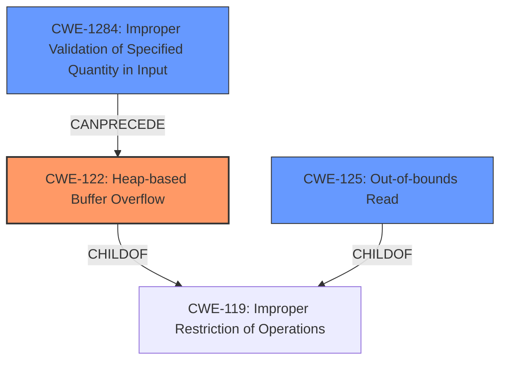

# Final Resolution for CVE-2021-43311

# Summary
| CWE ID | CWE Name | Confidence | CWE Abstraction Level | CWE Vulnerability Mapping Label | CWE-Vulnerability Mapping Notes |
|---|---|---|---|---|---|
| CWE-122 | Heap-based Buffer Overflow | 0.95 | Variant | Allowed | Primary CWE |
| CWE-125 | Out-of-bounds Read | 0.60 | Base | Allowed | Secondary Candidate |
| CWE-1284 | Improper Validation of Specified Quantity in Input | 0.50 | Base | Allowed | Secondary Candidate |

## Evidence and Confidence

*   **Confidence Score:** 0.80
*   **Evidence Strength:** MEDIUM

## Relationship Analysis
The primary CWE is CWE-122 (**Heap-based Buffer Overflow**), which is a variant of CWE-119 (**Improper Restriction of Operations within the Bounds of a Memory Buffer**). CWE-125 (**Out-of-bounds Read**) is included as a secondary candidate because the vulnerability description mentions a pointer pointing to an inaccessible address. However, this is likely a consequence of the heap overflow. A potential contributing factor, CWE-1284 (**Improper Validation of Specified Quantity in Input**), is considered if the buffer size is calculated based on an unvalidated value from the input file.

## Vulnerability Chain
The vulnerability chain starts with a potential **ROOTCAUSE** of CWE-1284 (**Improper Validation of Specified Quantity in Input**) if the buffer size isn't validated. This could lead to CWE-122 (**Heap-based Buffer Overflow**) if the allocated buffer is too small. Subsequently, the out-of-bounds write in CWE-122 can result in CWE-125 (**Out-of-bounds Read**) when the overflowed data is read or when a pointer points to an inaccessible address due to incorrect pointer arithmetic after the overflow.

Missing links: Further code analysis is required to determine if CWE-1284 is indeed a contributing factor.

## Summary of Analysis
The initial analysis correctly identified CWE-122 as the primary vulnerability due to the explicit mention of a "**heap-based buffer overflow**" in the vulnerability description. The inclusion of CWE-125 as a secondary candidate is plausible but needs further investigation to determine if it's a direct consequence of the heap overflow or an independent issue.

The criticism raised valid points about potential contributing factors, particularly CWE-1284 (**Improper Validation of Specified Quantity in Input**), CWE-190/191 (**Integer Overflow/Underflow**), and CWE-131 (**Incorrect Calculation of Buffer Size**). These are important to consider as they can directly lead to the heap overflow.

The final decision is to retain CWE-122 as the primary CWE with a confidence of 0.95, as the evidence is strong. CWE-125 is kept as a secondary candidate with a reduced confidence of 0.60, pending further investigation into its causality. CWE-1284 is added as a possible secondary candidate with a confidence of 0.50 as it relies on further code analysis.

The graph relationships influenced the decision by highlighting the potential chain of events leading to the heap overflow. If the buffer size is based on an unvalidated input value (CWE-1284), this could directly lead to an undersized buffer and the subsequent heap overflow (CWE-122). The out-of-bounds read (CWE-125) is likely a consequence of the heap overflow, but this needs to be confirmed through code analysis.

The selected CWEs are at the optimal level of specificity based on the available evidence. CWE-122 is a Variant that is specific enough to represent the vulnerability type. CWE-125 and CWE-1284 are Base level CWEs that are used to represent contributing factors if the conditions for them are met after further code analysis.