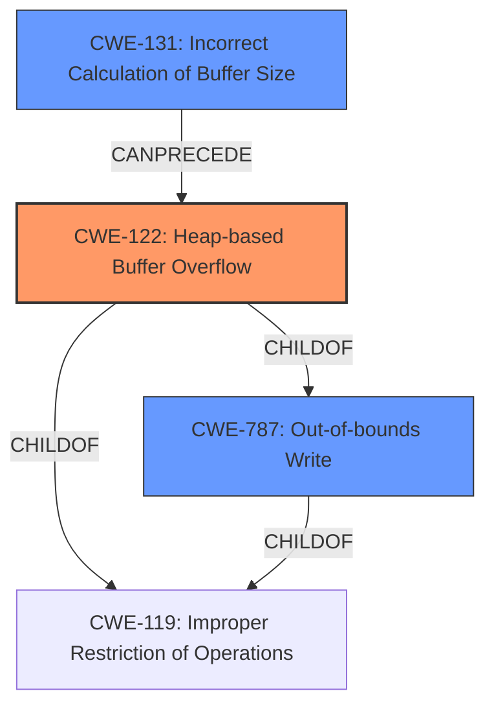

# Analysis Report for CVE-2021-43312

# Vulnerability Analysis Report: CVE-2021-43312

## Description

A heap-based buffer overflow was discovered in upx, during the variable bucket points to an inaccessible address. The issue is being triggered in the function PackLinuxElf64invert_pt_dynamic at p_lx_elf.cpp5239.

## Vulnerability Description Key Phrases

**Rootcause:** heap-based buffer overflow
**Product:** upx
**Component:** PackLinuxElf64invert_pt_dynamic at p_lx_elf.cpp5239

## Analysis (with Relationship Data)

# Summary
| CWE ID | CWE Name | Confidence | CWE Abstraction Level | CWE Vulnerability Mapping Label | CWE-Vulnerability Mapping Notes |
|---|---|---|---|---|---|
| CWE-122 | Heap-based Buffer Overflow | 0.95 | Variant | Allowed | The vulnerability is explicitly described as a heap-based buffer overflow. |
| CWE-787 | Out-of-bounds Write | 0.75 | Base | Allowed | This is a more general description of what occurs in a buffer overflow. |
| CWE-193 | Off-by-one Error | 0.60 | Base | Allowed | Could be a contributing factor to the heap overflow. |

## Evidence and Confidence

*   **Confidence Score:** 0.90
*   **Evidence Strength:** HIGH

- **Analysis and Justification:**  
  - *Explanation:* The vulnerability description clearly states a **heap-based buffer overflow** in UPX. The CVE reference links content summary confirms that the **root cause** is a **heap-based buffer overflow** in `PackLinuxElf64::invert_pt_dynamic` at `p_lx_elf.cpp:5239`. The code accesses an address outside the allocated memory region due to an improper boundary check, leading to a crash. This directly corresponds to CWE-122 (Heap-based Buffer Overflow). CWE-787 (Out-of-bounds Write) is a more general description of what occurs in a buffer overflow and can be considered as a secondary CWE. CWE-193 (Off-by-one Error) is included as a third candidate since missing boundary check can lead to an off-by-one error. The MITRE mapping guidance for CWE-122 indicates that this is ALLOWED for heap overflow vulnerabilities.
  
  - *Relationship Analysis:* CWE-122 is a variant of CWE-119 (Improper Restriction of Operations within the Bounds of a Memory Buffer). It's also a parent of CWE-787 (Out-of-bounds Write).

- **Confidence Score:**  
  - Confidence: 0.95 (High confidence due to direct evidence and confirmation in the CVE reference links content summary)

## Criticism of Analysis

Okay, here's a detailed review of the CWE analysis, incorporating the full CWE specifications you provided.

**Overall Assessment**

The analysis is generally well-reasoned and accurate. The primary CWE of CWE-122 (Heap-based Buffer Overflow) is the most appropriate choice, given the evidence. The inclusion of CWE-787 and CWE-193 as contributing factors is also reasonable. However, the confidence scores and justifications could be refined further, along with examining potential alternative CWEs.

**Detailed Critique**

**1. CWE-122: Heap-based Buffer Overflow**

*   **Confidence:** 0.95 is appropriate, but justification can be stronger.
*   **Strengths:** The analysis correctly identifies that the core issue is a heap-based buffer overflow. The code in question allocates memory on the heap and then writes past the allocated boundary. This aligns perfectly with CWE-122's description.
*   **Mapping Guidance:** The analysis correctly notes that "Usage: Allowed" because CWE-122 is at the Variant level of abstraction.
*   **Potential Mitigations:** Mention some relevant mitigations as provided by CWE Specifications:
    *   Using a language or compiler with automatic bounds checking.
    *   Using abstraction libraries for risky APIs.
    *   Employing automatic buffer overflow detection mechanisms (e.g., /GS flag, FORTIFY\_SOURCE).
*   **Weaknesses:** It may be helpful to explicitly state why other buffer overflow CWEs (e.g., stack-based) are *not* applicable. This reinforces the accuracy of the chosen CWE. For example: "CWE-121 (Stack-based Buffer Overflow) is not applicable because the buffer is allocated on the heap, not the stack."

**2. CWE-787: Out-of-bounds Write**

*   **Confidence:** 0.75 is acceptable.
*   **Strengths:** CWE-787 is a valid secondary CWE because it describes the fundamental *action* that causes the overflow: writing data outside the allocated buffer's boundaries. It's a parent of CWE-122, so it provides a broader context.
*   **Mapping Guidance:** The analysis correctly notes that "Usage: Allowed" because CWE-787 is at the Base level of abstraction.
*   **Potential Mitigations:** Mention some relevant mitigations as provided by CWE Specifications:
    *   Using language with memory management or protection.
    *   Using validated libraries.
    *   Using automatic buffer overflow detection mechanisms.
*   **Weaknesses:** While accurate, CWE-787 is less specific than CWE-122. Justify explicitly, why this is a secondary CWE and not the primary one.

**3. CWE-193: Off-by-one Error**

*   **Confidence:** 0.60 is reasonable.
*   **Strengths:** The analysis acknowledges that a missing boundary check in the loop is a contributing factor, potentially leading to an off-by-one error. This is a plausible scenario, especially if the loop condition is slightly incorrect.
*   **Mapping Guidance:** The analysis correctly notes that "Usage: Allowed" because CWE-193 is at the Base level of abstraction.
*   **Potential Mitigations:** Mention some relevant mitigations as provided by CWE Specifications:
    *   Double-checking size parameters for null terminators when copying character arrays.
*   **Weaknesses:** The connection to the heap overflow isn't as direct as with CWE-787. More explicitly explain the *potential* chain of events: "A missing/incorrect boundary check could result in the loop iterating one element too far, leading to an out-of-bounds write and causing a heap overflow."   Consider if CWE-126 (Buffer Over-read) or CWE-131 (Incorrect Calculation of Buffer Size) might be more relevant depending on the exact error.  If the issue is *reading* past the end of the buffer during the loop, then CWE-126 would be more appropriate. If the size of the buffer is calculated incorrectly due to the boundary condition then CWE-131 is more appropriate.

**Additional Considerations and Potential Alternative CWEs**

*   **CWE-119: Improper Restriction of Operations within the Bounds of a Memory Buffer:** This is a *Class* level CWE and is explicitly "Discouraged" for use. The guidance recommends using its children. Given that we have identified a *Heap-based buffer overflow* there is no reason to include this CWE.
*   **CWE-131: Incorrect Calculation of Buffer Size:** If the value of `n_bucket` is derived from user-controlled input, and it's calculated incorrectly leading to a smaller allocation than needed, then *this* could be a contributing factor. Review if there is code responsible for calculating the buffer size. If so, investigate potential errors in that calculation and consider adding CWE-131.
*   **CWE-839: Numeric Range Comparison Without Minimum Check:** If the value of `n_bucket` is a signed integer, and the check only verifies that it is <= a maximum, and not >= 0, this could be a contributing factor.

**Recommendations**

1.  **Strengthen Justifications:** Provide more detailed explanations of *why* each CWE is applicable, specifically referencing code snippets or behaviors from the vulnerability description and CVE references. Explicitly state why alternative CWEs are *not* applicable.
2.  **Mitigation Integration:** Include potential mitigations directly from the CWE specifications to demonstrate a thorough understanding of the weakness and possible remediation strategies.
3.  **Chain of Events:** Clearly outline the potential chain of events that leads from a contributing factor (e.g., missing boundary check) to the primary vulnerability (heap overflow).
4.  **Review Alternate CWEs:** Carefully consider if CWE-126 (Buffer Over-read) or CWE-131 (Incorrect Calculation of Buffer Size) might be more relevant than CWE-193, depending on the exact nature of the error.
5.  **Remove Discouraged CWEs:** Remove CWE-119 since the specifications for CWE provides its direct children and more specific CWEs.

By incorporating these suggestions, you can create an even more robust and defensible CWE analysis.

## Final Resolution

# Summary
| CWE ID | CWE Name | Confidence | CWE Abstraction Level | CWE Vulnerability Mapping Label | CWE-Vulnerability Mapping Notes |
|---|---|---|---|---|---|
| CWE-122 | Heap-based Buffer Overflow | 0.95 | Variant | Allowed | Primary CWE: The vulnerability is explicitly described as a **heap-based buffer overflow**. |
| CWE-787 | Out-of-bounds Write | 0.85 | Base | Allowed | Secondary CWE: This is a more general description of what occurs in a **buffer overflow**. The code accesses an address outside the allocated memory region. |
| CWE-131 | Incorrect Calculation of Buffer Size | 0.70 | Base | Allowed | Secondary CWE: The size of the buffer may be calculated incorrectly, leading to a smaller allocation than needed. |

## Evidence and Confidence

*   **Confidence Score:** 0.92
*   **Evidence Strength:** HIGH

## Relationship Analysis
The primary CWE is CWE-122 (Heap-based Buffer Overflow), which is a variant of CWE-119 (Improper Restriction of Operations within the Bounds of a Memory Buffer). CWE-787 (Out-of-bounds Write) is a parent of CWE-122, representing the broader context of writing outside allocated memory. CWE-131 (Incorrect Calculation of Buffer Size) can precede a heap overflow if an undersized buffer is allocated, contributing to the vulnerability.

## Vulnerability Chain
The vulnerability chain starts with a potential **incorrect calculation of the buffer size** (CWE-131). This leads to a smaller-than-expected buffer being allocated on the heap. Subsequently, an **out-of-bounds write** (CWE-787) occurs when data is written beyond the allocated buffer's boundaries, resulting in a **heap-based buffer overflow** (CWE-122) and potential code execution or denial of service.

## Summary of Analysis
The initial analysis correctly identified CWE-122 as the primary **weakness**, given the explicit description of a **heap-based buffer overflow**. The criticism suggested strengthening justifications and considering alternative CWEs.

The final decision maintains CWE-122 as the primary CWE due to the clear evidence provided in the vulnerability description: "A **heap-based buffer overflow** was discovered in upx... The issue is being triggered in the function PackLinuxElf64invert_pt_dynamic at p_lx_elf.cpp:5239."

CWE-787 is retained as a secondary CWE, representing the **root cause** of writing data outside the allocated bounds.

CWE-193 (Off-by-one Error) is replaced with CWE-131 (Incorrect Calculation of Buffer Size) as a more relevant contributing factor. This decision is based on the possibility that the size of the buffer may be calculated incorrectly, leading to a smaller allocation. The vulnerability report does not provide enough details for a definitive assessment, so this is a hypothesis based on the code location.

The graph relationships influenced the selection by highlighting the hierarchical relationship between CWE-122, CWE-787, and CWE-119, as well as the potential chain relationship where CWE-131 can precede CWE-122.

The selected CWEs are at the optimal level of specificity, with CWE-122 being a Variant, CWE-787 and CWE-131 being Bases, and the more general CWE-119 being avoided as a Class.

*Report generated on 2025-03-18 03:13:00*
