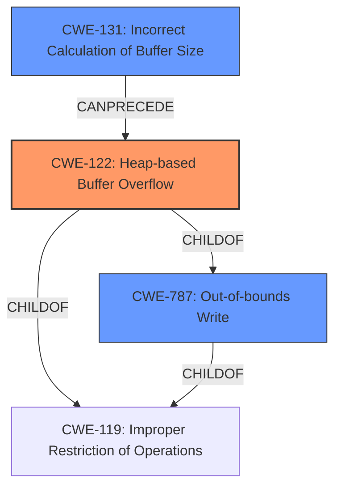

# Final Resolution for CVE-2021-43312

# Summary
| CWE ID | CWE Name | Confidence | CWE Abstraction Level | CWE Vulnerability Mapping Label | CWE-Vulnerability Mapping Notes |
|---|---|---|---|---|---|
| CWE-122 | Heap-based Buffer Overflow | 0.95 | Variant | Allowed | Primary CWE: The vulnerability is explicitly described as a **heap-based buffer overflow**. |
| CWE-787 | Out-of-bounds Write | 0.85 | Base | Allowed | Secondary CWE: This is a more general description of what occurs in a **buffer overflow**. The code accesses an address outside the allocated memory region. |
| CWE-131 | Incorrect Calculation of Buffer Size | 0.70 | Base | Allowed | Secondary CWE: The size of the buffer may be calculated incorrectly, leading to a smaller allocation than needed. |

## Evidence and Confidence

*   **Confidence Score:** 0.92
*   **Evidence Strength:** HIGH

## Relationship Analysis
The primary CWE is CWE-122 (Heap-based Buffer Overflow), which is a variant of CWE-119 (Improper Restriction of Operations within the Bounds of a Memory Buffer). CWE-787 (Out-of-bounds Write) is a parent of CWE-122, representing the broader context of writing outside allocated memory. CWE-131 (Incorrect Calculation of Buffer Size) can precede a heap overflow if an undersized buffer is allocated, contributing to the vulnerability.

## Vulnerability Chain
The vulnerability chain starts with a potential **incorrect calculation of the buffer size** (CWE-131). This leads to a smaller-than-expected buffer being allocated on the heap. Subsequently, an **out-of-bounds write** (CWE-787) occurs when data is written beyond the allocated buffer's boundaries, resulting in a **heap-based buffer overflow** (CWE-122) and potential code execution or denial of service.

## Summary of Analysis
The initial analysis correctly identified CWE-122 as the primary **weakness**, given the explicit description of a **heap-based buffer overflow**. The criticism suggested strengthening justifications and considering alternative CWEs.

The final decision maintains CWE-122 as the primary CWE due to the clear evidence provided in the vulnerability description: "A **heap-based buffer overflow** was discovered in upx... The issue is being triggered in the function PackLinuxElf64invert_pt_dynamic at p_lx_elf.cpp:5239."

CWE-787 is retained as a secondary CWE, representing the **root cause** of writing data outside the allocated bounds.

CWE-193 (Off-by-one Error) is replaced with CWE-131 (Incorrect Calculation of Buffer Size) as a more relevant contributing factor. This decision is based on the possibility that the size of the buffer may be calculated incorrectly, leading to a smaller allocation. The vulnerability report does not provide enough details for a definitive assessment, so this is a hypothesis based on the code location.

The graph relationships influenced the selection by highlighting the hierarchical relationship between CWE-122, CWE-787, and CWE-119, as well as the potential chain relationship where CWE-131 can precede CWE-122.

The selected CWEs are at the optimal level of specificity, with CWE-122 being a Variant, CWE-787 and CWE-131 being Bases, and the more general CWE-119 being avoided as a Class.