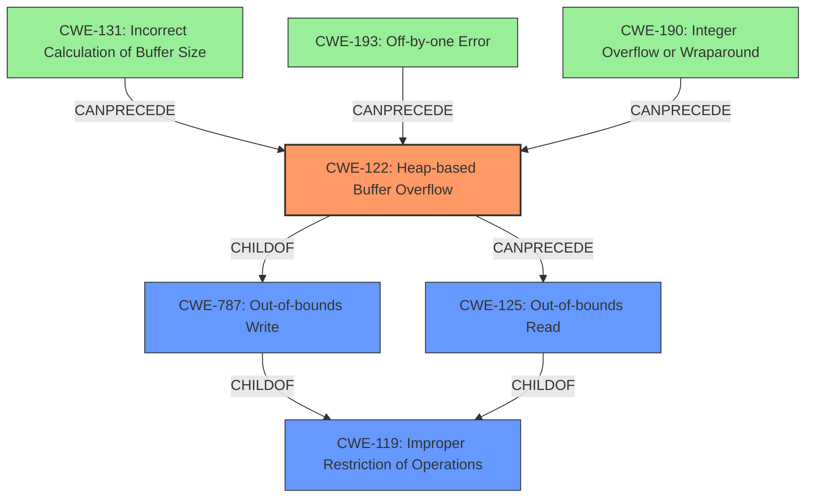

# Final Resolution for CVE-2021-43313

# Summary
| CWE ID | CWE Name | Confidence | CWE Abstraction Level | CWE Vulnerability Mapping Label | CWE-Vulnerability Mapping Notes |
|---|---|---|---|---|---|
| CWE-122 | Heap-based Buffer Overflow | 0.95 | Variant | Primary | Allowed |
| CWE-125 | Out-of-bounds Read | 0.65 | Base | Secondary | Allowed |
| CWE-131 | Incorrect Calculation of Buffer Size | 0.30 | Base | Contributing | Allowed | Possible contributing factor, if the initial buffer size was incorrectly calculated. |
| CWE-193 | Off-by-one Error | 0.30 | Base | Contributing | Allowed | Possible contributing factor, if the loop condition or buffer allocation was off by one. |
| CWE-190 | Integer Overflow or Wraparound | 0.30 | Base | Contributing | Allowed | Possible contributing factor, if an integer overflow occurred during buffer size calculation. |

## Evidence and Confidence

*   **Confidence Score:** 0.90
*   **Evidence Strength:** HIGH

## Relationship Analysis
The primary weakness is a **CWE-122 (Heap-based Buffer Overflow)**, a variant of **CWE-787 (Out-of-bounds Write)** and **CWE-119 (Improper Restriction of Operations within the Bounds of a Memory Buffer)**. The secondary weakness, **CWE-125 (Out-of-bounds Read)**, is a consequence of the overflow. The contributing factors, **CWE-131 (Incorrect Calculation of Buffer Size)**, **CWE-193 (Off-by-one Error)**, and **CWE-190 (Integer Overflow or Wraparound)**, could potentially precede the buffer overflow by causing memory allocation issues.

## Vulnerability Chain
The vulnerability chain starts with a potential **ROOTCAUSE** such as **CWE-131 (Incorrect Calculation of Buffer Size)**, **CWE-193 (Off-by-one Error)**, or **CWE-190 (Integer Overflow or Wraparound)** leading to an incorrectly sized buffer. This results in **CWE-122 (Heap-based Buffer Overflow)** when data is written beyond the allocated buffer's boundaries. The overflow then leads to **CWE-125 (Out-of-bounds Read)** when the code attempts to read from the corrupted memory region, potentially leaking sensitive information or causing further instability.

## Summary of Analysis
The initial analysis correctly identified **CWE-122 (Heap-based Buffer Overflow)** as the primary **WEAKNESS**, supported by the vulnerability description stating "heap-based buffer overflow" and the CVE reference detailing heap memory corruption. The secondary mapping to **CWE-125 (Out-of-bounds Read)** is also reasonable, as it represents a direct consequence of the overflow.

The criticism suggested considering potential contributing factors like **CWE-131 (Incorrect Calculation of Buffer Size)**, **CWE-193 (Off-by-one Error)**, and **CWE-190 (Integer Overflow or Wraparound)**, which could lead to the **HEAP** overflow. These have been added as contributing factors with a lower confidence score (0.30) because the provided evidence doesn't directly confirm their presence, but they are plausible given the nature of buffer overflows.

The graph relationships influenced the final selection by emphasizing the hierarchical relationship between **CWE-122 (Heap-based Buffer Overflow)** and its parent **CWE-787 (Out-of-bounds Write)** and the chain relationship where allocation issues may precede **CWE-122 (Heap-based Buffer Overflow)**, which in turn precedes **CWE-125 (Out-of-bounds Read)**.

The selected CWEs are at the optimal level of specificity because **CWE-122 (Heap-based Buffer Overflow)** accurately describes the type of buffer overflow (heap-based), while **CWE-125 (Out-of-bounds Read)** captures the consequence of the overflow. The contributing factors are included to highlight potential **ROOTCAUSES**, but with a lower confidence due to limited direct evidence.