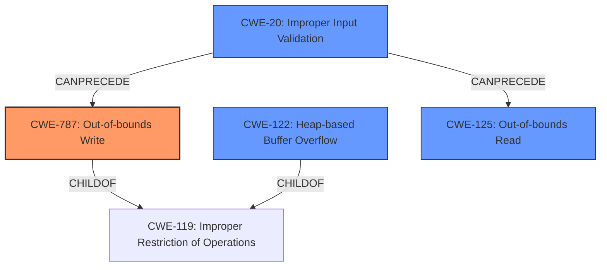

# Final Resolution for CVE-2021-43317

# Summary
| CWE ID  | CWE Name                           | Confidence | CWE Abstraction Level | CWE Vulnerability Mapping Label | CWE-Vulnerability Mapping Notes |
| :-------- | :--------------------------------- | :---------- | :---------------------- | :------------------------------ | :------------------------------ |
| CWE-787 | Out-of-bounds Write | 0.95       | Base                    | Allowed                         | Acceptable-Use, Primary CWE |
| CWE-122 | Heap-based Buffer Overflow | 0.70       | Variant                   | Allowed                         | Acceptable-Use, Secondary Candidate |
| CWE-125 | Out-of-bounds Read | 0.60       | Base                   | Allowed                         | Supplemental, if applicable, Secondary Candidate |
| CWE-20 | Improper Input Validation | 0.50       | Class                   | Allowed                         | Supplemental, if applicable, Secondary Candidate |

## Evidence and Confidence

*   **Confidence Score:** 0.90
*   **Evidence Strength:** HIGH

## Relationship Analysis
The primary relationship is that CWE-787 (Out-of-bounds Write) is a child of CWE-119 (Improper Restriction of Operations within the Bounds of a Memory Buffer). CWE-122 (Heap-based Buffer Overflow) is a variant, specifying the location of the overflow. CWE-20 (Improper Input Validation) can precede the memory corruption issues, as lack of proper input handling often leads to exploitable conditions. CWE-125 (Out-of-bounds Read) can be a contributing factor to the crash if the vulnerability starts as a read. Abstraction levels influenced the selection, favoring base and variant level CWEs for specificity, while acknowledging the potential relevance of class-level CWEs for broader context.

## Vulnerability Chain
The vulnerability chain starts with potentially **CWE-20 (Improper Input Validation)**, where the input file is not validated correctly. This leads to **CWE-125 (Out-of-bounds Read)**, where the program attempts to read data beyond the intended buffer. This read triggers the **ROOTCAUSE**, where the pointer `p` points to an inaccessible address. This then leads to **CWE-787 (Out-of-bounds Write)** as the program attempts to write data to an invalid memory location on the heap (**CWE-122 Heap-based Buffer Overflow**), resulting in a crash or other undefined behavior.

## Summary of Analysis
The initial analysis correctly identified **CWE-787 (Out-of-bounds Write)** as the primary **WEAKNESS**, given the clear description of a write operation occurring outside the allocated buffer. The inclusion of **CWE-122 (Heap-based Buffer Overflow)** is also appropriate, as the vulnerability is explicitly stated to be heap-based.

The criticism suggested considering **CWE-125 (Out-of-bounds Read)** and **CWE-20 (Improper Input Validation)**. The vulnerability description mentions "out-of-bounds reads," making CWE-125 a reasonable addition if the vulnerability starts as a read. Adding CWE-20 provides a broader context, acknowledging the lack of input validation as a potential contributing factor.

The graph relationships influenced the final selection by highlighting the chain of events. **CWE-20** can precede the memory corruption issues.

The selected CWEs are at the optimal level of specificity because **CWE-787** precisely describes the out-of-bounds write condition, **CWE-122** specifies the location of the overflow on the heap, **CWE-125** recognizes the read outside of the buffer and **CWE-20** acknowledges the lack of input validation as a precursor. These choices are based on the provided evidence and the CWE specifications, including mapping guidance and relationship information.