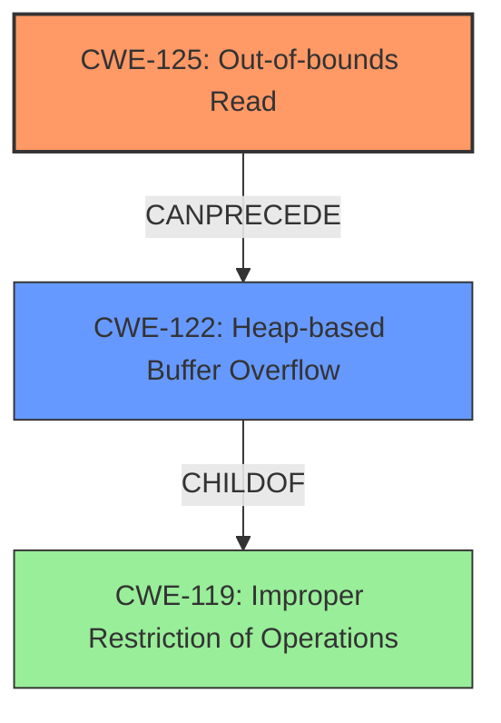

# Final Resolution for CVE-2021-43453

# Summary
| CWE ID | CWE Name | Confidence | CWE Abstraction Level | CWE Vulnerability Mapping Label | CWE-Vulnerability Mapping Notes |
|---|---|---|---|---|---|
| CWE-125 | Out-of-bounds Read | 0.95 | Base | Primary | Allowed |
| CWE-122 | Heap-based Buffer Overflow | 0.70 | Variant | Secondary Candidate | Allowed |

## Evidence and Confidence

*   **Confidence Score:** 0.90
*   **Evidence Strength:** HIGH

## Relationship Analysis
The primary weakness is **CWE-125 (Out-of-bounds Read)**, which can lead to **CWE-122 (Heap-based Buffer Overflow)**. **CWE-122** is a variant of **CWE-119 (Improper Restriction of Operations within the Bounds of a Memory Buffer)**. Although **CWE-119** is a parent of **CWE-122**, selecting it would be too general.

## Vulnerability Chain
The vulnerability chain starts with an **out-of-bounds read (CWE-125)** in the parser. This read occurs in the `parser_parse_for_statement_start` function. This can then lead to a **heap-based buffer overflow (CWE-122)**. The root cause is the parsing error leading to the out-of-bounds read. The impact is a potential buffer overflow and possible crash.

## Summary of Analysis
The initial analysis correctly identified **CWE-125 (Out-of-bounds Read)** as the primary weakness and **CWE-122 (Heap-based Buffer Overflow)** as a secondary weakness. The vulnerability description states an "out-of-bounds read," which directly aligns with **CWE-125**.

The criticism highlights the importance of explicitly discussing mitigations, explaining rejected retriever results, acknowledging **CWE-119 (Improper Restriction of Operations within the Bounds of a Memory Buffer)**, and considering further alternatives.

Regarding mitigations, **CWE-125** suggests "Assume all input is malicious" and "Use a language that provides appropriate memory abstractions." For **CWE-122**, mitigations include language selection with automatic bounds checking, using abstraction libraries, and environment hardening with compiler-based overflow detection.

The following were considered and rejected:

*   **CWE-193 (Off-by-one Error):** While a parsing error might involve an off-by-one error in length calculations, the core issue is the out-of-bounds read.
*   **CWE-190 (Integer Overflow or Wraparound):** Not directly mentioned in the vulnerability description.
*   **CWE-126 (Buffer Over-read):** Close variant of **CWE-125**. However, the description says "out-of-bounds read"
*   **CWE-197 (Numeric Truncation Error):** Not directly evident from the description.
*   **CWE-787 (Out-of-bounds Write):** The root cause is an out-of-bounds read, which can lead to an out-of-bounds write, but the primary issue starts with the read.
*   **CWE-1284: Improper Validation of Specified Quantity in Input:** This *could* be a contributing factor if the parsing error involves mishandling the size or length of the input data during the parsing of the `let` statement and class declaration. However, without more information, it's less direct than the out-of-bounds read.
*   **CWE-770: Allocation of Resources Without Limits or Throttling:** Similar to 1284, this is possible (the parser might allocate excessive memory due to the parsing error), but it's less direct than the out-of-bounds read. The allocation issue is probably due to the *results* of the parsing error.
*   **CWE-476: NULL Pointer Dereference:** Since the crash is sometimes mentioned in certain instances, this *could* be considered. However, it's usually a consequence of the heap overflow.

The decision to classify **CWE-125** as the primary weakness and **CWE-122** as a secondary weakness is based on the evidence provided in the vulnerability description, the relationship analysis, and the mapping guidance. The selected CWEs are at the optimal level of specificity.