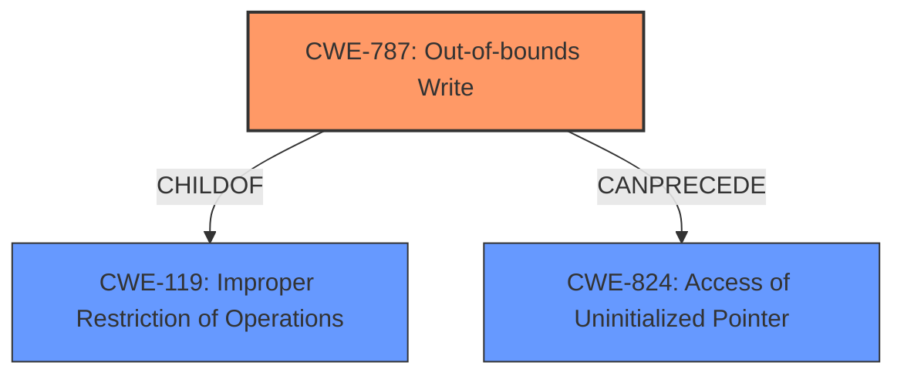

# Final Resolution for CVE-2021-43522

# Summary
| CWE ID | CWE Name | Confidence | CWE Abstraction Level | CWE Vulnerability Mapping Label | CWE-Vulnerability Mapping Notes |
|---|---|---|---|---|---|
| CWE-787 | Out-of-bounds Write | 1.0 | Base | Primary | Allowed |
| CWE-1285 | Improper Validation of Specified Index, Position, or Offset in Input | 0.4 | Base | Rejected Candidate | There was no indication the root cause was improper input validation related to index, position, or offset. |

## Evidence and Confidence

*   **Confidence Score:** 1.0
*   **Evidence Strength:** HIGH

## Relationship Analysis
The primary relationship considered was the hierarchical relationship between CWE-787 (**Out-of-bounds Write**) and CWE-119 (**Improper Restriction of Operations within the Bounds of a Memory Buffer**). CWE-787 is a child of CWE-119, indicating that it's a more specific type of buffer-related weakness. The analysis also considered the potential for CWE-787 to precede CWE-824 (**Access of Uninitialized Pointer**), as an out-of-bounds write can corrupt memory containing pointers.

## Vulnerability Chain
The vulnerability chain appears to involve an **out-of-bounds write (CWE-787)** in the `StorageSecurityCommandDxe` module. This allows an attacker to write fixed or predictable data to SMRAM, potentially leading to privilege escalation to SMM. The initial flaw is the **memory corruption** due to the **out-of-bounds write**. The consequence is the ability to overwrite sensitive memory regions in SMRAM, ultimately leading to privilege escalation. There's no clear evidence to suggest improper input validation or incorrect calculation of buffer size, making CWE-1285 a weak fit.

## Summary of Analysis
The initial analysis correctly identified CWE-787 as the primary weakness. The vulnerability description explicitly mentions "memory corruption" and "out-of-bounds write," directly mapping to CWE-787. The high confidence score of 1.0 is justified due to the clear evidence from the vulnerability description.

The inclusion of CWE-1285 as a secondary candidate was a weaker suggestion, as there's no specific evidence in the vulnerability description or CVE details to support it. The description focuses on the *result* of an out-of-bounds write rather than the *cause* being improper index/offset validation. As the criticism pointed out, it is important to state *why* the evidence *doesn't* support it. For example, "The vulnerability reports the *result* of an out-of-bounds write. There is no information about *how* the write occurred, only that an attacker *can write* data to SMRAM. There's no mention of the code receiving an index, position, or offset and failing to validate it."

The graph relationships influenced the decision by highlighting that CWE-787 is a specific type of buffer error (child of CWE-119) and can lead to further issues like uninitialized pointer access (precedes CWE-824).

The selected CWEs are at the optimal level of specificity because CWE-787 is a Base-level CWE that directly describes the **root cause** of the vulnerability (**out-of-bounds write**), and there's insufficient evidence to support any more specific or related CWEs. The decision to reject CWE-1285 is based on the lack of supporting evidence in the vulnerability description.