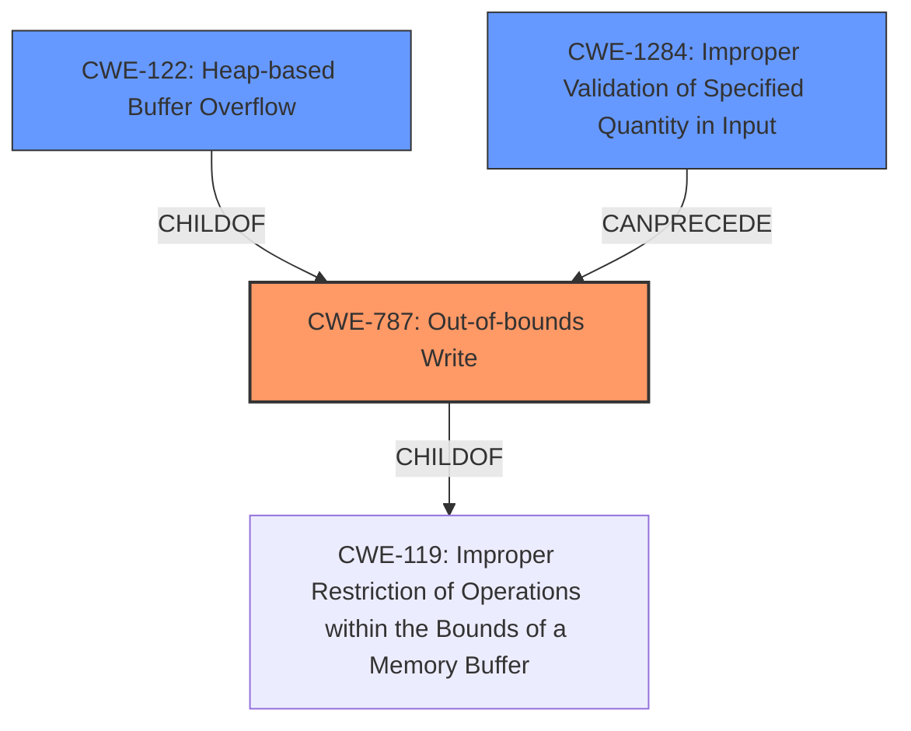

# Analysis Report for CVE-2021-43527

# Vulnerability Analysis Report: CVE-2021-43527

## Description

NSS (Network Security Services) versions prior to 3.73 or 3.68.1 ESR are vulnerable to a heap overflow when handling DER-encoded DSA or RSA-PSS signatures. Applications using NSS for handling signatures encoded within CMS, S/MIME, PKCS \#7, or PKCS \#12 are likely to be impacted. Applications using NSS for certificate validation or other TLS, X.509, OCSP or CRL functionality may be impacted, depending on how they configure NSS. *Note This vulnerability does NOT impact Mozilla Firefox.* However, email clients and PDF viewers that use NSS for signature verification, such as Thunderbird, LibreOffice, Evolution and Evince are believed to be impacted. This vulnerability affects NSS < 3.73 and NSS < 3.68.1.

## Vulnerability Description Key Phrases

**Weakness:** heap overflow
**Product:** NSS (Network Security Services)
**Version:** < 3.73 or 3.68.1 ESR

## Analysis (with Relationship Data)

# Summary
| CWE ID | CWE Name | Confidence | CWE Abstraction Level | CWE Vulnerability Mapping Label | CWE-Vulnerability Mapping Notes |
|---|---|---|---|---|---|
| CWE-787 | Out-of-bounds Write | 0.9 | Base | Allowed | The vulnerability involves writing data beyond the intended buffer boundary. |
| CWE-122 | Heap-based Buffer Overflow | 0.8 | Variant | Allowed | The **heap overflow** occurs due to writing past the end of a heap-allocated buffer. |
| CWE-1284 | Improper Validation of Specified Quantity in Input | 0.7 | Base | Allowed | The **root cause** involves not validating the length of the signature data. |

## Evidence and Confidence

*   **Confidence Score:** 0.9
*   **Evidence Strength:** HIGH

- **Analysis and Justification:**  
  - *Explanation:* The vulnerability is a **heap overflow** caused by writing data past the end of a buffer in the heap. This directly aligns with CWE-787 (Out-of-bounds Write) and CWE-122 (Heap-based Buffer Overflow). The analysis of CVE-2021-43527 explicitly states a heap-based buffer overflow in the `decodeECorDSASignature` function due to missing input validation of the signature length. This results in writing past the end of the intended buffer, which is a clear instance of CWE-787. CWE-122 is more specific, indicating that this out-of-bounds write happens on the heap. Additionally, the root cause traces to missing input validation, which aligns with CWE-1284 (Improper Validation of Specified Quantity in Input) where the quantity is the size or length of the input data. MITRE mapping guidance allows these mappings.

  - *Relationship Analysis:* CWE-787 is a child of CWE-119 (Improper Restriction of Operations within the Bounds of a Memory Buffer), but CWE-787 is more specific as it describes an out-of-bounds write. CWE-122 is a variant of CWE-119, specifying that the overflow occurs on the heap. CWE-1284 can precede CWE-787 as the missing validation enables the out-of-bounds write.

- **Confidence Score:**  
  - Confidence: 0.9 (High confidence due to explicit mention of heap overflow and root cause in the CVE reference materials.)

## Criticism of Analysis

Okay, I've reviewed the provided analysis of CVE-2021-43527 and the associated CWE specifications. Here's my critique:

**Overall Assessment:**

The analysis is generally good and provides a reasonable mapping to the relevant CWEs. The justification for each CWE is well-explained and the confidence scores are appropriate. The inclusion of chain examples of the CWEs from the CWE database was a good addition.

**Detailed Review:**

| CWE ID  | CWE Name                      | Confidence | Critique                                                                                                                                                                                                                                                                                                                                                                         |
|---------|-------------------------------|------------|---------------------------------------------------------------------------------------------------------------------------------------------------------------------------------------------------------------------------------------------------------------------------------------------------------------------------------------------------------------------------------------|
| CWE-787 | Out-of-bounds Write          | 0.9        | **Accurate**.  The description explicitly states a heap overflow, implying an out-of-bounds write.                                                                                                                                                                                                                                                                                  |
| CWE-122 | Heap-based Buffer Overflow    | 0.8        | **Accurate**. This is a more specific variant of CWE-787 and correctly reflects that the overflow occurs in heap memory.                                                                                                                                                                                                                                                               |
| CWE-1284| Improper Validation of Specified Quantity in Input | 0.7| **Accurate**. The lack of validation of the input signature length directly leads to the heap overflow. This is a clear case of CWE-1284, where the "quantity" is the size or length of the signature. CWE-1284 is a good fit for the *root cause*. The root cause description in the vulnerability details directly supports this mapping. |

**Suggestions for Improvement & Alternative CWEs Considered:**

1.  **CWE-347: Improper Verification of Cryptographic Signature:** While the primary issue is a buffer overflow due to improper input validation, it's worth considering whether CWE-347 is also relevant, although less directly. The vulnerability allows potentially invalid signatures to be processed, bypassing signature verification. However, the *direct* cause of the vulnerability is the heap overflow. It depends on whether you view the missing validation as fundamentally breaking the signature verification process, or simply as a means to an exploitable buffer overflow. I would not add this CWE mapping, unless it's for a more comprehensive report, due to the fact that the direct cause is the heap overflow.

2. **CWE-770: Allocation of Resources Without Limits or Throttling:** Is the product imposing any restrictions on the size of the signature, this might cause allocation of a large amount of memory, potentially leading to a denial-of-service condition, which can be mapped to CWE-770. If so, consider CWE-770 but only if excessive resource consumption is a possible outcome from the overflow.

**Justification for Confidence Levels:**

*   **CWE-787 (0.9):** High confidence is justified. The description of the vulnerability states that an out-of-bounds write is occurring.
*   **CWE-122 (0.8):** High confidence is justified. The description explicitly states a heap overflow.
*   **CWE-1284 (0.7):** High confidence is justified. The missing length validation enables the overflow.

**Feedback on CWE Specifications Usage:**

*   The analysis correctly references the CWE specifications to justify the mappings.
*   The potential mitigations for each CWE are relevant to the described vulnerability. For example, emphasizing input validation (CWE-1284) and using safer memory management practices/languages (CWE-787/CWE-122) are all valid recommendations.

**Recommendations:**

*   The analysis is well-structured and justified.
*   Continue to emphasize the chain of causation. CWE-1284 *leads to* CWE-787 and CWE-122.
*   Consider adding a note about disabling DSA in the system as a possible workaround, as mentioned within the Retriever Results.

In summary, the analysis is strong and accurately identifies the core weaknesses related to CVE-2021-43527. The suggestions above are minor refinements and alternative viewpoints to consider for a more comprehensive analysis.

## Final Resolution

# Summary

| CWE ID    | CWE Name                                         | Confidence | CWE Abstraction Level | CWE Vulnerability Mapping Label | CWE-Vulnerability Mapping Notes |
| :-------- | :----------------------------------------------- | :--------- | :-------------------- | :------------------------------ | :------------------------------ |
| CWE-787   | Out-of-bounds Write                              | 0.95       | Base                  | Allowed                         | Primary CWE                     |
| CWE-122   | Heap-based Buffer Overflow                       | 0.9        | Variant               | Allowed                         | Secondary Candidate             |
| CWE-1284  | Improper Validation of Specified Quantity in Input | 0.8        | Base                  | Allowed                         | Secondary Candidate             |

## Evidence and Confidence

*   **Confidence Score:** 0.9
*   **Evidence Strength:** HIGH

## Relationship Analysis

The primary relationship is that **CWE-1284 (Improper Validation of Specified Quantity in Input)** can precede **CWE-787 (Out-of-bounds Write)**, as improper validation can lead to an out-of-bounds write. **CWE-122 (Heap-based Buffer Overflow)** is a variant of **CWE-787**, specifying that the out-of-bounds write occurs on the heap. Selecting **CWE-787** as the primary CWE is appropriate because it's a base-level weakness, while **CWE-122** provides additional context.

## Vulnerability Chain

The vulnerability chain starts with **CWE-1284 (Improper Validation of Specified Quantity in Input)**, where the length of the signature data isn't validated. This leads to **CWE-787 (Out-of-bounds Write)** and **CWE-122 (Heap-based Buffer Overflow)**, as the code writes past the end of a heap-allocated buffer. The lack of input validation is the **root cause**, and the **heap overflow** is the direct consequence, leading to potential code execution or denial of service.

## Summary of Analysis

The initial analysis and criticism were both accurate. The vulnerability is indeed a **heap overflow** (**CWE-122**) caused by writing data past the end of a buffer in the heap, which is a clear instance of **CWE-787 (Out-of-bounds Write)**. The **root cause** is the missing input validation (**CWE-1284**).

The vulnerability description clearly states, "NSS (Network Security Services) versions prior to 3.73 or 3.68.1 ESR are vulnerable to a **heap overflow** when handling DER-encoded DSA or RSA-PSS signatures." This statement directly supports the selection of **CWE-787** and **CWE-122**. The fact that the overflow happens due to missing input validation of the signature length directly supports the inclusion of **CWE-1284**.

The graph relationships influenced the selection by highlighting the chain of events: missing validation leads to an out-of-bounds write on the heap. The selected CWEs are at the optimal level of specificity, as **CWE-787** is a base-level weakness, **CWE-122** provides additional context about the location of the overflow (heap), and **CWE-1284** identifies the **root cause**.

*Report generated on 2025-03-18 03:19:16*
