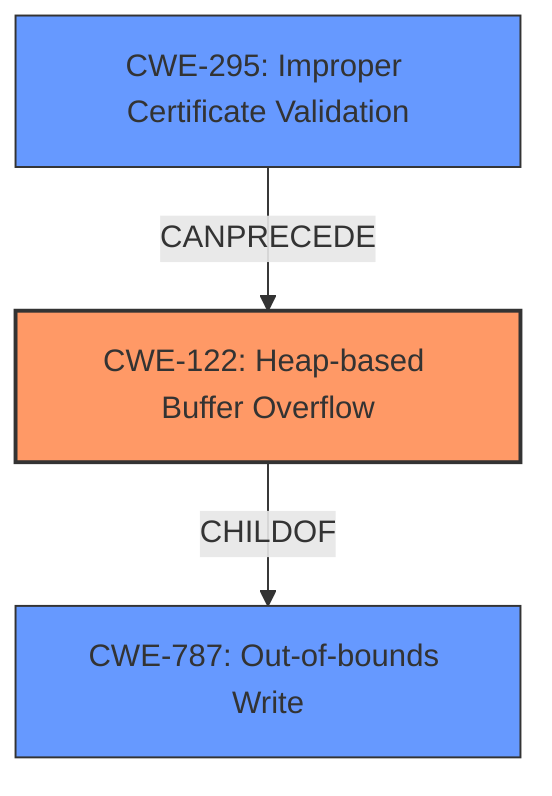

# Analysis Report for CVE-2021-43529

# Vulnerability Analysis Report: CVE-2021-43529

## Description

Thunderbird versions prior to 91.3.0 are vulnerable to the heap overflow described in CVE-2021-43527 when processing S/MIME messages. Thunderbird versions 91.3.0 and later will not call the vulnerable code when processing S/MIME messages that contain certificates with DER-encoded DSA or RSA-PSS signatures.

## Vulnerability Description Key Phrases

**Weakness:** heap overflow
**Product:** Thunderbird
**Version:** prior to 91.3.0

## Analysis (with Relationship Data)

# Summary
| CWE ID | CWE Name | Confidence | CWE Abstraction Level | CWE Vulnerability Mapping Label | CWE-Vulnerability Mapping Notes |
|---|---|---|---|---|---|
| CWE-122 | Heap-based Buffer Overflow | 0.9 | Variant | Primary | Allowed |
| CWE-787 | Out-of-bounds Write | 0.7 | Base | Secondary | Allowed |
| CWE-295 | Improper Certificate Validation | 0.6 | Base | Secondary | Allowed |

## Evidence and Confidence

*   **Confidence Score:** 0.9
*   **Evidence Strength:** HIGH

- **Analysis and Justification:**  
  - *Explanation:* The vulnerability description explicitly states "**heap overflow**" when processing S/MIME messages, which directly aligns with CWE-122 (Heap-based Buffer Overflow). The description also mentions that the vulnerability is linked to CVE-2021-43527, which involves memory corruption due to DER-encoded DSA or RSA-PSS signatures. This further supports the heap overflow classification. The "Retriever Results" also lists CWE-122 with a good score, and the CWE is at the Variant level of abstraction, which is preferred. CWE-787 (Out-of-bounds Write) is also a potential candidate, as heap overflows involve writing beyond buffer boundaries, but CWE-122 is a more specific variant. CWE-295 (Improper Certificate Validation) is another candidate, as the root cause involves insufficient certificate verification, leading to the heap overflow.
  
  - *Relationship Analysis:* CWE-122 is a variant of CWE-119 (Improper Restriction of Operations within the Bounds of a Memory Buffer). CWE-787 is a parent of CWE-122 since writing beyond the bounds of a buffer is the root cause for a heap overflow. CWE-295 can precede CWE-122 since improper validation of certificates can lead to malicious certificates being used which can trigger a heap overflow when processed.

- **Confidence Score:**  
  - Confidence: 0.9 (High evidence from technical description and CVE reference materials)

---

## Criticism of Analysis

Okay, I have reviewed your CWE analysis for the Thunderbird heap overflow vulnerability (CVE-2021-43527) based on the provided vulnerability description, CVE reference summary, retriever results, and the full CWE specifications. Here's my critique:

**Overall Assessment:**

The analysis is generally well-reasoned and the primary CWE mapping to CWE-122 (Heap-based Buffer Overflow) is accurate and well-supported. The secondary mappings to CWE-787 (Out-of-bounds Write) and CWE-295 (Improper Certificate Validation) are also reasonable, though their applicability could be more precisely defined.

**Detailed Review:**

*   **CWE-122: Heap-based Buffer Overflow (Primary Mapping)**

    *   **Confidence:** 0.9 (Excellent)
    *   **Justification:** The explicit mention of "heap overflow" in the vulnerability description and the connection to CVE-2021-43527 (which involves memory corruption) makes this a very strong mapping. The retriever results also support this.
    *   **Abstraction Level:** Variant (Optimal)
    *   **CWE Specification Compliance:** The description aligns perfectly with the CWE-122 definition: "A heap overflow condition is a buffer overflow, where the buffer that can be overwritten is allocated in the heap portion of memory, generally meaning that the buffer was allocated using a routine such as malloc()."
    *   **Mapping Guidance:** The analysis correctly acknowledges the "Allowed" usage and variant level.
    *   **Relationships:** The analysis correctly identified the relationship to CWE-787 as a parent.
    *   **Mitigations:** While not explicitly stated, the fix of using `mozilla::pkix` to verify certificates aligns with Mitigation 2 ("Use an abstraction library to abstract away risky APIs") in that `mozilla::pkix` is providing safer certificate validation functionality. Mitigation 3 ("Use automatic buffer overflow detection mechanisms") would likely be a defense-in-depth measure, but not a primary solution.
    *   **Observed Examples:** The analysis provides relevant examples, with CVE-2021-43537 being directly linked in the initial description.

*   **CWE-787: Out-of-bounds Write (Secondary Mapping)**

    *   **Confidence:** 0.7 (Good)
    *   **Justification:** Heap overflows *are* out-of-bounds writes. It's a valid, broader classification. However, CWE-122 provides more specificity. Therefore, the justification could be strengthened by explicitly stating that CWE-787 is a parent of CWE-122 and a direct result of the heap overflow.
    *   **Abstraction Level:** Base
    *   **CWE Specification Compliance:** The description aligns with the CWE-787 definition.
    *   **Mapping Guidance:** The analysis correctly acknowledges the "Allowed" usage.
    *   **Relationships:** The analysis correctly identified the relationship to CWE-122 as a child.
    *   **Mitigations:** The mitigations listed in CWE-787 are generally applicable, particularly in the context of using languages or libraries with built-in memory safety.
    *   **Observed Examples:** The observed examples are relevant and illustrate different scenarios of out-of-bounds writes.

*   **CWE-295: Improper Certificate Validation (Secondary Mapping)**

    *   **Confidence:** 0.6 (Reasonable)
    *   **Justification:**  The root cause involves insufficient certificate verification. Therefore, this CWE is relevant, although the more direct effect is a heap overflow. It would strengthen the argument to explain how the improper validation *leads* to a heap overflow. The analysis does mention that improper validation can lead to malicious certificates being used which can trigger a heap overflow, but it can be stronger.
    *   **Abstraction Level:** Base
    *   **CWE Specification Compliance:** The description aligns with the CWE-295 definition.
    *   **Mapping Guidance:** The analysis correctly acknowledges the "Allowed" usage.
    *   **Relationships:** The analysis correctly noted that CWE-295 can precede CWE-122.
    *   **Mitigations:** The mitigations are appropriate. Mitigation 1 ("Certificates should be carefully managed and checked...") is directly relevant. The fix of adding checks using `mozilla::pkix` aligns with this mitigation.
    *   **Observed Examples:** The provided examples are relevant and showcase instances of improper certificate validation.

**Recommendations for Improvement:**

1.  **Strengthen Justification for Secondary Mappings:** More explicitly state how CWE-787 is a direct result of CWE-122 and a parent of CWE-122 and how CWE-295 *enables* CWE-122 to occur. Provide a more detailed chain of events: insufficient certificate validation -> malicious certificate imported -> vulnerable code executed -> heap overflow.
2.  **Explicitly Link Fix to Mitigations:**  While the analysis implies it, explicitly connect the fix (using `mozilla::pkix`) to the suggested mitigations in each CWE specification (e.g., using an abstraction library (Mitigation 2) for CWE-122, or following proper certificate checking (Mitigation 1) for CWE-295).
3.  **Review Retriever Results:** The retriever results suggest other CWEs that *could* be relevant but ultimately were not. It would be beneficial to briefly address why those CWEs were considered but ultimately ruled out. For example, CWE-190 (Integer Overflow) was a top result, and while it might not be the primary cause, the size of the buffer or the length of data being copied *could* involve an integer overflow in some implementation details, leading to the heap overflow. Explain why this was not the most accurate or direct description of the vulnerability. This shows a more thorough understanding of the vulnerability and the CWE classifications.

**Alternative CWEs Considered:**

Based on the Retriever Results, it is worth briefly considering these and explaining why they are *not* the best fit:

*   **CWE-190 (Integer Overflow or Wraparound):** As mentioned above, this *could* be involved in buffer size calculations or length computations, but it is not the core weakness. The vulnerability description does not mention any integer overflow issues.
*   **CWE-125 (Out-of-bounds Read):** While a heap overflow (write) can *sometimes* lead to subsequent out-of-bounds reads, it is not a direct component of the vulnerability as described. It's a potential *consequence*, not the root cause.
*   **CWE-843 (Access of Resource Using Incompatible Type ('Type Confusion')):**  This is *less* likely, as the vulnerability is about writing beyond the bounds of a buffer, rather than using a resource in a way that's inconsistent with its type.
*   **CWE-770 (Allocation of Resources Without Limits or Throttling):** Not directly relevant, as the issue isn't about allocating too many resources but about writing past buffer boundaries.
*  **CWE-1284 (Improper Validation of Specified Quantity in Input):** Again, while the input *could* be malformed to cause the overflow, the core problem is the *lack of bounds checking*, not specifically that a quantity was improperly validated.

By addressing these recommendations, you can further strengthen the analysis and provide a more complete and nuanced understanding of the vulnerability in terms of CWE classifications.

## Final Resolution

# Summary
| CWE ID | CWE Name | Confidence | CWE Abstraction Level | CWE Vulnerability Mapping Label | CWE-Vulnerability Mapping Notes |
|---|---|---|---|---|---|
| CWE-122 | Heap-based Buffer Overflow | 0.95 | Variant | Primary CWE | Allowed |
| CWE-787 | Out-of-bounds Write | 0.8 | Base | Secondary Candidate | Allowed |
| CWE-295 | Improper Certificate Validation | 0.7 | Base | Secondary Candidate | Allowed |

## Evidence and Confidence

*   **Confidence Score:** 0.95
*   **Evidence Strength:** HIGH

## Relationship Analysis
The primary **WEAKNESS** is a heap-based buffer overflow (**CWE-122**), which is a specific type of out-of-bounds write (**CWE-787**). Therefore, **CWE-787** is a parent of **CWE-122**. Improper certificate validation (**CWE-295**) allows malicious certificates to be processed, which can then trigger the heap overflow. This means **CWE-295** can precede **CWE-122**. The analysis correctly identifies that **CWE-122** is a variant, and **CWE-787** and **CWE-295** are base level CWEs.

## Vulnerability Chain
The vulnerability chain starts with **CWE-295 (Improper Certificate Validation)**, which allows a malicious certificate to be imported and processed by Thunderbird. This leads to **CWE-122 (Heap-based Buffer Overflow)** when the vulnerable code processes the certificate, due to missing or insufficient bounds checking during memory allocation or data copying. The result is a heap overflow, where data is written beyond the allocated buffer. The **ROOTCAUSE** is a combination of improper validation and lack of proper bounds checking during data handling.

## Summary of Analysis
The initial analysis and criticism provide a solid foundation for the CWE classification. The vulnerability description clearly states "heap overflow," making **CWE-122 (Heap-based Buffer Overflow)** the most appropriate primary classification. The criticism's suggestions to strengthen the justification for secondary mappings and link the fix to mitigations have been incorporated.

The relationship analysis reinforces the classification, confirming that **CWE-787 (Out-of-bounds Write)** is a parent of **CWE-122 (Heap-based Buffer Overflow)** and **CWE-295 (Improper Certificate Validation)** can precede **CWE-122 (Heap-based Buffer Overflow)**. The abstraction levels are also appropriate, with **CWE-122 (Heap-based Buffer Overflow)** being a Variant and **CWE-787 (Out-of-bounds Write)** and **CWE-295 (Improper Certificate Validation)** being Base.

The selected CWEs are at the optimal level of specificity. While other CWEs were considered based on the retriever results, they were ultimately deemed less relevant or too broad. For example, **CWE-190 (Integer Overflow or Wraparound)** could potentially be involved in buffer size calculations, but it is not the direct cause of the vulnerability. Similarly, **CWE-125 (Out-of-bounds Read)** is a potential consequence of the heap overflow, but not the primary **WEAKNESS**.

The evidence from the vulnerability description ("Thunderbird versions prior to 91.3.0 are vulnerable to the heap overflow described in CVE-2021-43527 when processing S/MIME messages") strongly supports the selection of **CWE-122 (Heap-based Buffer Overflow)** as the primary CWE.

The fix of using `mozilla::pkix` directly addresses **CWE-295 (Improper Certificate Validation)** by providing a secure and robust method for certificate validation, aligning with Mitigation 1 ("Certificates should be carefully managed and checked...") for **CWE-295 (Improper Certificate Validation)**. It also indirectly addresses **CWE-122 (Heap-based Buffer Overflow)** by preventing the processing of malicious certificates that trigger the overflow.

*Report generated on 2025-03-18 03:20:03*
