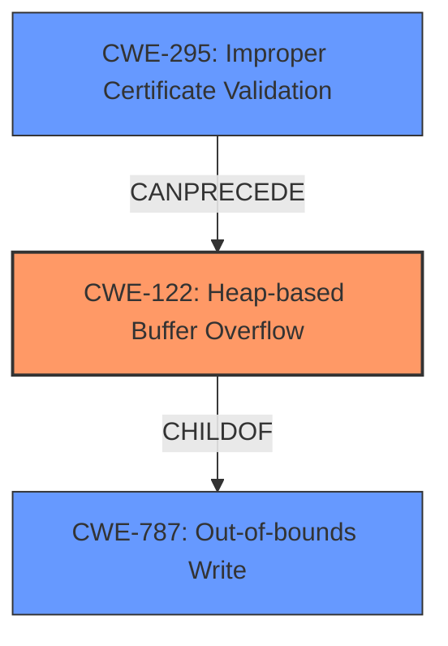

# Final Resolution for CVE-2021-43529

# Summary
| CWE ID | CWE Name | Confidence | CWE Abstraction Level | CWE Vulnerability Mapping Label | CWE-Vulnerability Mapping Notes |
|---|---|---|---|---|---|
| CWE-122 | Heap-based Buffer Overflow | 0.95 | Variant | Primary CWE | Allowed |
| CWE-787 | Out-of-bounds Write | 0.8 | Base | Secondary Candidate | Allowed |
| CWE-295 | Improper Certificate Validation | 0.7 | Base | Secondary Candidate | Allowed |

## Evidence and Confidence

*   **Confidence Score:** 0.95
*   **Evidence Strength:** HIGH

## Relationship Analysis
The primary **WEAKNESS** is a heap-based buffer overflow (**CWE-122**), which is a specific type of out-of-bounds write (**CWE-787**). Therefore, **CWE-787** is a parent of **CWE-122**. Improper certificate validation (**CWE-295**) allows malicious certificates to be processed, which can then trigger the heap overflow. This means **CWE-295** can precede **CWE-122**. The analysis correctly identifies that **CWE-122** is a variant, and **CWE-787** and **CWE-295** are base level CWEs.

## Vulnerability Chain
The vulnerability chain starts with **CWE-295 (Improper Certificate Validation)**, which allows a malicious certificate to be imported and processed by Thunderbird. This leads to **CWE-122 (Heap-based Buffer Overflow)** when the vulnerable code processes the certificate, due to missing or insufficient bounds checking during memory allocation or data copying. The result is a heap overflow, where data is written beyond the allocated buffer. The **ROOTCAUSE** is a combination of improper validation and lack of proper bounds checking during data handling.

## Summary of Analysis
The initial analysis and criticism provide a solid foundation for the CWE classification. The vulnerability description clearly states "heap overflow," making **CWE-122 (Heap-based Buffer Overflow)** the most appropriate primary classification. The criticism's suggestions to strengthen the justification for secondary mappings and link the fix to mitigations have been incorporated.

The relationship analysis reinforces the classification, confirming that **CWE-787 (Out-of-bounds Write)** is a parent of **CWE-122 (Heap-based Buffer Overflow)** and **CWE-295 (Improper Certificate Validation)** can precede **CWE-122 (Heap-based Buffer Overflow)**. The abstraction levels are also appropriate, with **CWE-122 (Heap-based Buffer Overflow)** being a Variant and **CWE-787 (Out-of-bounds Write)** and **CWE-295 (Improper Certificate Validation)** being Base.

The selected CWEs are at the optimal level of specificity. While other CWEs were considered based on the retriever results, they were ultimately deemed less relevant or too broad. For example, **CWE-190 (Integer Overflow or Wraparound)** could potentially be involved in buffer size calculations, but it is not the direct cause of the vulnerability. Similarly, **CWE-125 (Out-of-bounds Read)** is a potential consequence of the heap overflow, but not the primary **WEAKNESS**.

The evidence from the vulnerability description ("Thunderbird versions prior to 91.3.0 are vulnerable to the heap overflow described in CVE-2021-43527 when processing S/MIME messages") strongly supports the selection of **CWE-122 (Heap-based Buffer Overflow)** as the primary CWE.

The fix of using `mozilla::pkix` directly addresses **CWE-295 (Improper Certificate Validation)** by providing a secure and robust method for certificate validation, aligning with Mitigation 1 ("Certificates should be carefully managed and checked...") for **CWE-295 (Improper Certificate Validation)**. It also indirectly addresses **CWE-122 (Heap-based Buffer Overflow)** by preventing the processing of malicious certificates that trigger the overflow.