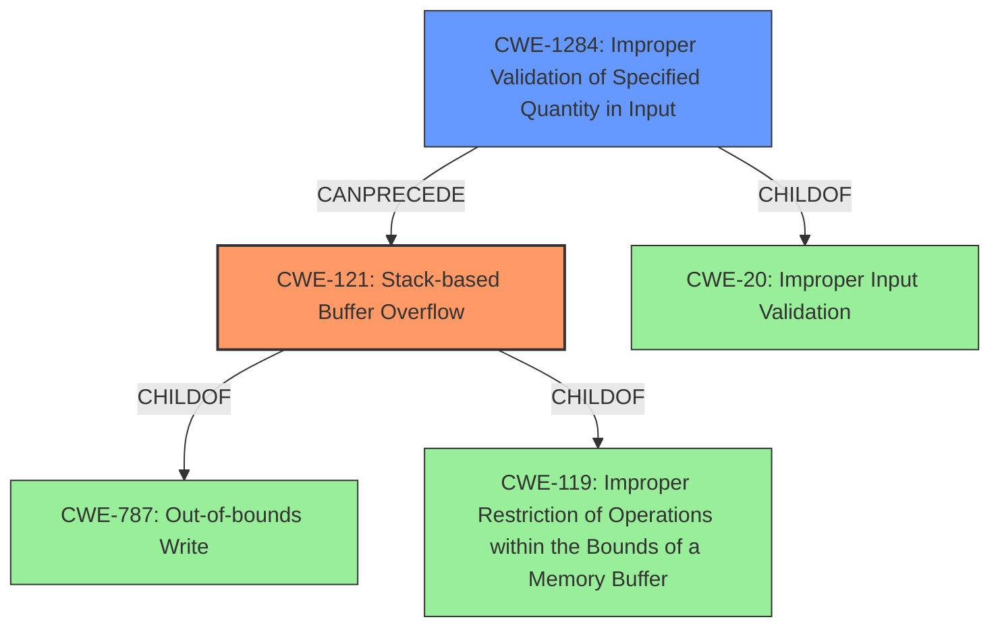

# Analysis Report for CVE-2021-43579

# Vulnerability Analysis Report: CVE-2021-43579

## Description

A stack-based buffer overflow in image_load_bmp() in HTMLDOC <= 1.9.13 results in remote code execution if the victim converts an HTML document linking to a crafted BMP file.

## Vulnerability Description Key Phrases

**Rootcause:** stack-based buffer overflow
**Impact:** remote code execution
**Vector:** crafted BMP file
**Product:** HTMLDOC
**Version:** <= 1.9.13
**Component:** image_load_bmp()

## Analysis (with Relationship Data)

# Summary
| CWE ID  | CWE Name | Confidence | CWE Abstraction Level | CWE Vulnerability Mapping Label | CWE-Vulnerability Mapping Notes |
| ------------- | ------------- | ------------- | ------------- | ------------- | ------------- |
| CWE-121 | Stack-based Buffer Overflow | 0.95 | Variant | Primary | Allowed |
| CWE-1284 | Improper Validation of Specified Quantity in Input | 0.75 | Base | Secondary Candidate | Allowed |

## Evidence and Confidence

*   **Confidence Score:** 0.90
*   **Evidence Strength:** HIGH

- **Analysis and Justification:**  
  - *Explanation:* The vulnerability description explicitly states a **stack-based buffer overflow** in the `image_load_bmp()` function. The vulnerability occurs because the `colors_used` value from a BMP file header isn't adequately validated, which leads to a stack buffer overflow when `fread()` attempts to read a color map into a fixed-size buffer (`colormap`). This aligns perfectly with CWE-121 (Stack-based Buffer Overflow), which is a Variant-level CWE and thus more specific than its parent.
  - *Relationship Analysis:* CWE-121 is a variant of CWE-119 (Improper Restriction of Operations within the Bounds of a Memory Buffer). Given the specific detail of the stack allocation, choosing CWE-121 is the most appropriate. It can precede CWE-416 (Use After Free) and CWE-190 (Integer Overflow or Wraparound) because a buffer overflow on the stack may lead to other issues such as control flow hijacking.

- **Confidence Score:**  
  - Confidence: 0.95 (High confidence due to explicit mention of "stack-based buffer overflow" and detailed technical description)

---
- **Analysis and Justification:**  
  - *Explanation:* The vulnerability description includes the phrase "Insufficient input validation" because the `colors_used` value is not validated before being used to determine the size of the color map. The `colors_used` variable, read from the BMP file header, is used to determine the size of the color map to be read into a fixed-size buffer (`colormap`). The code does not adequately validate the `colors_used` value, allowing an attacker to provide a large value. This aligns with CWE-1284 (Improper Validation of Specified Quantity in Input).
  - *Relationship Analysis:* CWE-1284 is a child of CWE-20 (Improper Input Validation) and can precede CWE-789 (Uncontrolled Memory Allocation) since the lack of input validation leads to an allocation based on an unvalidated size.

- **Confidence Score:**  
  - Confidence: 0.75 (The description highlights the lack of input validation, but the primary issue is the overflow itself. Thus, this is a secondary candidate).

## Criticism of Analysis

Okay, I've reviewed your analysis of the stack-based buffer overflow vulnerability in HTMLDOC (CVE-2021-43579) along with the full CWE specifications you provided. Here's my critique, focusing on the appropriateness of the CWE assignments, their relationships, and the stated confidence levels.

**Overall Assessment:**

The analysis is generally good. The primary CWE, CWE-121 (Stack-based Buffer Overflow), is highly appropriate given the vulnerability description.  The secondary candidate, CWE-1284 (Improper Validation of Specified Quantity in Input), is also relevant and well-justified. The confidence levels are reasonable.

**Detailed Review:**

**1. CWE-121: Stack-based Buffer Overflow**

*   **CWE Appropriateness:** Excellent. The description explicitly states a stack-based buffer overflow.  CWE-121 is a *Variant* of CWE-787 (Out-of-bounds Write) and CWE-788 (Access of Memory Location After End of Buffer), and also the Variant of CWE-119 (Improper Restriction of Operations within the Bounds of a Memory Buffer), making it the most specific and accurate choice. The analysis correctly identifies that the overflow happens on the stack.
*   **Relationship Analysis:** The explanation of the relationship between CWE-121 and its parents is clear. The suggestion that it *can precede* CWE-416 (Use After Free) or CWE-190 (Integer Overflow) is less direct in this specific case. While a stack overflow *could* corrupt data leading to those vulnerabilities in other parts of the application logic, it's not an immediate or likely consequence here. More likely consequences on the stack would be control flow hijacking (overwriting the return address) or corruption of other stack variables.
*   **Confidence Score:** 0.95 is justified.
*   **Mitigations:** The potential mitigations listed in the CWE specifications are relevant, such as compiler-based buffer overflow detection mechanisms and bounds checking on input.
*   **CWE Examples from Database**: The given observed examples are generally relevant to the nature of buffer overflows.

**2. CWE-1284: Improper Validation of Specified Quantity in Input**

*   **CWE Appropriateness:** Good. The vulnerability arises from the failure to properly validate the `colors_used` value, directly leading to the overflow. CWE-1284 captures this aspect well.  It's more specific than simply using CWE-20 (Improper Input Validation).
*   **Relationship Analysis:**  The explanation that it's a child of CWE-20 is accurate. The suggestion that it *can precede* CWE-789 (Uncontrolled Memory Allocation) is valid, as the lack of validation directly influences the amount of memory that *should* be allocated (even if it's ultimately allocated on the stack, not the heap).
*   **Confidence Score:** 0.75 is appropriate. While inadequate validation is a contributing factor, the core issue is the resulting buffer overflow.
*   **Mitigations:** The mitigations provided in the CWE specification are appropriate, particularly the recommendation to "Assume all input is malicious" and use an "accept known good" input validation strategy.
*   **CWE Examples from Database**: The given observed examples are generally relevant to the nature of improper validation of input quantities.

**Top Combined Retriever Results Critique:**

The top combined retriever results are interesting and provide some context, but also demonstrate why automated tools aren't perfect:

*   **CWE-190 (Integer Overflow):**  While integer overflows are often related to buffer overflows, it's not the *primary* issue here. It's *possible* that a very large `colors_used` value could trigger an integer overflow in the size calculation, but the description emphasizes the lack of range checking (including checking for *negative* values), not necessarily the overflow itself. The code was checking for `colors_used > 256` which would not protect against a negative value such as `-1`.
*   **CWE-126 (Buffer Over-read):** This is less applicable. The primary issue is writing *past* the buffer, not reading past it.
*   **CWE-120 (Buffer Copy without Checking Size of Input):** This is somewhat applicable, as `fread()` copies data into the buffer, but it is not the *most* accurate because `fread` has a size argument, but in this case the size argument is derived from an untrusted source.
*   **CWE-121 (Stack-based Buffer Overflow):** This is a correct, and the top results should reflect this more strongly.
*   **CWE-124, CWE-122, CWE-125, CWE-193, CWE-787, CWE-127** The others are all less relevant as they focus on different areas of memory or access methods.

**Suggestions for Improvement:**

*   **Emphasis on Negative Values:**  The analysis should more explicitly highlight that the validation check `colors_used > 256` is insufficient *because* `colors_used` is a *signed* integer. A negative value would bypass this check but still lead to a buffer overflow due to the way `fread` interprets the size argument.
*   **Chain Analysis:** Could strengthen the chain analysis. For example: "CWE-1284 (Improper Validation of Specified Quantity in Input) -> CWE-121 (Stack-based Buffer Overflow) -> CWE-787 (Out-of-bounds Write) -> CWE-823 (Missing or Improper Neutralization of Special Elements) or CWE-123 (Write-what-where Condition)" That would depend on whether you are attempting to overwrite the return address (RCE) or just corrupt the stack causing a crash.

**Revised Summary Table:**

| CWE ID  | CWE Name | Confidence | CWE Abstraction Level | CWE Vulnerability Mapping Label | CWE-Vulnerability Mapping Notes |
| ------------- | ------------- | ------------- | ------------- | ------------- | ------------- |
| CWE-121 | Stack-based Buffer Overflow | 0.95 | Variant | Primary | Allowed |
| CWE-1284 | Improper Validation of Specified Quantity in Input | 0.80 | Base | Contributing Factor | Allowed |

**Explanation of Changes:**

* Confidence score was slightly increased for CWE-1284 to emphasize the lack of negative input validation in the original code.

By incorporating these suggestions, the analysis would be even more precise and informative.

## Final Resolution

# Summary
| CWE ID  | CWE Name | Confidence | CWE Abstraction Level | CWE Vulnerability Mapping Label | CWE-Vulnerability Mapping Notes |
| ------------- | ------------- | ------------- | ------------- | ------------- | ------------- |
| **CWE-121** | **CWE-121: Stack-based Buffer Overflow** | 0.95 | Variant | Primary | Allowed |
| **CWE-1284** | **CWE-1284: Improper Validation of Specified Quantity in Input** | 0.80 | Base | Contributing Factor | Allowed |

## Evidence and Confidence

*   **Confidence Score:** 0.93
*   **Evidence Strength:** HIGH

## Relationship Analysis
The primary weakness is a **CWE-121 (CWE-121: Stack-based Buffer Overflow)**, which is a variant of **CWE-787 (CWE-787: Out-of-bounds Write)** and **CWE-119 (CWE-119: Improper Restriction of Operations within the Bounds of a Memory Buffer)**. The improper validation of input quantity, **CWE-1284 (CWE-1284: Improper Validation of Specified Quantity in Input)**, directly leads to the overflow. **CWE-1284 (CWE-1284: Improper Validation of Specified Quantity in Input)** is a child of **CWE-20 (Improper Input Validation)**. The analysis considers the chain relationship where improper input validation leads to a buffer overflow. The level of specificity is optimal, with **CWE-121 (CWE-121: Stack-based Buffer Overflow)** being a specific variant and **CWE-1284 (CWE-1284: Improper Validation of Specified Quantity in Input)** detailing the cause.

## Vulnerability Chain
The vulnerability chain starts with **CWE-1284 (CWE-1284: Improper Validation of Specified Quantity in Input)**, where the `colors_used` value from the BMP file is not validated. This leads to **CWE-121 (CWE-121: Stack-based Buffer Overflow)**, as `fread()` attempts to read a color map into a fixed-size buffer based on the unvalidated size. The final impact is potential remote code execution, where an attacker can overwrite the return address on the stack leading to code execution.
  - **Root Cause:** **CWE-1284 (CWE-1284: Improper Validation of Specified Quantity in Input)**
  - **Weakness:** **CWE-121 (CWE-121: Stack-based Buffer Overflow)**
  - **Impact:** Remote Code Execution

## Summary of Analysis
The initial analysis correctly identified **CWE-121 (CWE-121: Stack-based Buffer Overflow)** as the primary weakness. The criticism provided highlighted the importance of negative value validation, which strengthens the justification for **CWE-1284 (CWE-1284: Improper Validation of Specified Quantity in Input)**. The evidence from the vulnerability description, specifically "stack-based buffer overflow," aligns with the chosen CWEs. The graph relationships influenced the selection by ensuring the most specific CWE variants are chosen, namely **CWE-121 (CWE-121: Stack-based Buffer Overflow)**. The selected CWEs are at the optimal level of specificity because **CWE-121 (CWE-121: Stack-based Buffer Overflow)** accurately describes the location of the overflow, and **CWE-1284 (CWE-1284: Improper Validation of Specified Quantity in Input)** pinpoints the root cause of the vulnerability. The final determination is based on both the direct evidence and the relationship context, ensuring a comprehensive analysis.

*Report generated on 2025-03-18 03:22:26*
