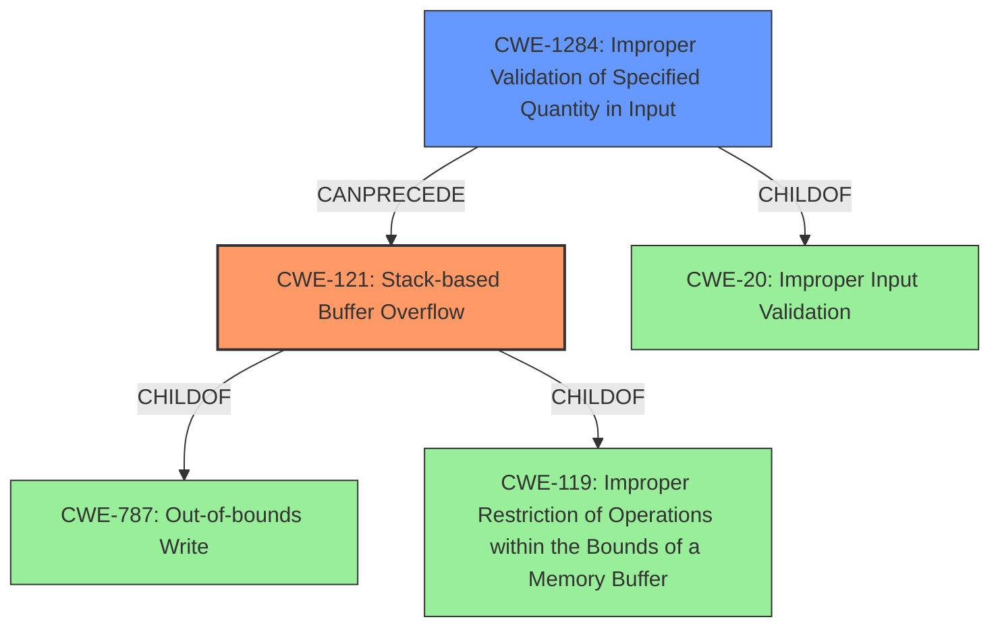

# Final Resolution for CVE-2021-43579

# Summary
| CWE ID  | CWE Name | Confidence | CWE Abstraction Level | CWE Vulnerability Mapping Label | CWE-Vulnerability Mapping Notes |
| ------------- | ------------- | ------------- | ------------- | ------------- | ------------- |
| **CWE-121** | **CWE-121: Stack-based Buffer Overflow** | 0.95 | Variant | Primary | Allowed |
| **CWE-1284** | **CWE-1284: Improper Validation of Specified Quantity in Input** | 0.80 | Base | Contributing Factor | Allowed |

## Evidence and Confidence

*   **Confidence Score:** 0.93
*   **Evidence Strength:** HIGH

## Relationship Analysis
The primary weakness is a **CWE-121 (CWE-121: Stack-based Buffer Overflow)**, which is a variant of **CWE-787 (CWE-787: Out-of-bounds Write)** and **CWE-119 (CWE-119: Improper Restriction of Operations within the Bounds of a Memory Buffer)**. The improper validation of input quantity, **CWE-1284 (CWE-1284: Improper Validation of Specified Quantity in Input)**, directly leads to the overflow. **CWE-1284 (CWE-1284: Improper Validation of Specified Quantity in Input)** is a child of **CWE-20 (Improper Input Validation)**. The analysis considers the chain relationship where improper input validation leads to a buffer overflow. The level of specificity is optimal, with **CWE-121 (CWE-121: Stack-based Buffer Overflow)** being a specific variant and **CWE-1284 (CWE-1284: Improper Validation of Specified Quantity in Input)** detailing the cause.

## Vulnerability Chain
The vulnerability chain starts with **CWE-1284 (CWE-1284: Improper Validation of Specified Quantity in Input)**, where the `colors_used` value from the BMP file is not validated. This leads to **CWE-121 (CWE-121: Stack-based Buffer Overflow)**, as `fread()` attempts to read a color map into a fixed-size buffer based on the unvalidated size. The final impact is potential remote code execution, where an attacker can overwrite the return address on the stack leading to code execution.
  - **Root Cause:** **CWE-1284 (CWE-1284: Improper Validation of Specified Quantity in Input)**
  - **Weakness:** **CWE-121 (CWE-121: Stack-based Buffer Overflow)**
  - **Impact:** Remote Code Execution

## Summary of Analysis
The initial analysis correctly identified **CWE-121 (CWE-121: Stack-based Buffer Overflow)** as the primary weakness. The criticism provided highlighted the importance of negative value validation, which strengthens the justification for **CWE-1284 (CWE-1284: Improper Validation of Specified Quantity in Input)**. The evidence from the vulnerability description, specifically "stack-based buffer overflow," aligns with the chosen CWEs. The graph relationships influenced the selection by ensuring the most specific CWE variants are chosen, namely **CWE-121 (CWE-121: Stack-based Buffer Overflow)**. The selected CWEs are at the optimal level of specificity because **CWE-121 (CWE-121: Stack-based Buffer Overflow)** accurately describes the location of the overflow, and **CWE-1284 (CWE-1284: Improper Validation of Specified Quantity in Input)** pinpoints the root cause of the vulnerability. The final determination is based on both the direct evidence and the relationship context, ensuring a comprehensive analysis.