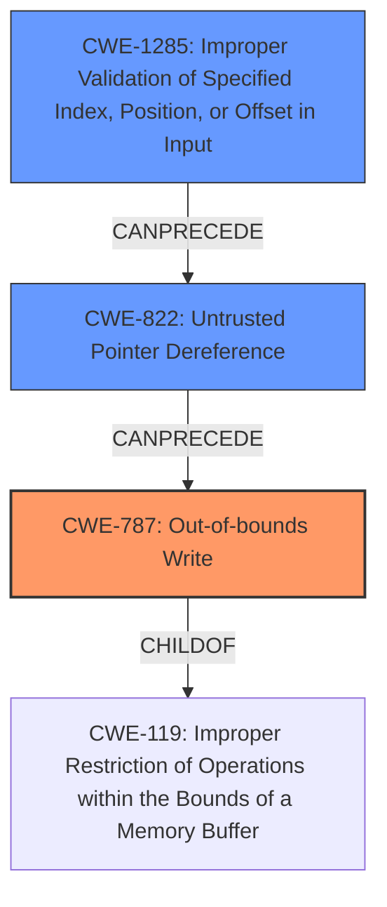

# Final Resolution for CVE-2021-43615

# Summary
| CWE ID | CWE Name | Confidence | CWE Abstraction Level | CWE Vulnerability Mapping Label | CWE-Vulnerability Mapping Notes |
|---|---|---|---|---|---|
| CWE-787 | Out-of-bounds Write | 0.95 | Base | Allowed | Primary CWE |
| CWE-1285 | Improper Validation of Specified Index, Position, or Offset in Input | 0.90 | Base | Allowed | Secondary Candidate |
| CWE-822 | Untrusted Pointer Dereference | 0.70 | Base | Allowed | Secondary Candidate |

## Evidence and Confidence

*   **Confidence Score:** 0.90
*   **Evidence Strength:** HIGH

## Relationship Analysis
The primary weakness is **CWE-787 (Out-of-bounds Write)**, which occurs due to a lack of proper input validation on buffer addresses, represented by **CWE-1285 (Improper Validation of Specified Index, Position, or Offset in Input)**. This lack of validation could potentially lead to an **untrusted pointer dereference (CWE-822)**, which then enables the out-of-bounds write. Thus, CWE-1285 can precede CWE-822, and CWE-822 can precede CWE-787, forming a vulnerability chain. CWE-787 is a child of **CWE-119 (Improper Restriction of Operations within the Bounds of a Memory Buffer)**, but CWE-787 is more specific and thus a better fit.

## Vulnerability Chain
The vulnerability chain starts with **CWE-1285 (Improper Validation of Specified Index, Position, or Offset in Input)**, where the lack of proper validation of buffer addresses allows an attacker to potentially use System Management RAM (SMRAM), Memory-Mapped I/O (MMIO), or OS kernel addresses, which should not be accessible from that context. This can lead to **CWE-822 (Untrusted Pointer Dereference)** if the unvalidated address is directly converted into a pointer and dereferenced. Finally, this culminates in **CWE-787 (Out-of-bounds Write)**, where the attacker is able to write fixed or predictable data to SMRAM, causing memory corruption and potentially escalating privileges to SMM.

## Summary of Analysis
The initial analysis correctly identified **CWE-787 (Out-of-bounds Write)** as the primary **WEAKNESS**, which directly aligns with the reported memory corruption in SMRAM. The criticism highlighted the importance of considering the root cause, which is the lack of validation on buffer addresses, and suggested **CWE-1285 (Improper Validation of Specified Index, Position, or Offset in Input)** as a more fundamental issue.

The vulnerability description states: "a lack of proper validation of buffer addresses when using the `Communicate()` function of the `EFI_SMM_COMMUNICATION_PROTOCOL`. This allows an attacker to potentially use System Management RAM (SMRAM), Memory-Mapped I/O (MMIO), or OS kernel addresses, which should not be accessible from that context." This is direct evidence for **CWE-1285 (Improper Validation of Specified Index, Position, or Offset in Input)**.

The graph relationships further support this analysis, as **CWE-1285 (Improper Validation of Specified Index, Position, or Offset in Input)** can precede **CWE-822 (Untrusted Pointer Dereference)** and **CWE-787 (Out-of-bounds Write)** in a vulnerability chain. While **CWE-822 (Untrusted Pointer Dereference)** is a plausible secondary CWE, the available information doesn't definitively confirm that an untrusted value is *directly* converted to a pointer. Therefore, the confidence level for **CWE-822 (Untrusted Pointer Dereference)** is slightly lower.

The final selection prioritizes **CWE-787 (Out-of-bounds Write)** as the primary CWE due to the direct evidence of memory corruption. **CWE-1285 (Improper Validation of Specified Index, Position, or Offset in Input)** is added as a secondary CWE because it represents the root cause of the vulnerability. **CWE-822 (Untrusted Pointer Dereference)** is retained as a secondary candidate with a slightly reduced confidence level, acknowledging its potential role in the vulnerability chain. These selections are at the optimal level of specificity, as they provide a clear and accurate representation of the **ROOTCAUSE** and the resulting **WEAKNESS**.