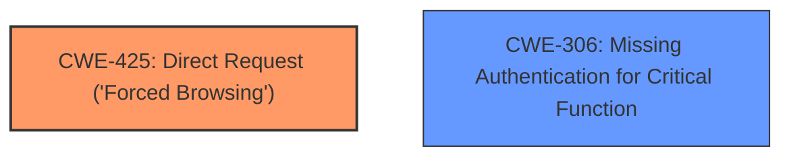

# Final Resolution for CVE-2021-43703

# Summary
| CWE ID | CWE Name | Confidence | CWE Abstraction Level | CWE Vulnerability Mapping Label | CWE-Vulnerability Mapping Notes |
|---|---|---|---|---|---|
| **CWE-425** | **CWE-425: Direct Request ('Forced Browsing')** | 0.9 | Base | Allowed | Primary CWE |
| CWE-306 | CWE-306: Missing Authentication for Critical Function | 0.6 | Base | Allowed | Secondary Candidate |

## Evidence and Confidence

*   **Confidence Score:** 0.9
*   **Evidence Strength:** HIGH

## Relationship Analysis
The primary weakness is **CWE-425: Direct Request ('Forced Browsing')** which is a base-level CWE. While **CWE-306: Missing Authentication for Critical Function** is a related concern, **CWE-425** more precisely captures the vulnerability's nature. There is no parent-child relationship between the selected CWEs. The analysis benefits from focusing on the direct request aspect, as the client-side check is bypassed, which means the application is not adequately enforcing access controls, leading to direct access of the admin console.

## Vulnerability Chain
The vulnerability chain starts with a missing or inadequate server-side access control check (**CWE-425**). The client-side JavaScript redirect is intended to control access, but since it can be bypassed, the application effectively has a **missing authentication for critical function** (**CWE-306**). The impact is unauthorized access to the administrator console.

## Summary of Analysis
The initial analysis and the criticism both agree that **CWE-425: Direct Request ('Forced Browsing')** is the most appropriate primary **WEAKNESS**. The vulnerability allows direct access to the administrator console by disabling JavaScript, which bypasses the intended authentication mechanism. The evidence is strong and the confidence is high. The criticism suggested elaborating on mitigation strategies and reinforcing server-side enforcement. I agree with this and have adjusted the confidence score to reflect the high evidence and justification of the initial analysis. The selection of **CWE-425** is at the optimal level of specificity as it is a Base CWE and captures the direct request aspect of the vulnerability. The reliance on client-side controls is a **ROOTCAUSE** that leads to the **CWE-425**.