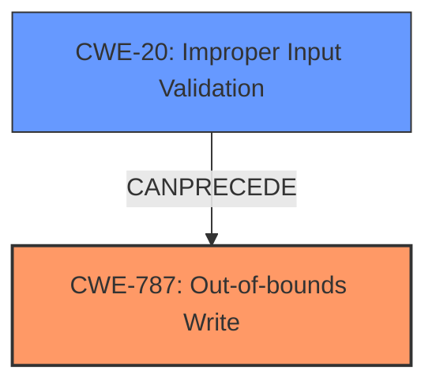

# Final Resolution for CVE-2021-43754

# Summary
| CWE ID | CWE Name | Confidence | CWE Abstraction Level | CWE Vulnerability Mapping Label | CWE-Vulnerability Mapping Notes |
|---|---|---|---|---|---|
| CWE-787 | Out-of-bounds Write | 0.9 | Base | Allowed | Primary CWE. Directly indicated by the vulnerability description. |
| CWE-20 | Improper Input Validation | 0.6 | Class | Allowed | Secondary CWE. The "insecure handling of a malicious file" suggests a failure in validating the file's contents. |

## Evidence and Confidence

*   **Confidence Score:** 0.8
*   **Evidence Strength:** MEDIUM

## Relationship Analysis
The primary CWE is CWE-787 (**Out-of-bounds Write**). The analysis correctly identifies this as the primary issue. The criticism suggests that the "insecure handling" aspect could be further investigated. I agree with this assessment. The description implies that the application is not validating the structure or size of the malicious file, which leads to the out-of-bounds write. This points to **CWE-20: Improper Input Validation** as a potential contributing factor.

The relationship between CWE-20 and CWE-787 is that improper input validation (CWE-20) can *precede* an out-of-bounds write (CWE-787). If the application doesn't properly validate the input file, it may allocate an incorrect amount of memory or write data beyond the buffer's boundaries when processing the file.

## Vulnerability Chain
The vulnerability chain starts with the **ROOTCAUSE** **CWE-20 (Improper Input Validation)**. The application fails to validate the malicious file, leading to a condition where it attempts to write data outside the allocated buffer. This results in **CWE-787 (Out-of-bounds Write)**, which allows arbitrary code execution.

## Summary of Analysis
The initial analysis correctly identified **CWE-787 (Out-of-bounds Write)** as the primary weakness. The vulnerability description explicitly states "Out-of-bounds Write vulnerability due to insecure handling of a malicious file".

The criticism highlights the "insecure handling" aspect, which is a key point. The phrase "insecure handling of a malicious file" suggests a lack of proper input validation. Therefore, I'm adding **CWE-20 (Improper Input Validation)** as a secondary CWE because it is a likely **ROOTCAUSE** that leads to the **WEAKNESS** of **CWE-787 (Out-of-bounds Write)**.

The CWEs selected are at the optimal level of specificity. **CWE-787 (Out-of-bounds Write)** is a base level CWE and accurately describes the direct consequence of the vulnerability. **CWE-20 (Improper Input Validation)** is also a class-level CWE and is sufficiently specific given the available information.