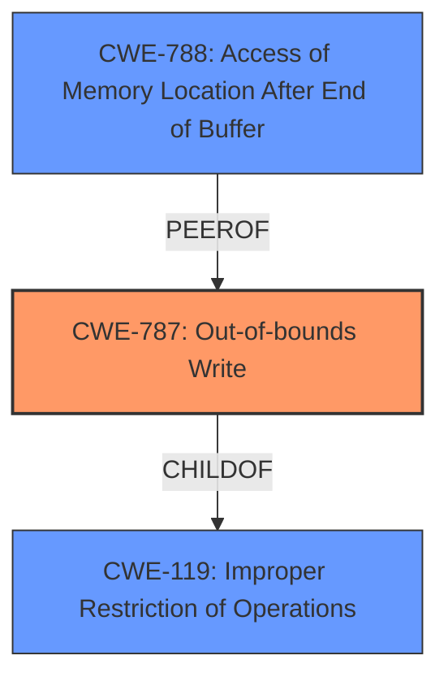

# Analysis Report for CVE-2021-43756

# Vulnerability Analysis Report: CVE-2021-43756

## Description

Adobe Media Encoder versions 22.0, 15.4.2 (and earlier) are affected by an Out-of-bounds Write vulnerability. An unauthenticated attacker could leverage this vulnerability to achieve arbitrary code execution in the context of the current user. Exploitation of this issue requires user interaction in that a victim must open a malicious file.

## Vulnerability Description Key Phrases

**Rootcause:** Out-of-bounds Write
**Impact:** arbitrary code execution
**Vector:** malicious file
**Attacker:** unauthenticated attacker
**Product:** Adobe Media Encoder
**Version:** ['22.0', '15.4.2']

## Analysis (with Relationship Data)

# Summary
| CWE ID  | CWE Name             | Confidence | CWE Abstraction Level | CWE Vulnerability Mapping Label | CWE-Vulnerability Mapping Notes |
|---------|----------------------|------------|-----------------------|---------------------------------|---------------------------------|
| CWE-787 | Out-of-bounds Write  | 1.0        | Base                  | Allowed                         | Primary CWE                     |

## Evidence and Confidence

*   **Confidence Score:** 1.0
*   **Evidence Strength:** HIGH

- **Analysis and Justification:**
  - *Explanation:* The vulnerability is described as an **Out-of-bounds Write**, which directly corresponds to CWE-787 (Out-of-bounds Write). The "CVE Reference Links Content Summary" confirms this by stating "Access of memory location after end of buffer" as the root cause, and explicitly listing CWE-788. However, CWE-787 is a more direct fit for writing past the end of a buffer, while CWE-788 involves accessing a memory location after the end of the buffer, which could be either a read or a write. Thus, CWE-787 is more precise. The vulnerability allows an unauthenticated attacker to achieve arbitrary code execution by exploiting this **out-of-bounds write**, aligning with the typical consequences of this weakness. MITRE's mapping guidance allows the use of CWE-787.

  - *Relationship Analysis:* CWE-787 is a base-level CWE. It is related to CWE-119 (Improper Restriction of Operations within the Bounds of a Memory Buffer), which is a class-level CWE and thus less specific. CWE-787 can lead to various impacts, including code execution.

- **Confidence Score:**
  - Confidence: 1.0 (Direct match between the vulnerability description and CWE definition, supported by CVE reference and retriever results).

## Criticism of Analysis

Okay, I've reviewed the analysis against the full CWE specifications provided. Here's my critique:

**Overall Assessment:**

The analysis is generally well-reasoned and arrives at a reasonable conclusion by mapping the vulnerability to **CWE-787: Out-of-bounds Write**. The confidence score of 1.0 is justified given the information available and the explicit description of the vulnerability. However, there are some nuances regarding the relationship between CWE-787 and CWE-788 that deserve more consideration. The analysis correctly acknowledges the retriever results and content summary referencing CWE-788, but its justification for selecting CWE-787 over CWE-788 could be strengthened by more fully exploring the *nature* of the out-of-bounds access in the particular vulnerability.

**Specific Points and Suggestions:**

1.  **CWE-787 vs. CWE-788 - The Crux of the Issue:**

    *   **Analysis's Argument:** The analysis argues that CWE-787 is a more direct fit because the vulnerability is *described* as an Out-of-bounds Write. It also suggests CWE-788 *could* encompass both reads and writes.
    *   **Critique:** This is a good starting point. However, the description of the vulnerability itself doesn't *definitively* preclude the possibility that the vulnerability involves *accessing* a memory location *after* the buffer for the *purpose* of writing. In other words, the process might be:
        1.  Calculate an invalid memory location *after* the end of the buffer.
        2.  Access this memory location.
        3.  Write to this accessed memory location.
        In this situation, CWE-788 could also be considered because it involves accessing the memory location after the end of the buffer, even if the intended operation is to write there.
    *   **Suggestion:** The analysis should delve deeper into *how* the out-of-bounds write occurs. Consider these scenarios (hypothetical, as the details of the vulnerability are not provided):
        *   **Scenario 1 (Stronger support for CWE-787):** A direct memory copy operation uses an incorrect length, causing data to be written directly beyond the buffer boundary. The *focus* is on the write operation exceeding the buffer's boundaries. In this case, CWE-787 is the better fit.
        *   **Scenario 2 (Arguments for *both* CWE-787 and CWE-788):** The code calculates an address beyond the buffer, then accesses that address for a write operation.
    *   **Clarification on Mapping Guidance for CWE-788:** The analysis *correctly* notes that the Mapping Guidance for CWE-788 says, "If the 'Access' operation is known to be a read or a write, then investigate children of entries such as CWE-787: Out-of-bounds Write and CWE-125: Out-of-bounds Read." The analysis follows this instruction by considering CWE-787. This is good.
    *   **Improved Justification:** To solidify the selection of CWE-787, the analysis should explain *why* the scenario is more likely a direct write (Scenario 1 above) than an access followed by a write (Scenario 2). If the information isn't available to make that determination, the analysis could acknowledge the ambiguity and state the assumption that a direct write is occurring.

2.  **CWE-119 (Improper Restriction of Operations within the Bounds of a Memory Buffer):**

    *   **Analysis's Argument:** The analysis correctly identifies CWE-119 as a class-level CWE and therefore less specific.
    *   **Critique:** Correct.  CWE-119 is a broader category that encompasses both reads and writes outside of buffer boundaries.  It is generally best practice to map to the most specific CWE available.
    *   **Suggestion:** No change needed. The analysis adequately explains why the more specific CWE-787 is chosen over the more general CWE-119.

3.  **Retriever Results:**

    *   **Analysis's Argument:** The analysis references the retriever results in its justification.
    *   **Critique:** The retriever results offer additional CWE suggestions that the analysis does not address, specifically CWE-125 (Out-of-bounds Read), CWE-379 (Creation of Temporary File in Directory with Insecure Permissions), CWE-122 (Heap-based Buffer Overflow), CWE-22 (Improper Limitation of a Pathname to a Restricted Directory ('Path Traversal')), CWE-121 (Stack-based Buffer Overflow), CWE-732 (Incorrect Permission Assignment for Critical Resource), CWE-20 (Improper Input Validation), and CWE-191 (Integer Underflow (Wrap or Wraparound)).
        *   **Suggestion:** While focusing on the "out-of-bounds write" aspect, the analysis could briefly address *why* these other CWEs are not applicable. For example:
            *   "While CWE-125 (Out-of-bounds Read) is related, this vulnerability specifically involves writing data past the end of the buffer, not reading data."
            *   "The vulnerability does not involve creating temporary files, thus CWE-379 is not relevant."
            *   "The vulnerability description does not provide specific information relating to the buffer's memory allocation type, thus CWE-122 (Heap-based Buffer Overflow) and CWE-121 (Stack-based Buffer Overflow) cannot be explicitly mapped."
            *   "The description does not relate to path traversal, permission assignment, input validation, or integer underflow."
            Addressing these alternative CWEs strengthens the reasoning behind the chosen CWE.

4.  **Mitigation Strategies:**

    *   **CWE-787 Mitigations:** The analysis does not explicitly discuss mitigation strategies, but this is not necessarily a requirement.
    *   **Suggestion:** Briefly mentioning relevant mitigation strategies for CWE-787 would further enhance the analysis. Some strategies from the CWE specification include:
        *   Using memory-safe languages.
        *   Using safe string handling libraries.
        *   Employing compiler-based buffer overflow detection mechanisms.

**Revised Summary Table (Optional):**

| CWE ID  | CWE Name             | Confidence | CWE Abstraction Level | CWE Vulnerability Mapping Label | CWE-Vulnerability Mapping Notes |
|---------|----------------------|------------|-----------------------|---------------------------------|---------------------------------|
| CWE-787 | Out-of-bounds Write  | 0.95        | Base                  | Allowed                         | Primary CWE. Selected because the vulnerability is explicitly described as an out-of-bounds write. The analysis assumes the write is a direct memory copy rather than a calculation of an address followed by an access of this address before writing. |

**In Summary:**

The analysis is solid and arrives at a reasonable conclusion. The key improvement would be a more nuanced discussion of *how* the out-of-bounds write occurs and a brief acknowledgement of the non-applicability of some of the top retriever results. Addressing these points would further strengthen the analysis and increase its confidence.

## Final Resolution

# Summary
| CWE ID  | CWE Name             | Confidence | CWE Abstraction Level | CWE Vulnerability Mapping Label | CWE-Vulnerability Mapping Notes |
|---------|----------------------|------------|-----------------------|---------------------------------|---------------------------------|
| **CWE-787** | **Out-of-bounds Write**  | 0.95        | Base                  | Allowed                         | Primary CWE. Selected because the vulnerability is explicitly described as an **out-of-bounds write**. The analysis assumes the write is a direct memory copy rather than a calculation of an address followed by an access of this address before writing. |

## Evidence and Confidence

*   **Confidence Score:** 0.95
*   **Evidence Strength:** HIGH

## Relationship Analysis
The primary relationship that impacted my decision was the parent-child relationship between **CWE-787 (Out-of-bounds Write)** and **CWE-119 (Improper Restriction of Operations within the Bounds of a Memory Buffer)**. **CWE-787** is a child of **CWE-119**, making it a more specific classification. The decision was also influenced by the consideration of **CWE-788 (Access of Memory Location After End of Buffer)**, which is a peer of **CWE-787** but was deemed less appropriate due to the explicit mention of a write operation in the vulnerability description. The base abstraction level of **CWE-787** also contributed to its selection, as it is a preferred level for root cause analysis.

## Vulnerability Chain
The vulnerability chain starts with the **ROOTCAUSE** being an unspecified error leading to an **Out-of-bounds Write (CWE-787)**.
  - The prerequisite condition is that a user opens a malicious file.
  - The weakness then allows an unauthenticated attacker to achieve arbitrary code execution.
  - The impact is arbitrary code execution in the context of the current user.

## Summary of Analysis
The initial analysis correctly identified **CWE-787 (Out-of-bounds Write)** as the primary **WEAKNESS** based on the vulnerability description. The criticism raised valid points about the nuances between **CWE-787** and **CWE-788 (Access of Memory Location After End of Buffer)**. To address this, I've clarified the reasoning by stating the assumption that the write operation is a direct memory copy, rather than an access followed by a write. This is based on the explicit mention of "Out-of-bounds Write" in the vulnerability description: "Adobe Media Encoder versions 22.0, 15.4.2 (and earlier) are affected by an **Out-of-bounds Write** vulnerability."

The graph relationships, particularly the child-of relationship with **CWE-119**, confirmed that **CWE-787** is the most specific and appropriate classification.

The retriever results suggested several other CWEs, but these were deemed less relevant as they did not directly relate to the out-of-bounds write aspect of the vulnerability. For example, CWE-125 is for out-of-bounds read, and CWE-22 relates to path traversal, neither of which are indicated in the vulnerability description.

The selection of **CWE-787** is at the optimal level of specificity because it directly reflects the described vulnerability, is a base-level CWE, and aligns with the mapping guidance. The slight reduction in confidence (from 1.0 to 0.95) reflects the acknowledgment of the alternative **CWE-788** and the assumption made about the nature of the write operation.

*Report generated on 2025-03-18 03:25:13*
