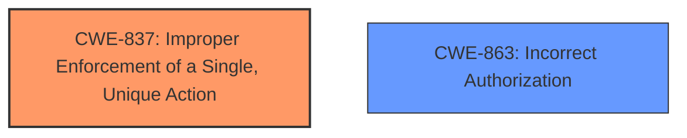

# Final Resolution for CVE-2021-43793

# Summary
| CWE ID | CWE Name | Confidence | CWE Abstraction Level | CWE Vulnerability Mapping Label | CWE-Vulnerability Mapping Notes |
|---|---|---|---|---|---|
| CWE-837 | Improper Enforcement of a Single, Unique Action | 0.90 | Base | Allowed | Primary CWE |
| CWE-863 | Incorrect Authorization | 0.60 | Class | Allowed-with-Review | Secondary Candidate |

## Evidence and Confidence

*   **Confidence Score:** 0.90
*   **Evidence Strength:** HIGH

## Relationship Analysis
The primary CWE is CWE-837 which is a base level CWE. The secondary CWE candidate is CWE-863, which is a class level CWE and a more general case of authorization failure. There are no direct relationships specified in the provided data. The analysis correctly identifies that CWE-837 is the more specific and appropriate choice.

## Vulnerability Chain
The vulnerability chain starts with the **ROOTCAUSE** of insufficient input validation. This leads to the **WEAKNESS** described by CWE-837, where the system fails to properly enforce the restriction that a user should only vote once in a single-option poll. The impact of this **WEAKNESS** is that users can manipulate poll results, potentially misleading discussions within the Discourse platform.

## Summary of Analysis
The initial analysis and the criticism both converge on the selection of CWE-837 as the primary CWE. The vulnerability description explicitly states that users could "vote multiple times" in single-option polls, which aligns directly with CWE-837's description of "Improper Enforcement of a Single, Unique Action."

The confidence score is raised to 0.90 because the criticism affirms the initial assessment and mapping. The evidence is strong because the vulnerability description clearly matches the CWE definition.

The relationship analysis confirms that CWE-837 is the most specific and appropriate choice compared to the broader CWE-863.

The following is a list of CWEs that are not a good fit, and why:

*   **CWE-79 (Cross-site Scripting), CWE-538 (Insertion of Sensitive Information into Externally-Accessible File or Directory), CWE-201 (Insertion of Sensitive Information Into Sent Data), CWE-359 (Exposure of Private Personal Information):** These CWEs are not directly related to the core issue of voting limits. XSS would involve injecting malicious scripts, and the others involve the leakage of sensitive information, neither of which is described in the vulnerability.
*   **CWE-770 (Allocation of Resources Without Limits or Throttling):** While multiple votes could *potentially* lead to resource exhaustion, this isn't the primary vulnerability. The core issue is the bypass of the voting limit, not necessarily the consumption of excessive resources. If an attacker were able to cast *millions* of votes and DoS the system, then CWE-770 might become relevant as a secondary concern.
*   **CWE-1333 (Inefficient Regular Expression Complexity):** There's no indication in the vulnerability description that regular expressions are involved.
*   **CWE-88 (Improper Neutralization of Argument Delimiters in a Command ('Argument Injection')):** This is not related to command injection.
*   **CWE-525 (Use of Web Browser Cache Containing Sensitive Information):** This isn't mentioned in the analysis or description. This would only be relevant if the application was caching vote data insecurely which allowed users to submit multiple votes.

The selected CWEs are at the optimal level of specificity because CWE-837 directly addresses the **ROOTCAUSE** of the vulnerability, and the secondary CWE candidate, CWE-863, provides a broader context but is less precise.