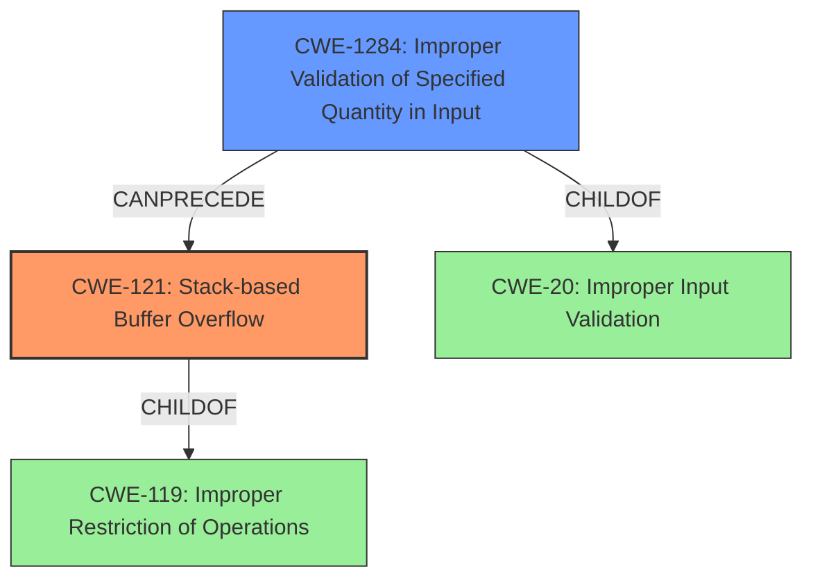

# Final Resolution for CVE-2021-43983

# Summary
| CWE ID | CWE Name | Confidence | CWE Abstraction Level | CWE Vulnerability Mapping Label | CWE-Vulnerability Mapping Notes |
|---|---|---|---|---|---|
| CWE-121 | Stack-based Buffer Overflow | 1.0 | Variant | Allowed | Primary CWE |
| CWE-1284 | Improper Validation of Specified Quantity in Input | 0.7 | Base | Allowed | Secondary Candidate |

## Evidence and Confidence

*   **Confidence Score:** 0.95
*   **Evidence Strength:** HIGH

## Relationship Analysis
The primary relationship impacting the decision is the hierarchical relationship where CWE-121 (Stack-based Buffer Overflow) is a variant of CWE-119 (Improper Restriction of Operations within the Bounds of a Memory Buffer). This confirms that CWE-121 is an appropriate, more specific classification than its parent. CWE-1284 (Improper Validation of Specified Quantity in Input) is considered a potential root cause that *can precede* CWE-121 if the size of input isn't validated and then leads to the overflow.

## Vulnerability Chain
The vulnerability chain starts with a failure to properly validate input (`CWE-1284`). Specifically, a quantity related to the input data (e.g., buffer size) is not validated. This **ROOTCAUSE** can then lead to a stack-based buffer overflow (`CWE-121`) when the program attempts to allocate or copy data based on the unvalidated quantity. The **WEAKNESS** then leads to the ability to execute arbitrary code on the affected system, which is the impact.

## Summary of Analysis
The initial analysis and criticism were both well-reasoned. The vulnerability description explicitly mentions "stack-based buffer overflow," making `CWE-121` a clear and direct match. The criticism correctly suggests that while `CWE-1284` is a plausible secondary candidate, the analysis could be strengthened by providing a more specific example and discussing why other input validation CWEs were not chosen.

I have increased the confidence for CWE-1284 to 0.7 to reflect my agreement with the criticism that this is a valid secondary candidate.

The evidence supporting `CWE-121` is strong: "WECON LeviStudioU Versions 2019-09-21 and prior are vulnerable to multiple stack-based buffer overflow instances...which may allow an attacker to execute arbitrary code." This statement directly aligns with the definition of `CWE-121`.

The graph relationships influenced the final selection by ensuring that the chosen CWEs were at the appropriate level of specificity. `CWE-121` is a variant, providing more detail than its parent `CWE-119`. `CWE-1284` is a potential contributing factor and a root cause that *can precede* the overflow.

I agree with the initial assessment that `CWE-121` and `CWE-1284` are the optimal selections based on the available evidence, the CWE definitions, and the MITRE mapping guidance.