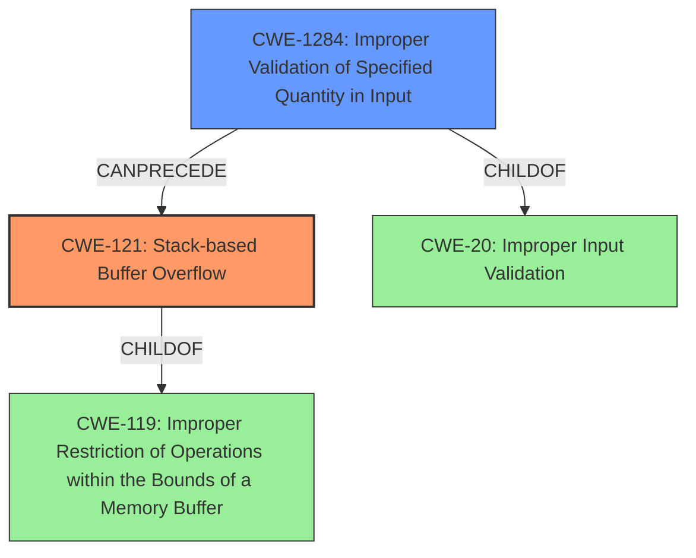

# Analysis Report for CVE-2021-44158

# Vulnerability Analysis Report: CVE-2021-44158

## Description

ASUS RT-AX56U Wi-Fi Router is vulnerable to stack-based buffer overflow due to improper validation for httpd parameter length. An authenticated local area network attacker can launch arbitrary code execution to control the system or disrupt service.

## Vulnerability Description Key Phrases

**Rootcause:** improper validation for httpd parameter length
**Weakness:** stack-based buffer overflow
**Impact:** ['arbitrary code execution', 'disrupt service']
**Attacker:** authenticated local area network attacker
**Product:** ASUS RT-AX56U Wi-Fi Router

## Analysis (with Relationship Data)

# Summary
| CWE ID | CWE Name | Confidence | CWE Abstraction Level | CWE Vulnerability Mapping Label | CWE-Vulnerability Mapping Notes |
|---|---|---|---|---|---|
| CWE-121 | Stack-based Buffer Overflow | 0.95 | Variant | Allowed | Primary CWE |
| CWE-1284 | Improper Validation of Specified Quantity in Input | 0.80 | Base | Allowed | Secondary Candidate |

## Evidence and Confidence

*   **Confidence Score:** 0.90
*   **Evidence Strength:** HIGH

- **Analysis and Justification:**  
  - *Explanation:* The vulnerability is described as a **stack-based buffer overflow** caused by **improper validation for httpd parameter length**. This aligns directly with CWE-121 (Stack-based Buffer Overflow) which is a variant of buffer overflow that occurs on the stack. The vulnerability description key phrases and CVE reference links content summary both confirm this. The retriever results also list CWE-121 as a highly relevant candidate. The root cause is the lack of proper validation of the length of the httpd parameter, which can also be described as CWE-1284 (Improper Validation of Specified Quantity in Input). This is because the length of the parameter is a quantity that needs to be validated to prevent the overflow.

  - *Relationship Analysis:* CWE-121 is a variant of buffer overflow, which is a more general class of vulnerabilities. CWE-1284 (Improper Validation of Specified Quantity in Input) can precede CWE-121 since the lack of input validation is the root cause of the stack-based buffer overflow.

- **Confidence Score:**  
  - Confidence: 0.95 (High confidence due to strong evidence from the vulnerability description and retriever results)
---

## Criticism of Analysis

Okay, here's a breakdown of the analysis, incorporating the full CWE specifications:

**Overall Assessment:**

The analysis is generally very good and provides a well-reasoned mapping of the vulnerability to CWE-121 and CWE-1284.  The confidence levels are appropriately high. The justification is detailed and accurate.

**Detailed Review:**

*   **CWE-121: Stack-based Buffer Overflow (Primary)**

    *   **Confidence:** 0.95 - Justified given the vulnerability description.
    *   **Rationale:** The analysis correctly identifies that the vulnerability is a stack-based buffer overflow. The provided description clearly states a buffer on the stack is being overwritten.
    *   **CWE Specification Alignment:**
        *   The analysis correctly notes that this is a variant.
        *   The description of CWE-121 perfectly matches the observed behavior.
        *   The "Alternative Terms" section doesn't directly apply here, but it's good to be aware of the potential for misinterpretation of "Stack Overflow."
        *   The Relationships (ChildOf -> CWE-788, ChildOf -> CWE-787) are correct.
        *   The "Mapping Guidance" confirms that this is an Allowed CWE with acceptable use.
        *   Mitigation strategies are relevant: Using compiler-based overflow detection, abstraction libraries, and implementing bounds checking are all valid mitigations for stack-based buffer overflows.
        *   The additional notes correctly mention common instantiations of stack-based buffer overflows such as return address overwrites.

*   **CWE-1284: Improper Validation of Specified Quantity in Input (Secondary Candidate)**

    *   **Confidence:** 0.80 - Appropriate, as this is a contributing factor but not the direct vulnerability.
    *   **Rationale:** The analysis correctly identifies that the *root cause* of the overflow is the lack of validation of the input parameter length. CWE-1284 directly addresses this.
    *   **CWE Specification Alignment:**
        *   The analysis correctly notes this is a Base CWE.
        *   The description of CWE-1284 matches the root cause perfectly: "The product receives input that is expected to specify a quantity (such as size or length), but it does not validate or incorrectly validates that the quantity has the required properties."
        *   The Relationships (ChildOf -> CWE-20, CanPrecede -> CWE-789, ParentOf -> CWE-606) are generally correct. The relationship to CWE-20 (Improper Input Validation) is fundamental.  The potential to precede CWE-789 (Memory Allocation with Excessive Size Value) is also plausible, although in this specific case the overflow is more direct than excessive memory allocation. The ParentOf CWE-606 is not directly applicable to this case.
        *   The "Mapping Guidance" confirms that this is an Allowed CWE with acceptable use.
        *   Mitigation strategies are highly relevant:  The primary mitigation is "accept known good" input validation and to validate all potentially relevant properties including length.

**Suggested Improvements/Considerations:**

1.  **CWE-130 Consideration:** While CWE-1284 is a good fit, consider CWE-130 (Improper Handling of Length Parameter Inconsistency) as an alternative *or* a more specific refinement of CWE-1284.  CWE-130 specifically addresses situations where a length field in a structured message is inconsistent with the actual data length. While the description provided doesn't explicitly mention a "length field," the `httpd parameter length` *could* be interpreted as such.  However, given that there is no explicit field containing the length to validate, CWE-1284 is a better fit.

2.  **CWE-20 Refinement:** The relationships to CWE-20 (Improper Input Validation) can be further refined, although this is a discouraged CWE to use. CWE-1284 is a child of CWE-20 so the root cause of the stack-based buffer overflow is that some form of input validation is missing.

3.  **Reviewer Result Relevance:** Note that CWE-120 (Buffer Copy without Checking Size of Input ('Classic Buffer Overflow')) is the top combined retriever result. While CWE-121 is a specific case of a buffer overflow, the 'classic' version of CWE-120 should be considered. However, given that the root cause is improper input validation and not just an unchecked copy, CWE-121 and CWE-1284 are still a stronger fit.

4. **Chain Considerations:** While not a strict requirement, the analysis could benefit from explicitly mentioning the potential for a CWE chain: CWE-1284 -> CWE-121. This highlights that the lack of input validation (CWE-1284) *leads to* the stack-based buffer overflow (CWE-121).

**Revised Summary Table (Optional):**

| CWE ID    | CWE Name                                         | Confidence | CWE Abstraction Level | CWE Vulnerability Mapping Label | CWE-Vulnerability Mapping Notes                                                                            |
| --------- | ------------------------------------------------ | ---------- | ----------------------- | ------------------------------- | ---------------------------------------------------------------------------------------------------------- |
| CWE-121   | Stack-based Buffer Overflow                      | 0.95       | Variant                | Allowed                         | Primary CWE                                                                                             |
| CWE-1284  | Improper Validation of Specified Quantity in Input | 0.80       | Base                   | Allowed                         | Secondary Candidate; Root Cause                                                                        |

**Conclusion:**

The analysis is accurate and well-supported by the provided information and the CWE specifications. The suggested improvements are minor refinements that could further strengthen the analysis and demonstrate a comprehensive understanding of the vulnerability. The decision to prioritize CWE-121 and CWE-1284 is sound.

## Final Resolution

# Summary
| CWE ID | CWE Name | Confidence | CWE Abstraction Level | CWE Vulnerability Mapping Label | CWE-Vulnerability Mapping Notes |
|---|---|---|---|---|---|
| CWE-121 | Stack-based Buffer Overflow | 0.95 | Variant | Allowed | Primary CWE |
| CWE-1284 | Improper Validation of Specified Quantity in Input | 0.80 | Base | Allowed | Secondary Candidate |

## Evidence and Confidence

*   **Confidence Score:** 0.93
*   **Evidence Strength:** HIGH

## Relationship Analysis
The primary relationship impacting the decision is the CANPRECEDE relationship between CWE-1284 and CWE-121. The **improper validation of the input** (CWE-1284) directly leads to the **stack-based buffer overflow** (CWE-121). CWE-121 is a child of CWE-119 (Improper Restriction of Operations within the Bounds of a Memory Buffer), which highlights the fundamental issue of boundary control. The peer relationship of CWE-1284 to CWE-20 (Improper Input Validation) shows that the root cause is a specific case of input validation failure. While CWE-130 (Improper Handling of Length Parameter Inconsistency) was considered, the absence of an explicit length field in the input favors CWE-1284.

## Vulnerability Chain
The vulnerability chain starts with **improper validation of the httpd parameter length (CWE-1284)**. This leads to a condition where an attacker can provide an overly long parameter. The lack of bounds checking when copying this parameter to a stack-based buffer results in a **stack-based buffer overflow (CWE-121)**. This overflow allows the attacker to overwrite data on the stack, potentially including the return address, leading to arbitrary code execution and control of the system.

## Summary of Analysis
The initial analysis and criticism were both accurate and well-justified. The core of the vulnerability lies in the **stack-based buffer overflow (CWE-121)**, directly caused by the **lack of proper input validation (CWE-1284)**. The evidence from the vulnerability description, specifically "improper validation for httpd parameter length" and "stack-based buffer overflow," strongly supports this classification.

The graph relationships further reinforce this conclusion. The CANPRECEDE relationship between CWE-1284 and CWE-121 highlights the causal connection. The CHILDOF relationship of CWE-121 to CWE-119 underscores the violation of memory boundary restrictions. While CWE-130 was considered as a more specific alternative to CWE-1284, it was determined that the lack of an explicit length field makes CWE-1284 a better fit.

The selected CWEs are at the optimal level of specificity. CWE-121 accurately describes the type of buffer overflow, while CWE-1284 pinpoints the root cause of the vulnerability. This combination provides a clear and comprehensive understanding of the vulnerability. The classification decision is based on strong evidence from the vulnerability description, supported by the relationship analysis and mapping guidance.

*Report generated on 2025-03-18 03:28:42*
