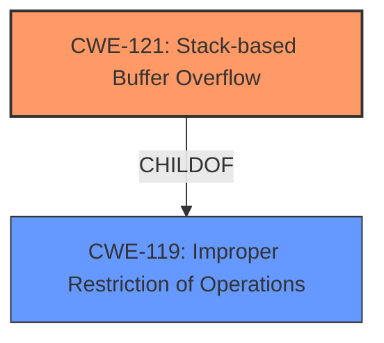

# Analysis Report for CVE-2021-44170

# Vulnerability Analysis Report: CVE-2021-44170

## Description

A stack-based buffer overflow vulnerability [CWE-121] in the command line interpreter of FortiOS before 7.0.4 and FortiProxy before 2.0.8 may allow an authenticated attacker to execute unauthorized code or commands via specially crafted command line arguments.

## Vulnerability Description Key Phrases

**Weakness:** stack-based buffer overflow
**Impact:** execute unauthorized code or commands
**Vector:** specially crafted command line arguments
**Attacker:** authenticated attacker
**Product:** ['FortiOS', 'FortiProxy']
**Version:** ['before 7.0.4', 'before 2.0.8']
**Component:** command line interpreter

## Analysis (with Relationship Data)

# Summary
| CWE ID | CWE Name | Confidence | CWE Abstraction Level | CWE Vulnerability Mapping Label | CWE-Vulnerability Mapping Notes |
|---|---|---|---|---|---|
| CWE-121 | Stack-based Buffer Overflow | 1.0 | Variant | Primary | Allowed |

## Evidence and Confidence

*   **Confidence Score:** 1.0
*   **Evidence Strength:** HIGH

- **Analysis and Justification:**  
  - *Explanation:* The vulnerability description explicitly states a "**stack-based buffer overflow** vulnerability" [CWE-121]. The CVE Reference Links Content Summary also confirms the root cause is a "**stack-based buffer overflow**". This directly matches CWE-121 (Stack-based Buffer Overflow), which is a Variant level CWE and is ALLOWED. The attacker can execute unauthorized code or commands via specially crafted command line arguments.

  - *Relationship Analysis:* CWE-121 is a variant of the more general CWE-119 (Improper Restriction of Operations within the Bounds of a Memory Buffer). Since the vulnerability is explicitly a stack-based buffer overflow, CWE-121 is more specific and appropriate than CWE-119.

- **Confidence Score:**  
  - Confidence: 1.0 (High evidence from technical description and CVE reference materials)

## Criticism of Analysis

Okay, I have reviewed the provided analysis along with the full CWE specifications for each of the mentioned CWEs. Here's a critique:

**Overall Assessment:**

The analysis is accurate and well-justified. The primary mapping to CWE-121 (Stack-based Buffer Overflow) is correct and supported by strong evidence from the vulnerability description and CVE references. The confidence score of 1.0 is appropriate.

**Detailed Critique:**

1.  **CWE-121 Mapping:**

    *   **Accuracy:** The analysis correctly identifies CWE-121 as the most appropriate CWE. The description clearly states "stack-based buffer overflow", and the CVE content summary reinforces this.
    *   **Justification:** The reasoning provided in the analysis is sound. It correctly points out that CWE-121 is a *Variant* of CWE-119, making it more specific and accurate for this scenario.  The fact that it is an "ALLOWED" CWE is another indicator.
    *   **CWE Specifications Compliance:** The analysis aligns perfectly with the CWE-121 specification. The description "A stack-based buffer overflow condition is a condition where the buffer being overwritten is allocated on the stack (i.e., is a local variable or, rarely, a parameter to a function)" matches the vulnerability.
    *   **Mitigations:** The analysis doesn't specifically mention mitigations, but it's implied that standard buffer overflow prevention techniques apply. The CWE-121 specifications list relevant mitigations such as using compiler extensions for buffer overflow detection (/GS flag, FORTIFY_SOURCE), using abstraction libraries, and implementing bounds checking on input.

2.  **Top Combined Results Critique:**

    Here's a look at why the top combined results are *not* the correct mapping, and why the analysis correctly prioritized CWE-121:

    *   **CWE-124 (Buffer Underwrite):** This is incorrect because the vulnerability is explicitly an *overflow*, not an *underwrite*.  The description mentions writing *past* the end of a buffer, not *before* the beginning.
    *   **CWE-120 (Buffer Copy without Checking Size of Input):** While a classic buffer overflow *could* be involved, the *stack-based* nature of the overflow makes CWE-121 more specific.  Also, CWE-120 requires careful review before use (Allowed-with-Review), and there's enough information to choose a more specific CWE.
    *   **CWE-193 (Off-by-one Error):** An off-by-one error *could* contribute to a buffer overflow, but it's not the fundamental issue. The primary cause is exceeding the buffer's boundaries on the stack, not a calculation error of one byte.
    *   **CWE-1284 (Improper Validation of Specified Quantity in Input):**  While related to input validation, this CWE is not the *primary* weakness. The lack of proper size checking during the buffer copy operation is a more direct cause of the overflow. Input validation is a contributing factor, but the core issue is the buffer overflow itself.  A chain could be considered (CWE-20 -> CWE-121), but it's simpler to focus on the direct cause.
    *   **CWE-78 (OS Command Injection):** This is incorrect. While the vulnerability involves command line arguments, there's no indication of OS command injection. The issue is exceeding buffer boundaries, not injecting malicious commands.
    *   **CWE-131 (Incorrect Calculation of Buffer Size):** Similar to CWE-193, this *could* be a contributing factor if the buffer size was incorrectly calculated before the overflow. However, the description focuses on the *overflow* itself, suggesting the buffer was simply not checked, rather than incorrectly sized.
    *   **CWE-122 (Heap-based Buffer Overflow):** Incorrect because the description explicitly states "stack-based" making CWE-121 the clear winner.
    *   **CWE-126 (Buffer Over-read):** Incorrect because the vulnerability is explicitly about an *out-of-bounds write*.
    *   **CWE-269 (Improper Privilege Management):** This is a higher-level concern. While the *impact* of the overflow could involve privilege escalation, CWE-269 isn't the root cause. It's discouraged to use this CWE.

3.  **CWE-119 (Improper Restriction of Operations within the Bounds of a Memory Buffer):**

    *   The analysis correctly identifies that CWE-121 is a specialization of CWE-119. It is good that the analysis recognized this relationship.
    *   The analysis correctly concludes that CWE-121 is the best fit because it is more specific.
    *   The analysis properly notes that CWE-119's usage is discouraged when more specific CWEs are available.

**Improvements and Considerations:**

*   **Chaining:** While the primary mapping to CWE-121 is correct, consider briefly mentioning potential contributing factors as part of a *chain*, particularly CWE-20 (Improper Input Validation) or CWE-131 (Incorrect Calculation of Buffer Size). For example: "The vulnerability is primarily a CWE-121 (Stack-based Buffer Overflow). A contributing factor *could* be CWE-20 (Improper Input Validation) if the command line arguments are not properly validated before being copied into the buffer." However, avoid over-complicating the analysis; only add chains if they significantly improve clarity.
*   **Mitigation Specificity:** Add a brief section on relevant mitigations, drawing from the CWE-121 specifications.  For example, mentioning compiler-based buffer overflow detection or input sanitization.

**Conclusion:**

The analysis is well-executed, accurate, and demonstrates a good understanding of CWE specifications. The justification for choosing CWE-121 is strong, and the reasoning for excluding other potential CWEs is also sound. By adding a brief mention of potential contributing factors (CWE-20, CWE-131) and relevant mitigations, the analysis could be further enhanced.

## Final Resolution

# Summary
| CWE ID | CWE Name | Confidence | CWE Abstraction Level | CWE Vulnerability Mapping Label | CWE-Vulnerability Mapping Notes |
|---|---|---|---|---|---|
| CWE-121 | Stack-based Buffer Overflow | 1.0 | Variant | Primary | Allowed |

## Evidence and Confidence

*   **Confidence Score:** 1.0
*   **Evidence Strength:** HIGH

## Relationship Analysis
The primary relationship considered was the parent-child relationship between CWE-119 (Improper Restriction of Operations within the Bounds of a Memory Buffer) and CWE-121 (Stack-based Buffer Overflow). Since the vulnerability description explicitly states a stack-based buffer overflow, CWE-121, being a variant of CWE-119, is the more specific and appropriate choice. No other relationships significantly influenced the decision.

## Vulnerability Chain
The vulnerability chain consists of a single, direct weakness: a **stack-based buffer overflow** [CWE-121] due to specially crafted command line arguments. The root cause is the lack of proper bounds checking when copying the command-line arguments to a stack-allocated buffer. The consequence is the ability for an authenticated attacker to execute unauthorized code or commands.

## Summary of Analysis
The initial analysis and criticism both converge on the same conclusion: CWE-121 (Stack-based Buffer Overflow) is the most accurate classification for this vulnerability. The evidence is strong, as the vulnerability description explicitly mentions a "stack-based buffer overflow" vulnerability in the command line interpreter of FortiOS.

The graph relationship analysis confirms that CWE-121 is a variant, offering a more specific categorization compared to its parent, CWE-119.

The selection of CWE-121 is at the optimal level of specificity because it directly reflects the technical nature of the vulnerability: a buffer overflow occurring on the stack.

*Report generated on 2025-03-18 03:29:15*
