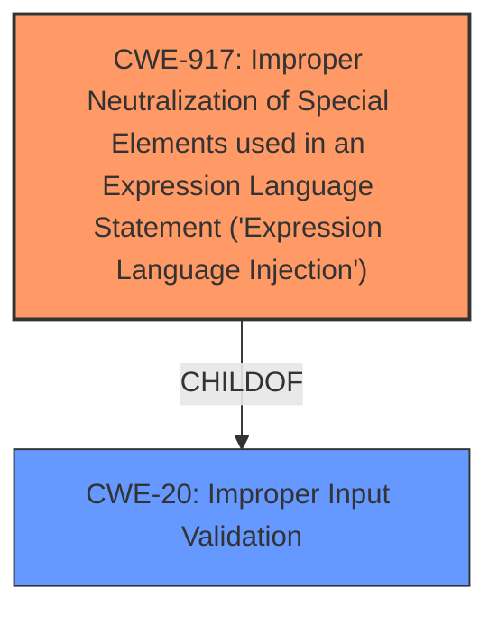

# Final Resolution for CVE-2021-44228

# Summary
| CWE ID | CWE Name | Confidence | CWE Abstraction Level | CWE Vulnerability Mapping Label | CWE-Vulnerability Mapping Notes |
|---|---|---|---|---|---|
| CWE-917 | Improper Neutralization of Special Elements used in an Expression Language Statement ('Expression Language Injection') | 0.90 | Base | Allowed | Primary CWE |
| CWE-20 | Improper Input Validation | 0.50 | Class | Discouraged | Secondary Candidate, Precursor to CWE-917, Root cause|

## Evidence and Confidence

*   **Confidence Score:** 0.90
*   **Evidence Strength:** HIGH

## Relationship Analysis
The primary relationship that impacted my decision was the parent-child relationship between CWE-20 (Improper Input Validation) and CWE-917 (Improper Neutralization of Special Elements used in an Expression Language Statement ('Expression Language Injection')). CWE-20 is a very general **weakness**, while CWE-917 is more specific to expression language injection. While CWE-20 can be considered a root cause, CWE-917 more accurately reflects the specific type of **vulnerability** present in Log4j2.

## Vulnerability Chain
The vulnerability chain starts with **improper input validation (CWE-20)**, which allows an attacker to inject special elements into an expression language statement. This leads to **improper neutralization of special elements (CWE-917)**, resulting in arbitrary code execution due to the attacker's ability to control LDAP endpoints.

## Summary of Analysis
I agree with the assessment and the provided criticism. The most relevant **weakness** is CWE-917, as it directly addresses the expression language injection. The vulnerability description clearly states that "JNDI features used in configuration, log messages, and parameters do not protect against attacker controlled LDAP and other JNDI related endpoints," which aligns perfectly with CWE-917's description. While CWE-20 is a valid consideration as a **root cause**, it is too general and does not capture the specificity of the expression language injection. The graph relationships confirm that CWE-917 is a more specific child of the broader CWE-20. Therefore, selecting CWE-917 provides a more accurate and detailed classification of the vulnerability. The mitigations for CWE-917, such as avoiding user-controlled data in expression interpreters, validating input, and encoding input, are also more directly applicable to the vulnerability than the general mitigations for CWE-20. I am updating the confidence score to 0.90 to reflect the strength of the evidence.