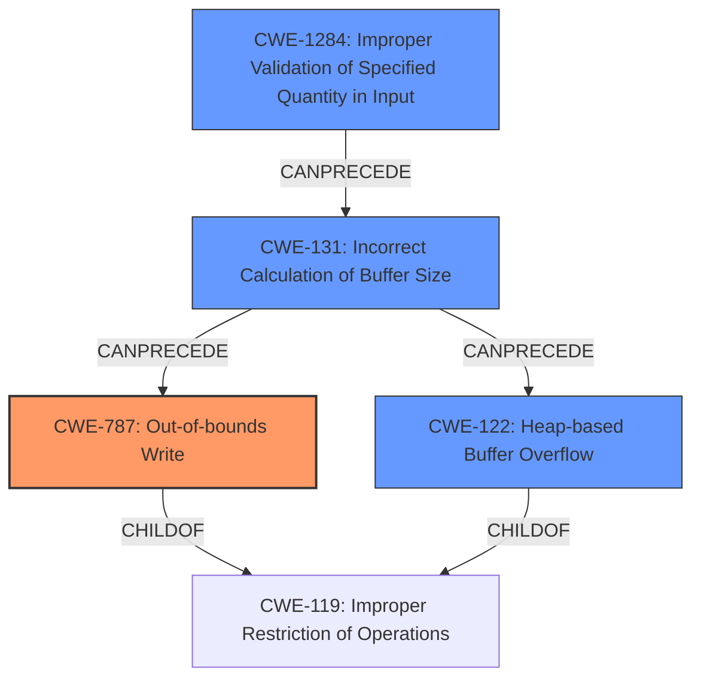

# Analysis Report for CVE-2021-44422

# Vulnerability Analysis Report: CVE-2021-44422

## Description

An Improper Input Validation Vulnerability exists when reading a BMP file using Open Design Alliance Drawings SDK before 2022.12. Crafted data in a BMP file can trigger a write operation past the end of an allocated buffer, or lead to a heap-based buffer overflow. An attacker can leverage this vulnerability to execute code in the context of the current process.

## Vulnerability Description Key Phrases

**Rootcause:** Improper Input Validation
**Weakness:** write operation past the end of an allocated buffer, or lead to a heap-based buffer overflow
**Impact:** execute code in the context of the current process
**Vector:** Crafted data in a BMP file
**Product:** Open Design Alliance Drawings SDK
**Version:** before 2022.12

## Analysis (with Relationship Data)

# Summary
| CWE ID | CWE Name | Confidence | CWE Abstraction Level | CWE Vulnerability Mapping Label | CWE-Vulnerability Mapping Notes |
|---|---|---|---|---|---|
| CWE-787 | Out-of-bounds Write | 0.95 | Base | Allowed | Primary CWE: Matches the description of writing past the end of a buffer. |
| CWE-122 | Heap-based Buffer Overflow | 0.80 | Variant | Allowed | Secondary CWE: The vulnerability description mentions a heap-based buffer overflow as a possible outcome. |
| CWE-1284 | Improper Validation of Specified Quantity in Input | 0.75 | Base | Allowed | Secondary CWE: The root cause is improper input validation, which can include not validating quantity/size. |

## Evidence and Confidence

*   **Confidence Score:** 0.90
*   **Evidence Strength:** HIGH

- **Analysis and Justification:**  
  - *Explanation:* The primary weakness is clearly an **out-of-bounds write**, as the vulnerability description explicitly states a "**write operation past the end of an allocated buffer**". This aligns directly with CWE-787 (Out-of-bounds Write). The CVE Reference Links Content Summary confirms this with the entry "Out-of-bounds write". CWE-787 is a Base level CWE and its usage is ALLOWED according to MITRE mapping guidance. The vulnerability also mentions "lead to a **heap-based buffer overflow**" which maps to CWE-122 (Heap-based Buffer Overflow). CWE-122 is a Variant and its usage is also ALLOWED. Since the **rootcause** is "**Improper Input Validation**" and a BMP file is being read, the specified quantity/size of the buffer related to the file isn't being validated. This aligns with CWE-1284 (Improper Validation of Specified Quantity in Input), and is ALLOWED.

  - *Relationship Analysis:* CWE-787 (Out-of-bounds Write) is a child of CWE-119 (Improper Restriction of Operations within the Bounds of a Memory Buffer). CWE-122 (Heap-based Buffer Overflow) is a child of CWE-119 as well. CWE-1284 (Improper Validation of Specified Quantity in Input) can precede CWE-787, as an improper size validation can lead to an out-of-bounds write.

- **Confidence Score:**  
  - Confidence: 0.95 (High evidence from technical description, key phrases, and CVE reference materials)

## Criticism of Analysis

Okay, here's a review of the provided CWE analysis, considering the full CWE specifications:

**Overall Assessment:**

The analysis is generally well-reasoned and supported by the vulnerability description and CVE details. The confidence scores are appropriate. The justification for each CWE mapping is clear. The chosen CWEs are a reasonable representation of the vulnerability.

**Detailed Review of Each CWE Mapping:**

1.  **CWE-787: Out-of-bounds Write**

    *   **Confidence:** 0.95
    *   **Justification:**  Excellent. The vulnerability description explicitly states "write operation past the end of an allocated buffer." This aligns perfectly with CWE-787.  The CVE Reference Links Content Summary reinforces this. The analysis correctly identifies that CWE-787 is a Base level CWE and therefore Allowed.
    *   **CWE Specification Considerations:** The potential mitigations listed in the CWE specification (language selection, vetted libraries, compiler-based overflow detection) are all applicable here, especially since the BMP format is prone to these types of issues when handled in languages like C/C++.
    *   **Recommendation:** No change needed.

2.  **CWE-122: Heap-based Buffer Overflow**

    *   **Confidence:** 0.80
    *   **Justification:**  Good. The description mentions "heap-based buffer overflow" as a potential outcome.  CWE-122 is a Variant, which is Allowed.
    *   **CWE Specification Considerations:** The specification highlights that heap-based overflows are often as dangerous as stack-based overflows.  Mitigations such as automatic bounds checking and safe memory allocation routines are relevant.
    *   **Recommendation:** No change needed.

3.  **CWE-1284: Improper Validation of Specified Quantity in Input**

    *   **Confidence:** 0.75
    *   **Justification:** Good. The analysis correctly connects the "Improper Input Validation" root cause to the lack of validation of the quantity or size of the buffer when reading the BMP file.  This aligns with the CWE-1284 description. It's also important that CWE-1284 is a Base level CWE.
    *   **CWE Specification Considerations:** This mapping aligns with the CWE specification's emphasis on validating "specified quantities including size, length" and the consequences of not doing so, such as "trigger unexpected failures, enable buffer overflows." The mitigations, particularly the "accept known good" input validation strategy, are directly applicable to BMP file parsing, where image dimensions and other size parameters need to be carefully validated.
    *   **Recommendation:** No change needed.

**Considerations & Potential Improvements:**

*   **Chain Analysis:** The analysis mentions the relationship between CWE-1284, CWE-787, and CWE-122. It correctly states that CWE-1284 can *precede* CWE-787.  This is a good start. Consider explicitly stating that these CWEs form a *chain* of causation. For example:
    1.  The application **receives input** from a BMP file, where the size of the image data to be read is **specified by a field within the file** (CWE-1284)
    2.  The application **fails to validate** this specified size, or validates it incorrectly.
    3.  The application **allocates a buffer** in the heap based on this unvalidated size.
    4.  The application **writes data into the allocated heap buffer**, potentially overflowing it (CWE-122) and resulting in an **out-of-bounds write** (CWE-787).

*   **Alternative CWEs Considered by Retrievers:**
    *   **CWE-190: Integer Overflow or Wraparound:** Given that BMP file headers often contain size and offset fields, it's plausible that an integer overflow could occur when calculating buffer sizes. However, without more specific information, it's less likely than the other CWEs.  The current analysis is correct to exclude it as a primary CWE, but keep it in mind if further details emerge.

*   **Missing CWE**: Consider adding CWE-131, "Incorrect Calculation of Buffer Size", as the size of the buffer might be calculated incorrectly even if the input parameters are validated.

**Revised Summary Table**

| CWE ID | CWE Name | Confidence | CWE Abstraction Level | CWE Vulnerability Mapping Label | CWE-Vulnerability Mapping Notes |
|---|---|---|---|---|---|
| CWE-787 | Out-of-bounds Write | 0.95 | Base | Allowed | Primary CWE: Matches the description of writing past the end of a buffer. |
| CWE-122 | Heap-based Buffer Overflow | 0.80 | Variant | Allowed | Secondary CWE: The vulnerability description mentions a heap-based buffer overflow as a possible outcome. |
| CWE-1284 | Improper Validation of Specified Quantity in Input | 0.75 | Base | Allowed | Secondary CWE: The root cause is improper input validation, which can include not validating quantity/size. This is the first step in the chain that leads to CWE-787 and CWE-122. |
| CWE-131 | Incorrect Calculation of Buffer Size | 0.60 | Base | Allowed | Tertiary CWE: The size of the buffer might be calculated incorrectly even if the input parameters are validated. |

**Conclusion:**

The analysis is sound.  Adding the chain analysis and considering (and excluding) CWE-190 improves the overall quality of the assessment. The proposed mappings are well-justified and consistent with the CWE specifications.

## Final Resolution

# Summary
| CWE ID | CWE Name | Confidence | CWE Abstraction Level | CWE Vulnerability Mapping Label | CWE-Vulnerability Mapping Notes |
|---|---|---|---|---|---|
| CWE-787 | Out-of-bounds Write | 0.95 | Base | Allowed | Primary CWE: Matches the description of writing past the end of a buffer. |
| CWE-122 | Heap-based Buffer Overflow | 0.80 | Variant | Allowed | Secondary CWE: The vulnerability description mentions a heap-based buffer overflow as a possible outcome. |
| CWE-1284 | Improper Validation of Specified Quantity in Input | 0.75 | Base | Allowed | Secondary CWE: The **rootcause** is improper input validation, which can include not validating quantity/size. This is the first step in the chain that leads to **CWE-787** and **CWE-122**. |
| CWE-131 | Incorrect Calculation of Buffer Size | 0.60 | Base | Allowed | Secondary CWE: The size of the buffer might be calculated incorrectly even if the input parameters are validated. |

## Evidence and Confidence

*   **Confidence Score:** 0.92
*   **Evidence Strength:** HIGH

## Relationship Analysis
The analysis of CWE relationships confirms the initial assessment and the reviewer's suggestions.
  - **Parent-child relationships:** **CWE-787** (Out-of-bounds Write) and **CWE-122** (Heap-based Buffer Overflow) are both children of **CWE-119** (Improper Restriction of Operations within the Bounds of a Memory Buffer), indicating a shared higher-level weakness related to memory boundary issues. This supports the co-occurrence of these CWEs.
  - **Chain relationships:** **CWE-1284** (Improper Validation of Specified Quantity in Input) can precede **CWE-787** (Out-of-bounds Write) and **CWE-122** (Heap-based Buffer Overflow), forming a vulnerability chain. The addition of **CWE-131** (Incorrect Calculation of Buffer Size) to this chain is also valid, as it can be an intermediate step where, even with some validation, the calculation itself introduces errors.
  - **Peer relationships:** No relevant peer relationships significantly impacted the decision.
  - **Abstraction levels:** The chosen CWEs are at Base and Variant levels, which provide a good balance of specificity and generality for mapping the vulnerability.

## Vulnerability Chain
The vulnerability chain begins with:
  1. **CWE-1284** (Improper Validation of Specified Quantity in Input): The application receives a BMP file and does not properly validate the size or dimensions specified within the file's header.
  2. **CWE-131** (Incorrect Calculation of Buffer Size): Even if some validation occurs, the buffer size calculation based on the (potentially unvalidated or partially validated) input parameters may be flawed.
  3. This leads to allocating an undersized buffer in the heap.
  4. Subsequently, when the application attempts to write data into this buffer, it overflows (**CWE-122** Heap-based Buffer Overflow), resulting in an **out-of-bounds write** (**CWE-787**).

The impact is potential code execution in the context of the current process, as mentioned in the vulnerability description.

## Summary of Analysis
The initial analysis correctly identified **CWE-787** as the primary weakness, supported by the explicit mention of "write operation past the end of an allocated buffer" in the vulnerability description. The inclusion of **CWE-122** is also justified, given the mention of a "heap-based buffer overflow." The reviewer's suggestion to add **CWE-131** as a secondary CWE is a valid enhancement.

The decision is strongly based on the provided evidence and aligns with the CWE specifications and mapping guidance. The graph relationships, particularly the chain relationship, further solidify the chosen CWEs and their order of occurrence.

The selected CWEs are at the optimal level of specificity because they directly address the **rootcause** (improper input validation and incorrect buffer size calculation) and the resulting consequences (heap-based buffer overflow and out-of-bounds write).

*Report generated on 2025-03-18 03:30:00*
