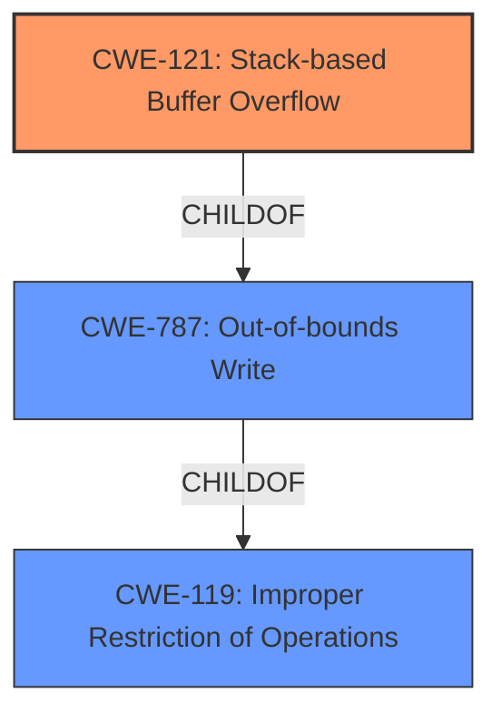

# Final Resolution for CVE-2021-44435

# Summary
| CWE ID | CWE Name | Confidence | CWE Abstraction Level | CWE Vulnerability Mapping Label | CWE-Vulnerability Mapping Notes |
|---|---|---|---|---|---|
| CWE-121 | Stack-based Buffer Overflow | 0.95 | Variant | Primary | The vulnerability is explicitly described as a stack-based buffer overflow. |
| CWE-787 | Out-of-bounds Write | 0.75 | Base | Secondary Candidate | This is a more general description of a buffer overflow, but the description specifies a stack-based overflow making CWE-121 a better fit. |

## Evidence and Confidence

*   **Confidence Score:** 0.95
*   **Evidence Strength:** HIGH

## Relationship Analysis
The initial analysis correctly identified CWE-121 (Stack-based Buffer Overflow) as the primary **WEAKNESS**. CWE-121 is a child of CWE-119 (Improper Restriction of Operations within the Bounds of a Memory Buffer) and CWE-787 (Out-of-bounds Write). The decision to choose CWE-121 over CWE-787 is based on the explicit mention of "stack-based" in the vulnerability description, making CWE-121 more specific. CWE-119 was considered but correctly rejected as it is a more general class and its mapping guidance discourages its use when more specific CWEs are available. This hierarchical relationship influenced the selection by ensuring the most precise classification.

## Vulnerability Chain
The **ROOTCAUSE** is the lack of proper bounds checking when parsing specially crafted JT files. This leads to a **WEAKNESS**, specifically a stack-based buffer overflow (CWE-121). An attacker can leverage this vulnerability to execute arbitrary code in the context of the current process. The chain is: Insufficient Input Validation -> Stack-based Buffer Overflow -> Arbitrary Code Execution.

## Summary of Analysis
The initial analysis and the criticism are both well-reasoned and accurate. The final determination is based on the explicit mention of "stack-based buffer overflow" in the vulnerability description: "JTTK library in affected products is vulnerable to **stack based buffer overflow** while parsing specially crafted JT files." This direct evidence supports the selection of CWE-121. The graph relationships confirm that CWE-121 is a more specific child of CWE-787 and CWE-119, justifying its selection as the primary CWE. The selection of CWE-121 is at the optimal level of specificity because it directly reflects the vulnerability type described in the report.