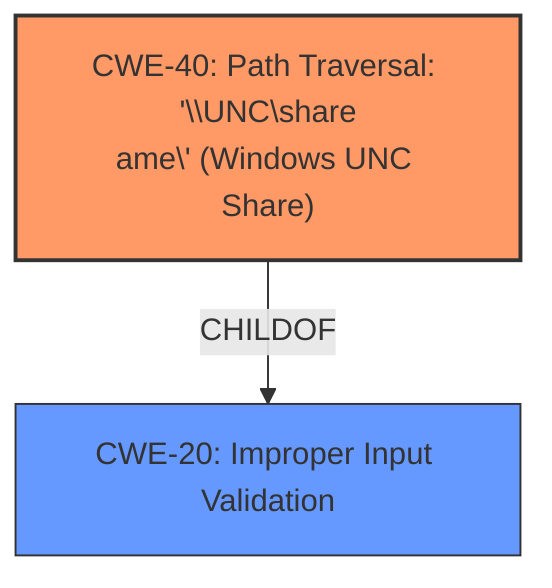

# Final Resolution for CVE-2021-44548

# Summary
| CWE ID | CWE Name | Confidence | CWE Abstraction Level | CWE Vulnerability Mapping Label | CWE-Vulnerability Mapping Notes |
|---|---|---|---|---|---|
| CWE-40 | Path Traversal: '\\UNC\share\name\' (Windows UNC Share) | 0.95 | Variant | Allowed | Primary CWE. The vulnerability allows an attacker to provide a Windows UNC path, leading to SMB network calls. Retriever Results confirm this mapping. |
| CWE-20 | Improper Input Validation | 0.30 | Class | Discouraged | Secondary CWE. The root cause involves **Improper Input Validation**, but CWE-40 offers a more specific representation. Included for completeness but discouraged as a primary mapping. |

## Evidence and Confidence

*   **Confidence Score:** 0.90
*   **Evidence Strength:** HIGH

## Relationship Analysis
The primary relationship influencing the decision is the hierarchical relationship between CWE-20 and CWE-40. CWE-40 is a more specific variant of the class-level CWE-20. While CWE-20 represents the general **Improper Input Validation**, CWE-40 pinpoints the specific issue of accepting Windows UNC shares. No chain relationships are relevant here.

## Vulnerability Chain
The vulnerability chain consists of:
1.  **ROOTCAUSE**: **Improper Input Validation** (CWE-20, but less specific)
2.  **WEAKNESS**: Acceptance of Windows UNC path (CWE-40)
3.  **IMPACT**: SMB network call leading to potential exfiltration of sensitive data or Remote Code Execution.

## Summary of Analysis
The initial analysis and criticism both correctly identified CWE-40 as the primary weakness. The vulnerability description explicitly states that an attacker can provide a Windows UNC path, resulting in an SMB network call. This aligns directly with CWE-40's description, which is a Variant-level CWE specifically addressing the acceptance of Windows UNC shares that redirect access.

The inclusion of CWE-20 is less compelling, given its broad nature and the availability of a more specific CWE. The criticism suggested lowering the confidence score for CWE-20 and explicitly acknowledging the "Discouraged" mapping guidance. I have lowered the confidence to 0.30 for CWE-20 to reflect that guidance. As the vulnerability is explicitly about the UNC path, the **Improper Input Validation** is only a general cause.

The graph relationships influenced the final selection by highlighting the parent-child relationship between CWE-20 and CWE-40, reinforcing the decision to prioritize the more specific CWE-40.

CWE-40 is at the optimal level of specificity because it directly addresses the vulnerability described in the report – the acceptance of Windows UNC paths. The evidence from the vulnerability description ("an attacker can provide a Windows UNC path") strongly supports this classification.