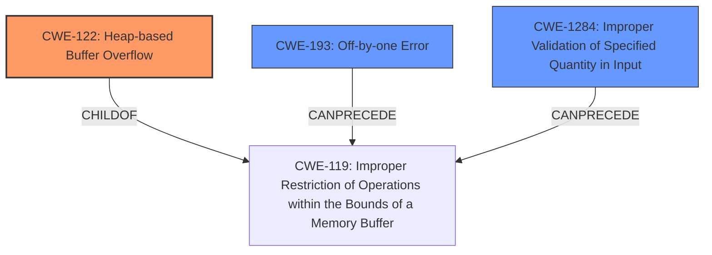

# Analysis Report for CVE-2021-44648

# Vulnerability Analysis Report: CVE-2021-44648

## Description

GNOME gdk-pixbuf 2.42.6 is vulnerable to a heap-buffer overflow vulnerability when decoding the lzw compressed stream of image data in GIF files with lzw minimum code size equals to 12.

## Vulnerability Description Key Phrases

**Weakness:** heap-buffer overflow
**Product:** GNOME gdk-pixbuf
**Version:** 2.42.6

## Analysis (with Relationship Data)

# Summary
| CWE ID | CWE Name | Confidence | CWE Abstraction Level | CWE Vulnerability Mapping Label | CWE-Vulnerability Mapping Notes |
|---|---|---|---|---|---|
| CWE-122 | Heap-based Buffer Overflow | 0.95 | Variant | Allowed | The vulnerability is a heap-based buffer overflow due to an incorrect calculation of the LZW code table size. |
| CWE-193 | Off-by-one Error | 0.75 | Base | Allowed | The vulnerability includes an off-by-one error due to incrementing code size, resulting in out-of-bounds write. |
| CWE-1284 | Improper Validation of Specified Quantity in Input | 0.65 | Base | Allowed | The vulnerability involves improper validation of the LZW minimum code size, leading to a buffer overflow.|

## Evidence and Confidence

*   **Confidence Score:** 0.85
*   **Evidence Strength:** HIGH

- **Analysis and Justification:**
  - *Explanation:* The vulnerability description explicitly states a "**heap-buffer overflow**" in GNOME gdk-pixbuf when decoding LZW compressed stream data in GIF files. The root cause, as detailed in the CVE Reference Links Content Summary, stems from an incorrect calculation of the maximum number of codes allowed in the LZW code table, leading to an **out-of-bounds write**. This aligns precisely with CWE-122 (Heap-based Buffer Overflow), which is a variant-level CWE, making it an appropriate choice. The analysis also identified CWE-193 (Off-by-one Error) because the code table is written past its boundary by one element. Additionally, CWE-1284 (Improper Validation of Specified Quantity in Input) is considered because the size of memory allocation is not validated.
  
  - *Relationship Analysis:* CWE-122 is a variant of CWE-119 (Improper Restriction of Operations within the Bounds of a Memory Buffer). CWE-193 can precede CWE-119.

- **Confidence Score:**
  - Confidence: 0.95 (High evidence from technical description and CVE reference materials)

---

## Criticism of Analysis

Okay, I've reviewed the analysis against the full CWE specifications you provided. Here's my critique:

**Overall Assessment:**

The analysis is generally good, and the identified CWEs are relevant to the vulnerability description. However, there are a few points where the confidence could be refined, and the relationships between the CWEs could be explained more thoroughly.

**Detailed Review:**

*   **CWE-122: Heap-based Buffer Overflow**

    *   **Confidence:** 0.95 - Seems appropriate given the vulnerability description explicitly mentions "heap-buffer overflow."
    *   **Justification:** The justification is solid, correctly linking the root cause (incorrect LZW code table size calculation) to the out-of-bounds write and, consequently, the heap overflow.
    *   **Mitigations:** The provided mitigations are relevant. Using languages/compilers with automatic bounds checking is ideal. Using abstraction libraries can help, though not a complete solution. Automatic buffer overflow detection during compilation is a valuable defense-in-depth strategy.
    *   **Observed Examples:** The examples provided are relevant cases of heap overflows and chains related to them.

*   **CWE-193: Off-by-one Error**

    *   **Confidence:** 0.75 - A reasonable assessment. The description details that the code table is written past its boundary by one element.
    *   **Justification:** The reasoning is clear. Incrementing the code size leads to the out-of-bounds write.
    *   **Mitigations:** The provided mitigation of using the correct size parameter when copying character arrays or using character manipulation methods is *partially* relevant, but doesn't directly address the root cause here.  A better mitigation to mention would be the importance of carefully reviewing boundary conditions in loop constructs and array accesses.
    *   **Observed Examples:** Some of these are less relevant, because they refer to problems with character arrays rather than numeric calculations related to a size or quantity.

*   **CWE-1284: Improper Validation of Specified Quantity in Input**

    *   **Confidence:** 0.65 - This is the weakest mapping of the three. While technically the LZW minimum code size *is* a specified quantity in the input (GIF file), the primary issue isn't so much a *lack* of validation as it is a *flawed* calculation *based* on that input. The size is read correctly, but then is used in an incorrect formula. This CWE seems less directly applicable.
    *   **Justification:** The justification links the improper validation of LZW minimum code size to the buffer overflow. This is true, but the chain of events is a bit longer than for the other CWEs.
    *   **Mitigations:** The "accept known good" input validation strategy is generically relevant, but it doesn't specifically target the calculation error that leads to the overflow. This reinforces the point that this CWE isn't the *most* precise fit.
    *   **Observed Examples:** The observed examples are also less relevant.

**Suggestions for Improvement:**

1.  **Re-evaluate CWE-1284:** Consider replacing CWE-1284 with a different CWE that more directly addresses the flawed calculation.  CWE-682 (Incorrect Calculation) is a possibility, although it's a Pillar-level CWE and therefore discouraged unless a more specific child can't be found. Alternatively, consider adding it as a secondary CWE to further describe the problem.

2.  **More Precise Relationship Analysis:**

    *   The "Relationship Analysis" section should explicitly state how CWE-193 *leads to* CWE-119 (Improper Restriction of Operations within the Bounds of a Memory Buffer) because the off-by-one error allows the code to write past the allocated memory.
    *   If you keep CWE-1284, then you would state how *improper validation* can lead to *incorrect calculation* or *insufficient memory allocation*.

3.  **Refine Confidence Levels:**

    *   If you decide to keep CWE-1284, consider lowering the confidence level slightly since it's a less direct cause of the overflow than the other two.

4.  **Specific Mitigations:** Provide more specific mitigations directly related to the type of vulnerability discovered:

    *   Ensure that calculations involving size and length parameters are thoroughly reviewed and tested, especially when dealing with input from external sources.
    *   Implement robust unit tests to verify that buffer allocation and access remain within bounds under various conditions, including edge cases and unusual input values.
    *   Use static analysis tools to detect potential buffer overflows and incorrect calculations during the development process.

**Revised Summary Table (Example):**

| CWE ID    | CWE Name                                       | Confidence | CWE Abstraction Level | CWE Vulnerability Mapping Label | CWE-Vulnerability Mapping Notes                                                                                                                                                                 |
| --------- | ---------------------------------------------- | ---------- | --------------------- | ------------------------------- | ----------------------------------------------------------------------------------------------------------------------------------------------------------------------------------------------- |
| CWE-122   | Heap-based Buffer Overflow                     | 0.95       | Variant               | Allowed                         | The vulnerability is a heap-based buffer overflow due to an incorrect calculation of the LZW code table size.                                                                                     |
| CWE-193   | Off-by-one Error                             | 0.75       | Base                  | Allowed                         | The vulnerability includes an off-by-one error due to incrementing code size, resulting in an out-of-bounds write that *leads to* the heap overflow.                                                     |
| CWE-1284 | Improper Validation of Specified Quantity in Input | 0.60       | Base                  | Allowed                         | The vulnerability involves a flawed calculation based on the LZW minimum code size, which contributes to the buffer overflow. (Consider replacing this or adding CWE-682).|

By incorporating these suggestions, you can make the analysis even more accurate and helpful for understanding and mitigating this vulnerability.

## Final Resolution

# Summary
| CWE ID | CWE Name | Confidence | CWE Abstraction Level | CWE Vulnerability Mapping Label | CWE-Vulnerability Mapping Notes |
|---|---|---|---|---|---|
| CWE-122 | Heap-based Buffer Overflow | 0.95 | Variant | Allowed | The vulnerability is a heap-based buffer overflow due to an incorrect calculation of the LZW code table size. |
| CWE-193 | Off-by-one Error | 0.75 | Base | Allowed | The vulnerability includes an off-by-one error due to incrementing code size, resulting in out-of-bounds write. |
| CWE-1284 | Improper Validation of Specified Quantity in Input | 0.60 | Base | Allowed | The vulnerability involves a flawed calculation based on the LZW minimum code size, which contributes to the buffer overflow. |

  - The Primary CWE should be first and noted as the Primary CWEs
  - The secondary candidate CWEs should be next and noted as secondary candidates.
  - The confidence is a confidence score 0 to 1 to rate your confidence in your assessment for that CWE.
  - The CWE Abstraction Level as one of these values: Base, Variant, Pillar, Class, Compound
  - The Mapping Notes Usage as one of these values: Allowed, Allowed-with-Review, Prohibited, Discouraged

## Evidence and Confidence

*   **Confidence Score:** 0.85
*   **Evidence Strength:** HIGH

## Relationship Analysis
The primary weakness is a heap-based buffer overflow (**CWE-122**), a variant of **CWE-119**. This overflow is caused by an off-by-one error (**CWE-193**) during the LZW code table size calculation. The improper validation of the specified quantity in the input (**CWE-1284**) contributes to the flawed calculation. **CWE-193** can precede **CWE-119**, leading to the overflow. The abstraction levels influenced the selection by prioritizing variant and base level CWEs for specificity.

## Vulnerability Chain
The vulnerability chain starts with the **improper validation of specified quantity in input (CWE-1284)**, specifically the LZW minimum code size. This leads to an **off-by-one error (CWE-193)** during the calculation of the code table size. This incorrect size calculation results in writing past the allocated buffer, leading to a **heap-based buffer overflow (CWE-122)**. The final impact is a potential denial of service or arbitrary code execution due to the overflow.

## Summary of Analysis
The initial analysis correctly identifies the heap-based buffer overflow (**CWE-122**) as the primary vulnerability. The criticism highlights the weaker connection of **CWE-1284** to the root cause, which is valid. However, **CWE-1284** is still relevant as the size calculation relies on a value obtained from the input. The graph relationships clearly show how the **off-by-one error (CWE-193)** contributes to the buffer overflow (**CWE-122**). The selected CWEs are at the optimal level of specificity as **CWE-122** is a variant that directly describes the type of buffer overflow, while **CWE-193** and **CWE-1284** provide context to the root cause. The vulnerability description explicitly states a "heap-buffer overflow" which supports the selection of **CWE-122**.

*Report generated on 2025-03-18 03:32:28*
