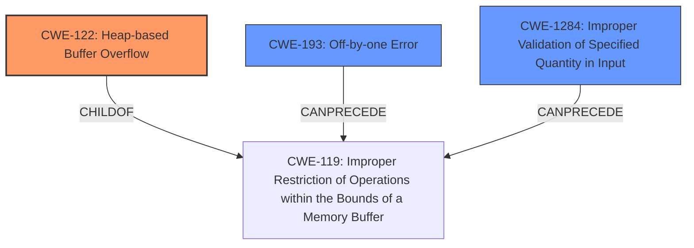

# Final Resolution for CVE-2021-44648

# Summary
| CWE ID | CWE Name | Confidence | CWE Abstraction Level | CWE Vulnerability Mapping Label | CWE-Vulnerability Mapping Notes |
|---|---|---|---|---|---|
| CWE-122 | Heap-based Buffer Overflow | 0.95 | Variant | Allowed | The vulnerability is a heap-based buffer overflow due to an incorrect calculation of the LZW code table size. |
| CWE-193 | Off-by-one Error | 0.75 | Base | Allowed | The vulnerability includes an off-by-one error due to incrementing code size, resulting in out-of-bounds write. |
| CWE-1284 | Improper Validation of Specified Quantity in Input | 0.60 | Base | Allowed | The vulnerability involves a flawed calculation based on the LZW minimum code size, which contributes to the buffer overflow. |

  - The Primary CWE should be first and noted as the Primary CWEs
  - The secondary candidate CWEs should be next and noted as secondary candidates.
  - The confidence is a confidence score 0 to 1 to rate your confidence in your assessment for that CWE.
  - The CWE Abstraction Level as one of these values: Base, Variant, Pillar, Class, Compound
  - The Mapping Notes Usage as one of these values: Allowed, Allowed-with-Review, Prohibited, Discouraged

## Evidence and Confidence

*   **Confidence Score:** 0.85
*   **Evidence Strength:** HIGH

## Relationship Analysis
The primary weakness is a heap-based buffer overflow (**CWE-122**), a variant of **CWE-119**. This overflow is caused by an off-by-one error (**CWE-193**) during the LZW code table size calculation. The improper validation of the specified quantity in the input (**CWE-1284**) contributes to the flawed calculation. **CWE-193** can precede **CWE-119**, leading to the overflow. The abstraction levels influenced the selection by prioritizing variant and base level CWEs for specificity.

## Vulnerability Chain
The vulnerability chain starts with the **improper validation of specified quantity in input (CWE-1284)**, specifically the LZW minimum code size. This leads to an **off-by-one error (CWE-193)** during the calculation of the code table size. This incorrect size calculation results in writing past the allocated buffer, leading to a **heap-based buffer overflow (CWE-122)**. The final impact is a potential denial of service or arbitrary code execution due to the overflow.

## Summary of Analysis
The initial analysis correctly identifies the heap-based buffer overflow (**CWE-122**) as the primary vulnerability. The criticism highlights the weaker connection of **CWE-1284** to the root cause, which is valid. However, **CWE-1284** is still relevant as the size calculation relies on a value obtained from the input. The graph relationships clearly show how the **off-by-one error (CWE-193)** contributes to the buffer overflow (**CWE-122**). The selected CWEs are at the optimal level of specificity as **CWE-122** is a variant that directly describes the type of buffer overflow, while **CWE-193** and **CWE-1284** provide context to the root cause. The vulnerability description explicitly states a "heap-buffer overflow" which supports the selection of **CWE-122**.