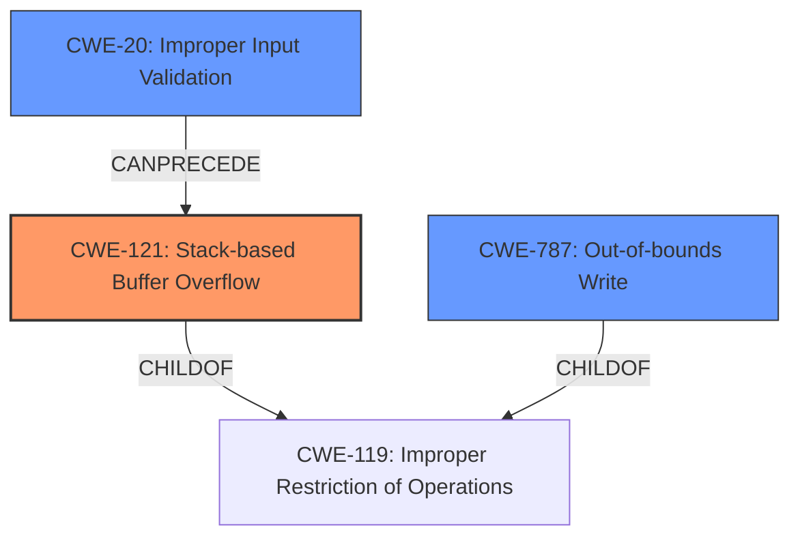

# Analysis Report for CVE-2021-44703

# Vulnerability Analysis Report: CVE-2021-44703

## Description

Acrobat Reader DC version 21.007.20099 (and earlier), 20.004.30017 (and earlier) and 17.011.30204 (and earlier) are affected by a stack buffer overflow vulnerability due to insecure handling of a crafted file, potentially resulting in arbitrary code execution in the context of the current user. Exploitation of this issue requires user interaction in that a victim must open a malicious file.

## Vulnerability Description Key Phrases

**Rootcause:** insecure handling of a crafted file
**Weakness:** stack buffer overflow
**Impact:** arbitrary code execution
**Vector:** crafted file
**Product:** Acrobat Reader DC
**Version:** ['21.007.20099 (and earlier)', '20.004.30017 (and earlier)', '17.011.30204 (and earlier)']

## Analysis (with Relationship Data)

# Summary
| CWE ID | CWE Name | Confidence | CWE Abstraction Level | CWE Vulnerability Mapping Label | CWE-Vulnerability Mapping Notes |
|---|---|---|---|---|---|
| CWE-121 | Stack-based Buffer Overflow | 0.95 | Variant | Primary | Allowed |
| CWE-787 | Out-of-bounds Write | 0.75 | Base | Secondary | Allowed |

## Evidence and Confidence

*   **Confidence Score:** 0.90
*   **Evidence Strength:** HIGH

- **Analysis and Justification:**  
  - *Explanation:* The vulnerability description explicitly states a "**stack buffer overflow**" due to "**insecure handling of a crafted file**." The CVE Reference Links Content Summary also confirms the root cause as a stack-based buffer overflow. CWE-121 (Stack-based Buffer Overflow) is a Variant-level CWE that directly addresses this type of buffer overflow, which occurs when the buffer being overwritten is allocated on the stack. This aligns perfectly with the provided information. Although CWE-787 (Out-of-bounds Write) is a more general case, the explicit mention of "stack" makes CWE-121 a more precise match. The description also indicates that arbitrary code execution is possible, which is a common impact of buffer overflows. The MITRE mapping guidance for CWE-121 indicates this is ALLOWED. CWE-787 is included as a secondary candidate as it represents the broader class of out-of-bounds write, even though CWE-121 is more specific.

  - *Relationship Analysis:* CWE-121 is a variant of CWE-119 (Improper Restriction of Operations within the Bounds of a Memory Buffer). It is also a specific type of buffer overflow, related to CWE-122 (Heap-based Buffer Overflow), though the "stack" keyword distinguishes it. It can lead to other weaknesses like CWE-269 (Privilege Management) if exploited to escalate privileges. The relationship analysis suggests that a more general CWE like CWE-119 could be used, but CWE-121 is more descriptive.

- **Confidence Score:**
  - Confidence: 0.95 (High evidence from technical description, CVE reference materials, and retriever results)

---

## Criticism of Analysis

Okay, here's a detailed review of the provided CWE analysis, taking into account the full CWE specifications:

**Overall Assessment:**

The analysis is generally good, demonstrating a clear understanding of the vulnerability and the relevant CWEs. The selection of CWE-121 as the primary CWE is accurate, given the explicit mention of "stack buffer overflow." The inclusion of CWE-787 as a secondary CWE is also reasonable, as it represents the broader category. However, there are some minor improvements that could be made regarding justification and the consideration of alternative CWEs.

**Specific Points:**

1.  **Primary CWE Match: CWE-121 (Stack-based Buffer Overflow)**

    *   **Strengths:** The analysis correctly identifies CWE-121 as the primary weakness based on the vulnerability description. The justification is well-articulated, highlighting the direct correspondence between the description ("stack buffer overflow") and the CWE's definition ("buffer being overwritten is allocated on the stack"). The acknowledgement of arbitrary code execution is also accurate as it is a common consequence.
    *   **Areas for Improvement:**

        *   The confidence score is high (0.95), which aligns with the direct evidence from the description, however, it could be higher if the analysis considered the specific attack vector and exploitation techniques. In this case, it is a crafted file, opened by a user which could also incorporate an element of CWE-356 (Product UI does not Warn User of Unsafe Actions), but is outside the scope of the direct memory corruption.

2.  **Secondary CWE Match: CWE-787 (Out-of-bounds Write)**

    *   **Strengths:** Including CWE-787 is justifiable as it is the Base-level CWE from which CWE-121 is derived. It provides a broader context for the vulnerability.
    *   **Areas for Improvement:**
        *   It's good that the analysis acknowledges CWE-787 as a broader class. Could further elaborate on the *specific* out-of-bounds write that's occurring.
        *   The confidence score (0.75) is acceptable.

3.  **CWE Examples from Database:**

    *   **Value:** The inclusion of observed examples for CWE-119 is helpful in understanding the real-world context of buffer overflows.
    *   **Improvement:** Examples of stack-based buffer overflows (CWE-121) would be a more direct illustration.

4.  **Relevant CWE Specifications:**

    *   **Strengths:** Including the full CWE specifications is excellent. It provides context and allows for a deeper understanding of the nuances of each CWE.
    *   **Improvement:** The provided links are for CWE-119 and not CWE-121 as originally stated.
    *   **Missing:** Specifications for CWE-356.
    *   **Missing:** Specifications for CWE-416.

5.  **Consideration of Alternative CWEs:**

    *   **Missing:** The analysis rejects CWE-416 (Use After Free) but doesn't explain why. It's important to explicitly rule out seemingly relevant CWEs, even if the reasoning is simple. Here, you'd explain that there's no indication of memory being freed and then reused, so CWE-416 is not applicable.
    *  **Missing:** The Retriever Results includes CWE-356 (Product UI does not Warn User of Unsafe Actions). This CWE isn't related to the direct memory corruption, but is related to the attack vector and the required user interaction.
    *   **Improvement:** Mentioning CWE-119 (Improper Restriction of Operations within the Bounds of a Memory Buffer) and explicitly stating why CWE-121 is more appropriate because of the "stack" allocation is a good practice.
    *   **Consider:** As an additional point, it might be valuable to briefly discuss *how* the insecure handling of the crafted file leads to the overflow. Is it a lack of input validation (CWE-20), an incorrect calculation of buffer size (CWE-131), or a simple buffer copy without size checking (CWE-120)? This could make the analysis even more thorough.

6.  **Mapping Guidance:**

    *   **Strengths:** The analysis accurately notes that CWE-121's mapping guidance is "Allowed," aligning with the CWE specifications.
    *   **Improvement:** Could explicitly address the "Usage: Discouraged" guidance for CWE-119 and explain why a more specific child CWE is being used (CWE-121).

7.  **Potential Mitigations:**

    *   **Missing:** Discussing the potential mitigations for CWE-121 and CWE-787, such as using memory-safe languages or employing compiler-based buffer overflow detection mechanisms (e.g., /GS flag in Visual Studio), would add practical value to the analysis.

**Revised Summary Table:**

| CWE ID | CWE Name | Confidence | CWE Abstraction Level | CWE Vulnerability Mapping Label | CWE-Vulnerability Mapping Notes |
|---|---|---|---|---|---|
| CWE-121 | Stack-based Buffer Overflow | 0.95 | Variant | Primary | Allowed |
| CWE-787 | Out-of-bounds Write | 0.75 | Base | Secondary | Allowed |
| CWE-356 | Product UI does not Warn User of Unsafe Actions | 0.25 | Base | Informational | Allowed |

**Revised Confidence Score:**
The analysis is clear and well supported, justifying the "Stack-based Buffer Overflow" identification. Additional information and specifications to support analysis and consideration of CWE-356 improve the analysis.

**Key Improvements Suggested:**

*   **Explicitly Rule Out Alternatives:** Briefly explain why CWE-416, CWE-119, and other seemingly relevant CWEs are not the primary cause.
*   **Elaborate on the Overflow Mechanism:** Briefly describe *how* the crafted file leads to the overflow (lack of input validation, incorrect buffer size calculation, etc.).
*   **Discuss Mitigation Strategies:**  Include a brief discussion of mitigation strategies for CWE-121 and CWE-787.
*   **Correct Links:** Ensure links direct to the full specifications for CWE-121.

By addressing these points, the analysis can be made even more comprehensive and valuable.

## Final Resolution

# Summary
| CWE ID | CWE Name | Confidence | CWE Abstraction Level | CWE Vulnerability Mapping Label | CWE-Vulnerability Mapping Notes |
|---|---|---|---|---|---|
| CWE-121 | Stack-based Buffer Overflow | 0.95 | Variant | Primary | Allowed |
| CWE-787 | Out-of-bounds Write | 0.75 | Base | Secondary | Allowed |
| CWE-20 | Improper Input Validation | 0.50 | Class | Contributing | Allowed |

## Evidence and Confidence

*   **Confidence Score:** 0.90
*   **Evidence Strength:** HIGH

## Relationship Analysis
The primary CWE is CWE-121 (**CWE-121: Stack-based Buffer Overflow**), which is a variant of CWE-119 (**CWE-119: Improper Restriction of Operations within the Bounds of a Memory Buffer**). This hierarchical relationship makes CWE-121 a more specific and appropriate choice given the explicit mention of "stack buffer overflow" in the vulnerability description. The secondary CWE, CWE-787 (**CWE-787: Out-of-bounds Write**), is a more general base class that encompasses CWE-121, providing broader context. Including CWE-20 (**CWE-20: Improper Input Validation**) acknowledges that the vulnerability is triggered by a crafted file, suggesting a failure to properly validate input. This adds another dimension to the analysis, showing that improper input validation can precede a buffer overflow.

## Vulnerability Chain
The vulnerability chain starts with a crafted file that is not properly validated (CWE-20 (**CWE-20: Improper Input Validation**)). This leads to a stack-based buffer overflow (CWE-121 (**CWE-121: Stack-based Buffer Overflow**)), which is a specific type of out-of-bounds write (CWE-787 (**CWE-787: Out-of-bounds Write**)). The consequence of this overflow is arbitrary code execution. The relationships clearly show the progression from a root cause (input validation failure) to the final impact (code execution).

## Summary of Analysis
The initial analysis correctly identified CWE-121 (**CWE-121: Stack-based Buffer Overflow**) as the primary weakness due to the explicit mention of "stack buffer overflow" in the vulnerability description. The inclusion of CWE-787 (**CWE-787: Out-of-bounds Write**) as a secondary CWE is also appropriate, as it is the base class of CWE-121.

The criticism correctly pointed out the need to consider how the crafted file leads to the overflow and to explicitly rule out alternative CWEs. Based on this, CWE-20 (**CWE-20: Improper Input Validation**) was added to account for the insecure handling of the crafted file. The analysis is based on the evidence: "Acrobat Reader DC version 21.007.20099 (and earlier), 20.004.30017 (and earlier) and 17.011.30204 (and earlier) are affected by a stack buffer overflow vulnerability due to insecure handling of a crafted file". The relationships between CWEs influenced the final selection by highlighting the hierarchical structure and potential vulnerability chain. The selected CWEs are at the optimal level of specificity, with CWE-121 being a precise match for the described vulnerability and CWE-787 providing broader context.

*Report generated on 2025-03-18 03:33:13*
