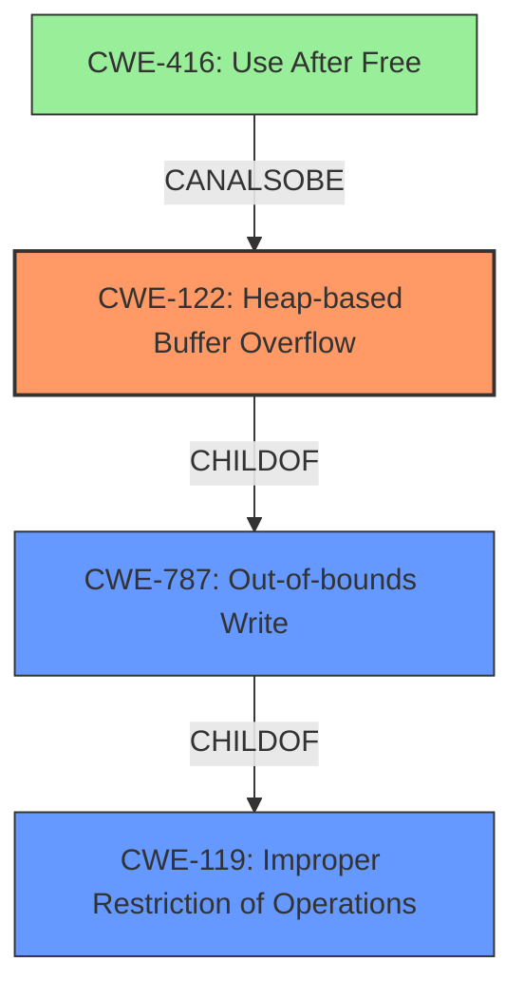

# Final Resolution for CVE-2021-44709

# Summary

| CWE ID | CWE Name | Confidence | CWE Abstraction Level | CWE Vulnerability Mapping Label | CWE-Vulnerability Mapping Notes |
|---|---|---|---|---|---|
| CWE-122 | Heap-based Buffer Overflow | 0.95 | Variant | Allowed | Primary CWE |
| CWE-787 | Out-of-bounds Write | 0.75 | Base | Allowed | Secondary Candidate |
| CWE-416 | Use After Free | 0.5 | Variant | Allowed | Secondary Candidate (Speculative) |

## Evidence and Confidence

*   **Confidence Score:** 0.90
*   **Evidence Strength:** HIGH

## Relationship Analysis
The primary relationship influencing the decision is the parent-child relationship between CWE-787 (**Out-of-bounds Write**) and CWE-122 (**Heap-based Buffer Overflow**). CWE-122 is a specific type of CWE-787 occurring on the heap. Therefore, while CWE-787 is applicable, CWE-122 provides a more precise classification. CWE-416 (**Use After Free**) is considered due to the "insecure handling" aspect of the description, suggesting a potential, though speculative, vulnerability chain involving memory management issues. The abstraction levels are appropriate, with CWE-122 at the Variant level, providing specificity, and CWE-787 at the Base level, capturing the fundamental nature of the out-of-bounds write.

## Vulnerability Chain
The vulnerability chain starts with **insecure handling** of a crafted file, leading to a **CWE-122 (Heap-based Buffer Overflow)**. This means that the application copies data into a heap-allocated buffer without proper bounds checking. As a consequence, data is written past the end of the buffer (**CWE-787 (Out-of-bounds Write)**). A speculative chain could involve the heap overflow corrupting memory management data structures, leading to a **CWE-416 (Use After Free)** if a corrupted pointer is later used to free memory twice. The final impact is arbitrary code execution.

## Summary of Analysis
The analysis correctly identifies **CWE-122 (Heap-based Buffer Overflow)** as the primary weakness, supported by the vulnerability description's explicit mention of a "heap overflow" and "insecure handling" of a crafted file. The CVE Reference Links Content Summary confirms the **root cause of the vulnerability** is a "Heap-based Buffer Overflow (CWE-122)". The relationship analysis reinforces this decision, highlighting the parent-child relationship between CWE-787 and CWE-122. The initial analysis and the criticism both agree on the primary weakness.

The inclusion of **CWE-787 (Out-of-bounds Write)** is justified because it describes the underlying mechanism of writing beyond the buffer's boundary. The justification for **CWE-416 (Use After Free)** is weaker, as it relies on the speculative possibility that the heap overflow could corrupt memory management structures, leading to a use-after-free condition. As the criticism suggests, this is not explicitly stated in the vulnerability description, but is inferred based on the "**insecure handling**" aspect.

The classification reflects an optimal level of specificity. **CWE-122 (Heap-based Buffer Overflow)** is a Variant-level CWE, providing more detail than its parent **CWE-787 (Out-of-bounds Write)**, while still being directly relevant to the vulnerability description.