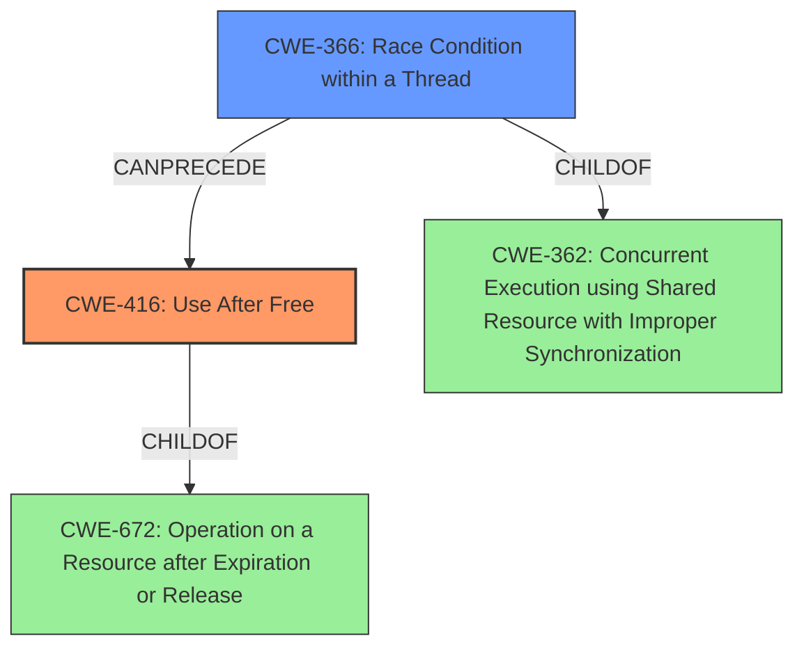

# Analysis Report for CVE-2021-44733

# Vulnerability Analysis Report: CVE-2021-44733

## Description

A use-after-free exists in drivers/tee/tee_shm.c in the TEE subsystem in the Linux kernel through 5.15.11. This occurs because of a race condition in tee_shm_get_from_id during an attempt to free a shared memory object.

## Vulnerability Description Key Phrases

**Rootcause:** race condition
**Weakness:** use-after-free
**Product:** Linux kernel
**Version:** through 5.15.11
**Component:** drivers/tee/tee_shm.c

## Analysis (with Relationship Data)

# Summary
| CWE ID | CWE Name | Confidence | CWE Abstraction Level | CWE Vulnerability Mapping Label | CWE-Vulnerability Mapping Notes |
|---|---|---|---|---|---|
| CWE-416 | Use After Free | 0.95 | Variant | Allowed | Primary CWE |
| CWE-366 | Race Condition within a Thread | 0.85 | Base | Allowed | Secondary Candidate |

## Evidence and Confidence

*   **Confidence Score:** 0.90
*   **Evidence Strength:** HIGH

- **Analysis and Justification:**  
  - *Explanation:* The vulnerability description explicitly states a "**use-after-free** exists... because of a **race condition**". The CVE Reference Links Content Summary further clarifies that the **use-after-free** (CWE-416) occurs because the `tee_shm` object can be accessed after it has been freed by the dma-buf subsystem. The lookup function can return a pointer to an object that is in the process of deallocation. CWE-416 (Use After Free) is a Variant level CWE and is ALLOWED based on MITRE mapping guidance. The **race condition** (CWE-366) is a contributing factor allowing the UAF to occur.
  
  - *Relationship Analysis:* CWE-416 is a variant of CWE-672 (Operation on Resource after Expiry). The **race condition** CWE-366 is a base level CWE, related to concurrency issues, which allows the UAF.

- **Confidence Score:**  
  - *Example:* Confidence: 0.95 (High evidence from technical description and CVE reference materials)

---

## Criticism of Analysis

Okay, here's a review of the provided analysis, incorporating the full CWE specifications:

**Overall Assessment:**

The analysis is generally very good. It correctly identifies CWE-416 (Use After Free) as the primary vulnerability and CWE-366 (Race Condition within a Thread) as a contributing factor. The evidence and justifications are well-articulated. The confidence score seems appropriate.

**Detailed Review & Critique:**

**1. Primary CWE: CWE-416 (Use After Free)**

*   **Correctness:**  The mapping to CWE-416 is accurate and well-supported by the vulnerability description and the CVE reference summary. The description clearly indicates the core issue: memory is accessed after it has been freed.
*   **Abstraction Level:**  The analysis correctly identifies CWE-416 as a `Variant` level CWE. The MITRE mapping guidance states that this level is preferred, making this a suitable choice.
*   **Evidence Strength:** The analysis highlights the explicit mention of "use-after-free" in the vulnerability description and the detailed explanation of how the `tee_shm` object is accessed after deallocation.  This justifies the "HIGH" evidence strength.
*   **Relationship Analysis:** The analysis correctly links CWE-416 to its parent, CWE-672 (Operation on Resource after Expiry), which is a Class level CWE. The connection is logical, as UAF is a specific type of operating on an expired resource.
*   **CWE Examples:** The analysis includes several relevant CVE examples of CWE-416, reinforcing the correctness of the mapping. Notably, several examples include race conditions as a contributing factor to the UAF.
*   **Potential Mitigations:** The analysis could be strengthened by explicitly mentioning mitigations listed in the CWE-416 specification, like setting freed pointers to NULL (although the analysis notes the limitations of this approach in complex data structures) or choosing a language with automatic memory management.
*   **Minor Note:** The analysis mentions that CWE-416 can be caused by race conditions, which is accurate.

**2. Secondary Candidate: CWE-366 (Race Condition within a Thread)**

*   **Correctness:**  The identification of CWE-366 is also appropriate. The vulnerability arises because of a race condition between closing a shared memory file descriptor and another thread accessing the same memory.
*   **Abstraction Level:**  CWE-366 is a `Base` level CWE, which is also a preferred level of abstraction for mapping.
*   **Evidence Strength:** The analysis extracts "race condition" from the original description, and the CVE summary elaborates on the nature of the race, justifying the high confidence.
*   **Relationship Analysis:** The analysis highlights that CWE-366 contributes to the UAF. It's the race condition that *enables* the use-after-free to occur. The analysis could also explicitly mention that CWE-366 is a child of the Class-level CWE-362 (Concurrent Execution using Shared Resource with Improper Synchronization).
*   **CWE Examples:** The provided CWE-366 specification includes the example CVE-2022-2621 that shows a chain of CWE-366 leading to CWE-416. This strengthens the selection of CWE-366 as a contributing factor.
*   **Potential Mitigations:** The analysis could be improved by suggesting mitigations from the CWE-366 specification, such as using locking mechanisms or resource-locking validation checks.  The CVE reference summary does mention that the `teedev` mutex is insufficient. So, the analysis should state that the mutex should be used correctly or a new locking method must be implemented.
*   **Specificity:** While CWE-366 is correct,  it might be argued that a more specific "Time-of-check Time-of-use (TOCTOU) Race Condition" (CWE-367) could apply. However, since the core problem is the lifetime management of the shared memory objects and the lack of proper synchronization during deallocation, CWE-366 is a reasonable choice, especially considering the "race condition within a thread" aspect.

**3. Overall Suggestions for Improvement:**

*   **Mitigation Details:** Expand the mitigation section by explicitly mentioning and discussing the applicability (or inapplicability) of the mitigations listed in the CWE specifications for both CWE-416 and CWE-366.  This shows a deeper understanding of the vulnerability and potential defense strategies. For example, the mitigations for CWE-366 are highly relevant (locking, validation checks). The analysis already partially does this in stating that setting pointers to NULL after free has limited utility in this case due to complex data structures.
*   **Alternative CWE Consideration:** While not strictly necessary, acknowledging and briefly dismissing other potentially relevant CWEs (like CWE-367 or perhaps even CWE-911, Improper Update of Reference Count) could further strengthen the analysis.  For CWE-911, the analysis could mention that this CWE is about the *incorrect* update of a reference count, while the description of this vulnerability states that the subsystem lacked direct reference counting to its shared memory buffers, making CWE-911 not applicable.
*   **CWE Hierarchy Exploration:** Explicitly stating the parent-child relationships of the selected CWEs (e.g., CWE-416 is a child of CWE-672, and CWE-366 is a child of CWE-362) helps illustrate the broader context of the vulnerability.

**Revised Summary Table (Incorporating suggestions):**

| CWE ID | CWE Name | Confidence | CWE Abstraction Level | CWE Vulnerability Mapping Label | CWE-Vulnerability Mapping Notes |
|---|---|---|---|---|---|
| CWE-416 | Use After Free | 0.95 | Variant | Allowed | Primary CWE. Enabled by race condition. Consider setting freed pointers to NULL, but may have limited utility in complex data structures.  |
| CWE-366 | Race Condition within a Thread | 0.85 | Base | Allowed | Secondary Candidate. Contributes to UAF by allowing access to freed memory.  Mitigate with appropriate locking mechanisms around shared resources and validation checks. Ensure the `teedev` mutex is used correctly or implement a new locking method. |

**In conclusion, the analysis is strong and well-reasoned. The suggested improvements would further enhance its completeness and demonstrate a more thorough understanding of the relevant CWEs and their associated mitigations.**

## Final Resolution

# Summary
| CWE ID | CWE Name | Confidence | CWE Abstraction Level | CWE Vulnerability Mapping Label | CWE-Vulnerability Mapping Notes |
|---|---|---|---|---|---|
| CWE-416 | Use After Free | 0.95 | Variant | Allowed | Primary CWE. Enabled by **race condition**. Consider setting freed pointers to NULL, but may have limited utility in complex data structures.  |
| CWE-366 | Race Condition within a Thread | 0.85 | Base | Allowed | Secondary Candidate. Contributes to UAF by allowing access to freed memory.  Mitigate with appropriate locking mechanisms around shared resources and validation checks. Ensure the `teedev` mutex is used correctly or implement a new locking method. |

## Evidence and Confidence

*   **Confidence Score:** 0.92
*   **Evidence Strength:** HIGH

## Relationship Analysis
The primary weakness is **CWE-416 (Use After Free)**, a `Variant` of **CWE-672 (Operation on a Resource after Expiration or Release)**, which is a `Class`. The secondary weakness is **CWE-366 (Race Condition within a Thread)**, a `Base` that is a child of **CWE-362 (Concurrent Execution using Shared Resource with Improper Synchronization)**, which is a `Class`. The **race condition** enables the **use-after-free** by allowing access to memory that has already been freed.

## Vulnerability Chain
The vulnerability chain starts with a **race condition** (**CWE-366**) occurring when attempting to free a shared memory object. This leads to a situation where the `tee_shm` object is accessed after it has been freed, resulting in a **use-after-free** (**CWE-416**).

## Summary of Analysis
The initial analysis and criticism both accurately identify **CWE-416 (Use After Free)** as the primary **weakness** and **CWE-366 (Race Condition within a Thread)** as a contributing factor. The evidence provided, including the vulnerability description and CVE reference summary, supports this conclusion.

The vulnerability description explicitly states, "A **use-after-free** exists... because of a **race condition**". This statement directly links the two **weaknesses**, with the **race condition** enabling the **use-after-free**.

The graph relationships further solidify this assessment, showing that **CWE-366** can precede **CWE-416**. Both **CWEs** are at appropriate levels of abstraction, with **CWE-416** being a `Variant` and **CWE-366** being a `Base`.

The suggested improvements in the criticism, such as expanding on mitigation details and acknowledging alternative **CWEs**, are valuable. Considering mitigations like locking mechanisms and validation checks for **CWE-366** and setting freed pointers to NULL for **CWE-416** reinforces the understanding of the vulnerability and potential defense strategies.

The final determination is that **CWE-416** and **CWE-366** are the most appropriate classifications for this vulnerability. They accurately represent the root cause and contributing factors, and they are at the optimal level of specificity based on the available evidence.

*Report generated on 2025-03-18 03:35:26*
