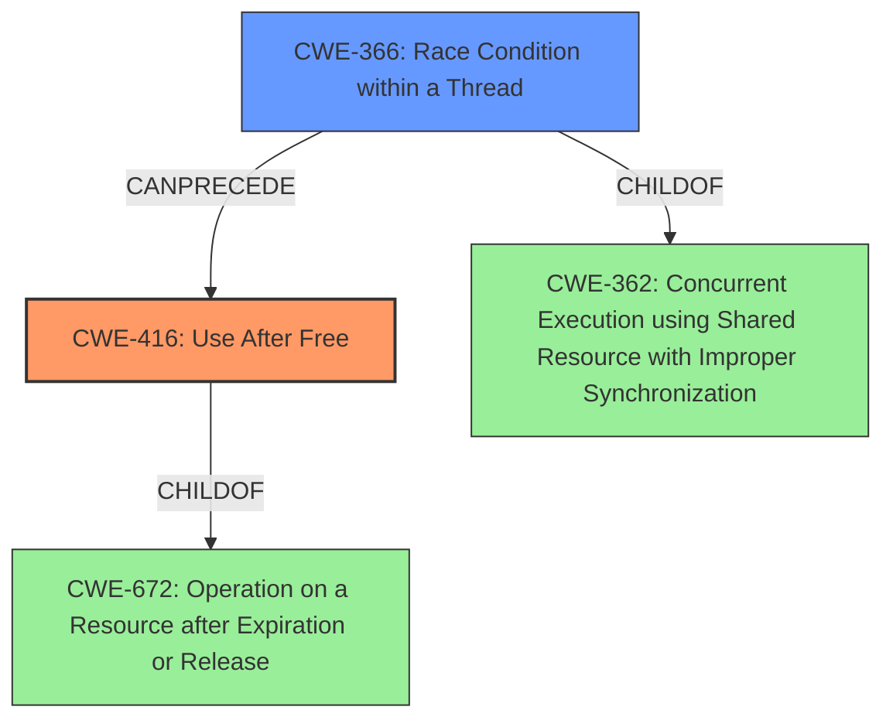

# Final Resolution for CVE-2021-44733

# Summary
| CWE ID | CWE Name | Confidence | CWE Abstraction Level | CWE Vulnerability Mapping Label | CWE-Vulnerability Mapping Notes |
|---|---|---|---|---|---|
| CWE-416 | Use After Free | 0.95 | Variant | Allowed | Primary CWE. Enabled by **race condition**. Consider setting freed pointers to NULL, but may have limited utility in complex data structures.  |
| CWE-366 | Race Condition within a Thread | 0.85 | Base | Allowed | Secondary Candidate. Contributes to UAF by allowing access to freed memory.  Mitigate with appropriate locking mechanisms around shared resources and validation checks. Ensure the `teedev` mutex is used correctly or implement a new locking method. |

## Evidence and Confidence

*   **Confidence Score:** 0.92
*   **Evidence Strength:** HIGH

## Relationship Analysis
The primary weakness is **CWE-416 (Use After Free)**, a `Variant` of **CWE-672 (Operation on a Resource after Expiration or Release)**, which is a `Class`. The secondary weakness is **CWE-366 (Race Condition within a Thread)**, a `Base` that is a child of **CWE-362 (Concurrent Execution using Shared Resource with Improper Synchronization)**, which is a `Class`. The **race condition** enables the **use-after-free** by allowing access to memory that has already been freed.

## Vulnerability Chain
The vulnerability chain starts with a **race condition** (**CWE-366**) occurring when attempting to free a shared memory object. This leads to a situation where the `tee_shm` object is accessed after it has been freed, resulting in a **use-after-free** (**CWE-416**).

## Summary of Analysis
The initial analysis and criticism both accurately identify **CWE-416 (Use After Free)** as the primary **weakness** and **CWE-366 (Race Condition within a Thread)** as a contributing factor. The evidence provided, including the vulnerability description and CVE reference summary, supports this conclusion.

The vulnerability description explicitly states, "A **use-after-free** exists... because of a **race condition**". This statement directly links the two **weaknesses**, with the **race condition** enabling the **use-after-free**.

The graph relationships further solidify this assessment, showing that **CWE-366** can precede **CWE-416**. Both **CWEs** are at appropriate levels of abstraction, with **CWE-416** being a `Variant` and **CWE-366** being a `Base`.

The suggested improvements in the criticism, such as expanding on mitigation details and acknowledging alternative **CWEs**, are valuable. Considering mitigations like locking mechanisms and validation checks for **CWE-366** and setting freed pointers to NULL for **CWE-416** reinforces the understanding of the vulnerability and potential defense strategies.

The final determination is that **CWE-416** and **CWE-366** are the most appropriate classifications for this vulnerability. They accurately represent the root cause and contributing factors, and they are at the optimal level of specificity based on the available evidence.