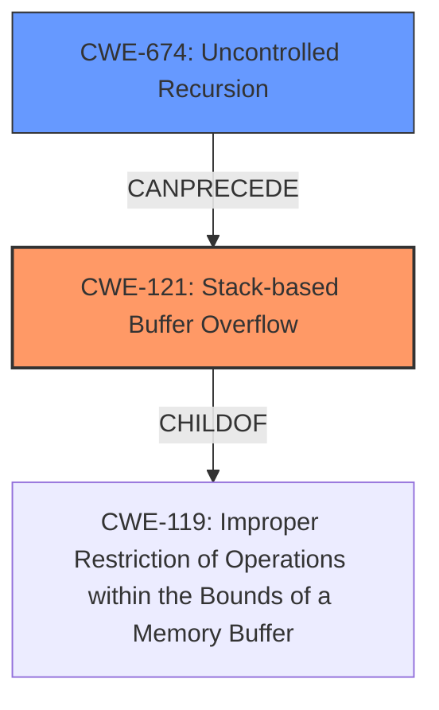

# Final Resolution for CVE-2021-44988

# Summary
| CWE ID | CWE Name | Confidence | CWE Abstraction Level | CWE Vulnerability Mapping Label | CWE-Vulnerability Mapping Notes |
|---|---|---|---|---|---|
| CWE-121 | Stack-based Buffer Overflow | 0.95 | Variant | Allowed | Primary CWE |
| CWE-674 | Uncontrolled Recursion | 0.75 | Class | Allowed-with-Review | Secondary Candidate, Root Cause, Contributes to CWE-121 |

## Evidence and Confidence

*   **Confidence Score:** 0.9
*   **Evidence Strength:** HIGH

## Relationship Analysis
The primary relationship influencing the decision is the hierarchical relationship between CWE-121 (Variant) and CWE-119 (Base), where CWE-121 is a `CHILDOF` CWE-119. This ensures the classification is at the most specific level. The analysis also recognizes that CWE-674 (Uncontrolled Recursion) contributes to the **weakness** by creating the conditions for the **stack overflow**. There is also a CANPRECEDE relationship between CWE-674 and CWE-121, which can be inferred.

## Vulnerability Chain
The vulnerability chain starts with **CWE-674 (Uncontrolled Recursion)**, leading to **CWE-121 (Stack-based Buffer Overflow)**. The lack of proper control over the recursion depth (CWE-674) causes excessive memory allocation on the stack, eventually overflowing the buffer (CWE-121). The final impact is a denial of service or potential arbitrary code execution.

## Summary of Analysis
The initial analysis and criticism are both well-reasoned and supported by the evidence provided in the vulnerability description and CVE reference materials. The analysis correctly identifies **CWE-121 (Stack-based Buffer Overflow)** as the primary **weakness** due to the explicit mention of a "stack overflow" in the description. The inclusion of **CWE-674 (Uncontrolled Recursion)** as a secondary contributing factor is also justified, as the recursive nature of the exploit contributes to the overflow.

The graph relationships support the selection of CWE-121 as the primary CWE, as it is a more specific variant of **CWE-119 (Improper Restriction of Operations within the Bounds of a Memory Buffer)**. The analysis also considers potential alternative classifications, such as **CWE-120 (Buffer Copy without Checking Size)** and **CWE-787 (Out-of-bounds Write)**, but correctly determines that CWE-121 provides the optimal level of specificity.

The selection of CWEs is based on the provided evidence, including the vulnerability description ("Jerryscript v3.0.0 and below was discovered to contain a stack overflow via ecma_find_named_property in ecma-helpers.c") and the CVE Reference Links Content Summary ("The vulnerability in `ecma_find_named_property` is triggered by a recursive call"). The CWEs are also at the optimal level of specificity, with CWE-121 being a Variant-level CWE and CWE-674 being a Class-level CWE that captures an important contributing factor.