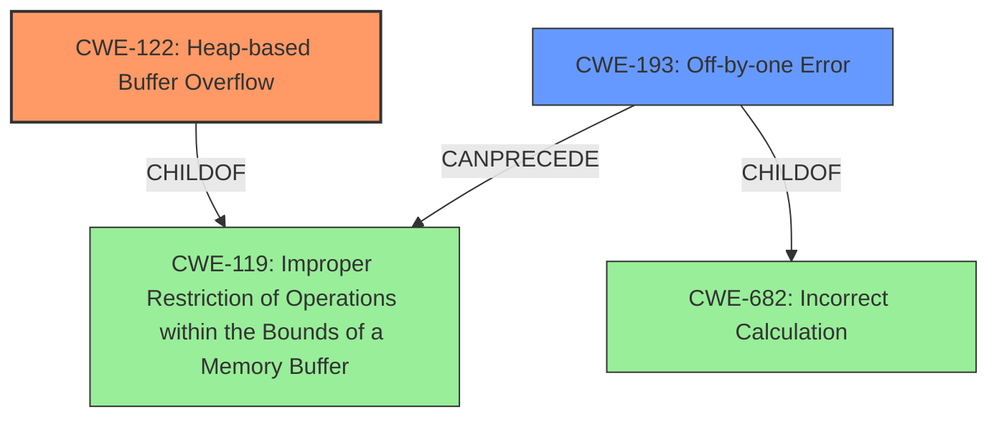

# Final Resolution for CVE-2021-45005

# Summary
| CWE ID | CWE Name | Confidence | CWE Abstraction Level | CWE Vulnerability Mapping Label | CWE-Vulnerability Mapping Notes |
|---|---|---|---|---|---|
| CWE-122 | Heap-based Buffer Overflow | 0.9 | Variant | Allowed | Primary CWE |
| CWE-193 | Off-by-one Error | 0.5 | Base | Allowed | Secondary Candidate |

## Evidence and Confidence

*   **Confidence Score:** 0.85
*   **Evidence Strength:** MEDIUM

## Relationship Analysis
The decision was impacted by the following CWE relationships:
  - CWE-122 is a variant of CWE-119 (Improper Restriction of Operations within the Bounds of a Memory Buffer), providing a more specific classification for heap-based overflows.
  - CWE-193 is a child of CWE-682 (Incorrect Calculation) and can potentially precede buffer overflows, suggesting a possible contributing factor.
  - The abstraction levels influenced the selection by favoring the more specific Variant (CWE-122) over its Base (CWE-119) parent.

## Vulnerability Chain
The chain of root cause and weaknesses is as follows:
  - **ROOTCAUSE**: Conflicting JumpList of nested try/finally statements.
  - **WEAKNESS**: Potential Off-by-one Error (**CWE-193**) in buffer size calculation or loop conditions during jump list management (speculative).
  - **WEAKNESS**: Heap-based Buffer Overflow (**CWE-122**) due to writing past the allocated buffer on the heap.
  - **IMPACT**: Unspecified, but typical impacts of buffer overflows include code execution or denial of service.

## Summary of Analysis
The analysis accurately identifies **CWE-122 (Heap-based Buffer Overflow)** as the primary **weakness**, based on the explicit mention of "heap buffer overflow" in the vulnerability description. The justification is well-supported, connecting the conflicting JumpList to a potential overflow mechanism.

The selection of **CWE-193 (Off-by-one Error)** as a secondary **weakness** is more speculative, relying on the *CVE Reference Links Content Summary* which mentions potential for memory management issues in calculating jump targets. The confidence in this classification has been reduced to 0.5, reflecting the lack of direct evidence linking the off-by-one error to the heap overflow.

The graph relationships influenced the final selection by highlighting the hierarchical relationship between **CWE-122** and **CWE-119**, justifying the choice of the more specific variant. The potential chain relationship between **CWE-193** and **CWE-119** suggests that an off-by-one error could contribute to the overflow.

The selected CWEs are at an appropriate level of specificity, with **CWE-122** providing a precise classification of the heap-based overflow and **CWE-193** representing a possible contributing factor. The analysis considered alternative mappings, such as **CWE-131 (Incorrect Calculation of Buffer Size)**, but determined that the available evidence did not strongly support these alternatives.