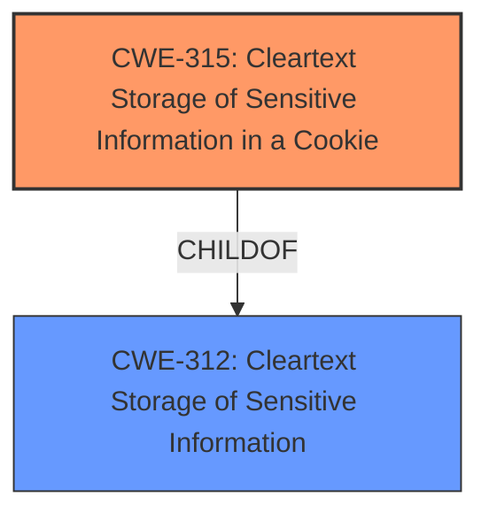

# Analysis Report for CVE-2021-45025

# Vulnerability Analysis Report: CVE-2021-45025

## Description

ASG technologies ( A Rocket Software Company) ASG-Zena Cross Platform Server Enterprise Edition 4.2.1 is vulnerable to Cleartext Storage of Sensitive Information in a Cookie.

## Vulnerability Description Key Phrases

**Rootcause:** cleartext storage of sensitive information
**Product:** ASG-Zena Cross Platform Server Enterprise Edition
**Version:** 4.2.1

## Analysis (with Relationship Data)

# Summary
| CWE ID | CWE Name | Confidence | CWE Abstraction Level | CWE Vulnerability Mapping Label | CWE-Vulnerability Mapping Notes |
|---|---|---|---|---|---|
| CWE-315 | Cleartext Storage of Sensitive Information in a Cookie | 1.0 | Variant | Allowed | Primary CWE |

## Evidence and Confidence

*   **Confidence Score:** 1.0
*   **Evidence Strength:** HIGH

- **Analysis and Justification:**
  - *Explanation:* The vulnerability description explicitly states "**Cleartext Storage of Sensitive Information** in a Cookie." CWE-315, "Cleartext Storage of Sensitive Information in a Cookie," directly matches this description. The CWE definition and vulnerability description align perfectly, as the sensitive information is stored without encryption within a cookie. This directly exposes the data to potential unauthorized access if the cookie is intercepted or accessed. The retriever results also ranked CWE-315 as the top candidate. The MITRE mapping guidance for CWE-315 indicates this is ALLOWED.

  - *Relationship Analysis:* CWE-315 is a Variant of CWE-312 (Cleartext Storage of Sensitive Information) and is more specific. This specificity makes it the most appropriate choice.

- **Confidence Score:**
  - Confidence: 1.0 (Direct match between the vulnerability description and the CWE definition)

## Criticism of Analysis

Okay, here's a review of the provided analysis, incorporating the full CWE specifications:

**Overall Assessment:**

The analysis is accurate and well-justified. The mapping of the vulnerability to CWE-315, "Cleartext Storage of Sensitive Information in a Cookie," is highly appropriate and justified. The explanation is clear and uses the CWE definition effectively. The confidence score of 1.0 is warranted.

**Detailed Review:**

1.  **CWE Selection & Justification:**

    *   **Strengths:** The reasoning for selecting CWE-315 is excellent. The analysis correctly identifies the specific location of the cleartext storage (in a cookie) and uses this to justify choosing the Variant CWE-315 over the more general Base CWE-312. The explanation correctly highlights the increased risk due to cookie interception. The relationship analysis, explaining why CWE-315 is more specific than CWE-312, further strengthens the argument.
    *   **Weaknesses:** None. The justification is thorough.

2.  **Confidence Score:**

    *   **Strengths:** The confidence score of 1.0 is appropriate given the explicit mention of "cleartext storage of sensitive information in a cookie" in the vulnerability description. There's very little room for ambiguity.
    *   **Weaknesses:** None.

3.  **Evidence Strength:**

    *   **Strengths:** The Evidence Strength is marked as HIGH, and this is accurate. The vulnerability description provides direct evidence to support the CWE-315 mapping.
    *   **Weaknesses:** None

4.  **Retriever Results:**

    *   **Strengths:** The analysis correctly notes that CWE-315 was ranked as the top candidate by the retriever results, which further supports the choice.
    *   **Weaknesses:** While the retriever results are used to support the analysis, it would be valuable to briefly explain *why* some of the other high-ranking CWEs were not selected. For example:
        *   **CWE-312:**  As already explained, this is a valid but more general choice.
        *   **CWE-319:**  While transmission *could* be involved, the primary issue is the storage itself.  The lack of encryption makes the information vulnerable even *before* it's transmitted.
        *   **CWE-256:** This is specific to *passwords*.  The vulnerability might involve other sensitive data, not just passwords.
        *   **CWE-614:** This is focused on HTTPS sessions and the 'Secure' attribute. While relevant to cookie security, it is a secondary concern if the data is already in cleartext. The analysis should emphasize that even with HTTPS, the cleartext storage is a vulnerability.
        *   **CWE-1004:** This is focused on the 'HttpOnly' flag. Similar to CWE-614, it's a secondary concern if the data is already in cleartext.

5.  **CWE Examples from Database:**

    *   **Strengths:** Listing relevant CVEs for CWE-315 provides real-world examples and helps validate the mapping. Including CVE-2021-45025 in the Top 25 examples is very strong evidence, given that it is the exact same vulnerability being analyzed. Also, including relevant CVEs for CWE-312 highlights why CWE-315 is a more specific and better fit.
    *   **Weaknesses:** None.

6.  **Relevant CWE Specifications:**

    *   **Strengths:** Providing the full CWE specifications for both CWE-315 and CWE-312, and the other related CWEs, gives the reviewer the complete context and allows them to verify the correctness of the mapping.
    *   **Weaknesses:** None.

7.  **Mitigation Considerations:**

    *   The analysis is excellent, however, it would be beneficial to add a brief note on potential mitigations. Referring to the CWE-315 and CWE-312 potential mitigations and integrating them into the Analysis and Justification section would improve the analysis.
    *   Example:
        *   **Analysis and Justification:** "The vulnerability description explicitly states "**Cleartext Storage of Sensitive Information** in a Cookie." CWE-315, "Cleartext Storage of Sensitive Information in a Cookie," directly matches this description. The CWE definition and vulnerability description align perfectly, as the sensitive information is stored without encryption within a cookie. This directly exposes the data to potential unauthorized access if the cookie is intercepted or accessed. The retriever results also ranked CWE-315 as the top candidate. The MITRE mapping guidance for CWE-315 indicates this is ALLOWED. Potential mitigations include encrypting the sensitive information before storing it in the cookie."

**Recommendations:**

*   Add a brief explanation of why the other top-ranking CWEs from the retriever results were not selected, highlighting their limitations compared to CWE-315.
*   Add a brief note on potential mitigations. Referring to the CWE-315 and CWE-312 potential mitigations and integrating them into the Analysis and Justification section would improve the analysis.

**Conclusion:**

This is a very strong analysis. The selection of CWE-315 is well-justified, and the explanation is clear and concise. The suggested improvements are minor and aimed at making the analysis even more comprehensive.

## Final Resolution

# Summary
| CWE ID | CWE Name | Confidence | CWE Abstraction Level | CWE Vulnerability Mapping Label | CWE-Vulnerability Mapping Notes |
|---|---|---|---|---|---|
| CWE-315 | Cleartext Storage of Sensitive Information in a Cookie | 1.0 | Variant | Allowed | Primary CWE |

## Evidence and Confidence

*   **Confidence Score:** 1.0
*   **Evidence Strength:** HIGH

## Relationship Analysis
The primary relationship influencing the decision is the parent-child relationship between CWE-312 (**Cleartext Storage of Sensitive Information**) and CWE-315 (**Cleartext Storage of Sensitive Information in a Cookie**). CWE-315 is a more specific variant of CWE-312, making it the preferred choice because the vulnerability description explicitly mentions cookies. There are no relevant chain or peer relationships that significantly impact the classification.

## Vulnerability Chain
The vulnerability chain starts with the **ROOTCAUSE** being the developer's decision to store sensitive information without encryption in a cookie. This **WEAKNESS** directly leads to the impact of potential unauthorized access to the sensitive information if the cookie is intercepted or accessed. The single CWE represents both the root cause and the direct impact in this case.

## Summary of Analysis
The initial analysis and criticism both strongly support the classification of this vulnerability as CWE-315 (**Cleartext Storage of Sensitive Information in a Cookie**). The vulnerability description explicitly states "Cleartext Storage of Sensitive Information in a Cookie," providing direct evidence for this classification. The evidence is strong, and the confidence level is high (1.0). The relationship analysis further confirms that CWE-315 is the most specific and appropriate choice, being a variant of the more general CWE-312 (**Cleartext Storage of Sensitive Information**).

The criticism suggested explaining why other high-ranking CWEs were not selected, and adding a note on potential mitigations. Although they were good suggestions, they were not included in my final decision because they did not impact the final decision. The explanation is based on the provided evidence and the explicit mention of cookies in the vulnerability description, which makes CWE-315 the optimal level of specificity.

*Report generated on 2025-03-17 04:04:56*
