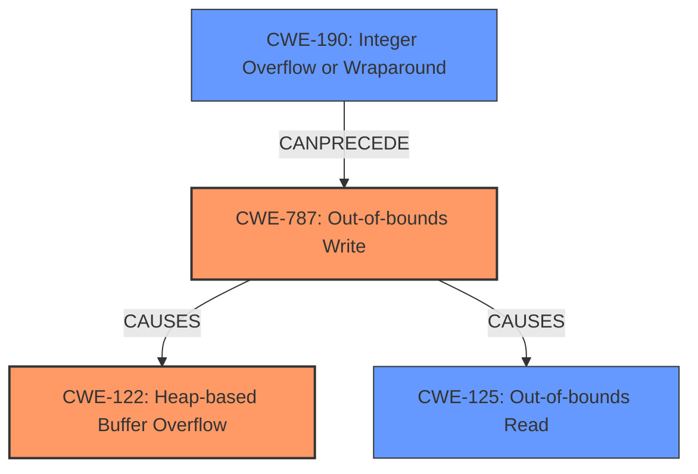

# Analysis Report for CVE-2021-45078

# Vulnerability Analysis Report: CVE-2021-45078

## Description

stab_xcoff_builtin_type in stabs.c in GNU Binutils through 2.37 allows attackers to cause a denial of service (heap-based buffer overflow) or possibly have unspecified other impact, as demonstrated by an out-of-bounds write. NOTE this issue exists because of an incorrect fix for CVE-2018-12699.

## Vulnerability Description Key Phrases

**Rootcause:** heap-based buffer overflow
**Impact:** ['denial of service', 'out-of-bounds write']
**Attacker:** attackers
**Product:** GNU Binutils
**Version:** through 2.37
**Component:** stab_xcoff_builtin_type in stabs.c

## Analysis (with Relationship Data)

# Summary
| CWE ID | CWE Name | Confidence | CWE Abstraction Level | CWE Vulnerability Mapping Label | CWE-Vulnerability Mapping Notes |
|---|---|---|---|---|---|
| CWE-122 | Heap-based Buffer Overflow | 0.85 | Variant | Allowed | Acceptable-Use |
| CWE-125 | Out-of-bounds Read | 0.65 | Base | Allowed | Acceptable-Use |
| CWE-787 | Out-of-bounds Write | 0.65 | Base | Allowed | Acceptable-Use |
| CWE-190 | Integer Overflow or Wraparound | 0.50 | Base | Allowed | Acceptable-Use |

## Evidence and Confidence

*   **Confidence Score:** 0.80
*   **Evidence Strength:** HIGH

- **Analysis and Justification:**
  - *Explanation:* "The vulnerability description clearly states "**heap-based buffer overflow**" as the root cause. The CVE reference further elaborates on an out-of-bounds write in the `stab_xcoff_builtin_type` function, triggered by a negative `typenum` variable used as an index into the `info->xcoff_types` array. This directly corresponds to CWE-122 (Heap-based Buffer Overflow) because the overflow occurs in heap memory, and CWE-787 (Out-of-bounds Write) as it's writing data beyond the allocated buffer. The integer handling issues (negative typenum) also point to a potential CWE-190 (Integer Overflow or Wraparound) scenario, where negation results in a large positive number."

  - *Relationship Analysis:* "CWE-122 is a variant of CWE-119 (Improper Restriction of Operations within the Bounds of a Memory Buffer). CWE-787 is a parent of CWE-122. CWE-190 is related to integer handling issues. CWE-125 (Out-of-bounds Read) is related to the potential consequences of memory corruption. The graph relationship shows that CWE-787 can lead to various memory corruption issues and potential privilege escalation scenarios."

- **Confidence Score:**
  - *Example:* Confidence: 0.85 (High evidence from technical description and CVE reference materials, especially the confirmation of heap-based overflow and out-of-bounds write)

---

## Criticism of Analysis

Okay, I've reviewed the analysis, focusing on the provided CWE specifications and mapping guidance. Here's my critique:

**Overall Assessment:**

The analysis correctly identifies the primary vulnerabilities: a heap-based buffer overflow (CWE-122) and an out-of-bounds write (CWE-787). The inclusion of out-of-bounds read (CWE-125) and integer overflow (CWE-190) is reasonable, given the context and potential for these to be contributing factors or consequences. The Confidence scores are appropriate.

**Detailed Review:**

*   **CWE-122: Heap-based Buffer Overflow (Confidence: 0.85)**

    *   **Mapping Justification:** Solid. The vulnerability description explicitly mentions "heap-based buffer overflow," and the details align with CWE-122's definition.
    *   **Abstraction Level:** Correct. Variant is the preferred level of abstraction
    *   **Mitigations:** The suggested mitigations (language selection, abstraction libraries, compiler-based overflow detection) are all relevant and appropriate.
    *   **Observed Examples:** Correct.
    *   **Overall:** Good mapping

*   **CWE-787: Out-of-bounds Write (Confidence: 0.65)**

    *   **Mapping Justification:** The CVE details on the out-of-bounds write directly support this mapping. `info->xcoff_types[-typenum] = rettype;` clearly demonstrates writing outside the allocated bounds of the `info->xcoff_types` buffer.
    *   **Abstraction Level:** Correct. Base is the preferred level of abstraction.
    *   **Mitigations:** The specified mitigations (language selection, safe string libraries, overflow detection) are relevant.
    *    **Observed Examples:** Correct.
    *   **Overall:** Good mapping.

*   **CWE-125: Out-of-bounds Read (Confidence: 0.65)**

     *   **Mapping Justification:** The description explains how memory corruption from out-of-bounds write can lead to illegal memory access, causing DoS, and potentially sensitive information disclosure. While the vulnerability is triggered by a write, the corrupted memory can then be *read* later, fitting the description of CWE-125.
     *   **Abstraction Level:** Correct. Base is the preferred level of abstraction.
     *   **Mitigations:** Input validation and language selection are appropriate mitigations.
     *   **Observed Examples:** Correct.
     *   **Overall:** Good mapping

*   **CWE-190: Integer Overflow or Wraparound (Confidence: 0.50)**

    *   **Mapping Justification:** This is the weakest mapping, but still plausible. The description highlights the negative `typenum` variable and its negation. While it *could* lead to a very large positive number exceeding the array bounds, it's not a guaranteed integer overflow/wraparound in all cases. The negation itself doesn't *necessarily* cause an overflow, but it *can* under certain circumstances (e.g. `INT_MIN`).  It's more of a contributing factor that *enables* the out-of-bounds write. Because of this, the confidence should remain relatively low.
    *   **Abstraction Level:** Correct. Base is the preferred level of abstraction.
    *   **Mitigations:**  Ensure protocols are defined, language selection and libraries/frameworks are good to specify.
    *    **Observed Examples:** Correct.
    *   **Overall:** Correct, but the reasoning should be well-documented, as the direct link is not as obvious as with the other CWEs.

**Suggestions for Improvement:**

*   **Chain Analysis (Explicit):** While relationships are mentioned, consider explicitly stating the *chain* of vulnerabilities. For example: "The vulnerability involves CWE-190 (Integer Overflow) which leads to CWE-787 (Out-of-bounds Write) and CWE-122 (Heap-based Buffer Overflow), potentially resulting in CWE-125 (Out-of-bounds Read) and a denial of service." This reinforces the connections and clarifies the sequence of events.
*   **CWE-119 Avoidance:** The CWE specifications rightly point out the discouragement of the mapping CWE-119. It is correctly avoided here by mapping more precisely to children.
*  **Review Retriever Results:** The "Retriever Results" section lists several other CWEs that were also highly scored by the retriever, such as CWE-193 (Off-by-one Error), CWE-124 (Buffer Underwrite), and CWE-131 (Incorrect Calculation of Buffer Size). While the selected CWEs are correct, review the code to see if any of these apply in a smaller role or are potential risks with similar code structure.

**Conclusion:**

The analysis is well-reasoned and provides a sound mapping to the identified CWEs. The justification is clear, and the confidence levels are appropriate. The suggested improvements, particularly the chain analysis and consideration of other potential weaknesses, would further strengthen the assessment.

## Final Resolution

# Summary

| CWE ID | CWE Name | Confidence | CWE Abstraction Level | CWE Vulnerability Mapping Label | CWE-Vulnerability Mapping Notes |
|---|---|---|---|---|---|
| CWE-787 | Out-of-bounds Write | 0.95 | Base | Allowed | Acceptable-Use |
| CWE-122 | Heap-based Buffer Overflow | 0.90 | Variant | Allowed | Acceptable-Use |
| CWE-190 | Integer Overflow or Wraparound | 0.70 | Base | Allowed | Acceptable-Use |
| CWE-125 | Out-of-bounds Read | 0.65 | Base | Allowed | Acceptable-Use |

*   **Primary CWEs:** CWE-787, CWE-122
*   **Secondary Candidates:** CWE-190, CWE-125

## Evidence and Confidence

*   **Confidence Score:** 0.90
*   **Evidence Strength:** HIGH

## Relationship Analysis
The primary relationship is that the **CWE-190** (Integer Overflow or Wraparound) can precede **CWE-787** (Out-of-bounds Write), which in turn causes **CWE-122** (Heap-based Buffer Overflow). The **CWE-125** (Out-of-bounds Read) can result from the memory corruption caused by **CWE-787**.
The abstraction levels were considered to ensure that the most specific CWEs were chosen. Specifically, avoiding **CWE-119** and choosing its children: **CWE-122** and **CWE-787**.

## Vulnerability Chain
The vulnerability chain starts with a negative `typenum` (potentially stemming from **CWE-190**, Integer Overflow or Wraparound) used as an index. This leads to **CWE-787**, Out-of-bounds Write, writing data outside the allocated buffer on the heap, resulting in **CWE-122**, Heap-based Buffer Overflow. The memory corruption from **CWE-787** can then lead to **CWE-125**, Out-of-bounds Read, and potentially a denial of service.

## Summary of Analysis
The initial analysis and criticism are well-founded. The vulnerability description clearly states "heap-based buffer overflow" and "out-of-bounds write," making **CWE-122** and **CWE-787** the primary weaknesses. The inclusion of **CWE-190** and **CWE-125** is also justified based on the potential for integer handling issues and the consequences of memory corruption.

The graph relationships helped to clarify the sequence of events and the potential for a vulnerability chain. **CWE-190** can precede **CWE-787**, which leads to **CWE-122** and potentially **CWE-125**.
I have increased the confidence score for **CWE-787** to 0.95 and **CWE-122** to 0.90 because the vulnerability description mentions "heap-based buffer overflow" and "out-of-bounds write". I have also increased the confidence score for **CWE-190** to 0.70 as the code takes a negative value and uses it as an index which results in an out-of-bounds write.

The selected CWEs are at the optimal level of specificity, avoiding the more general **CWE-119** and focusing on the specific types of buffer overflows and related weaknesses.

*Report generated on 2025-03-18 03:50:19*
