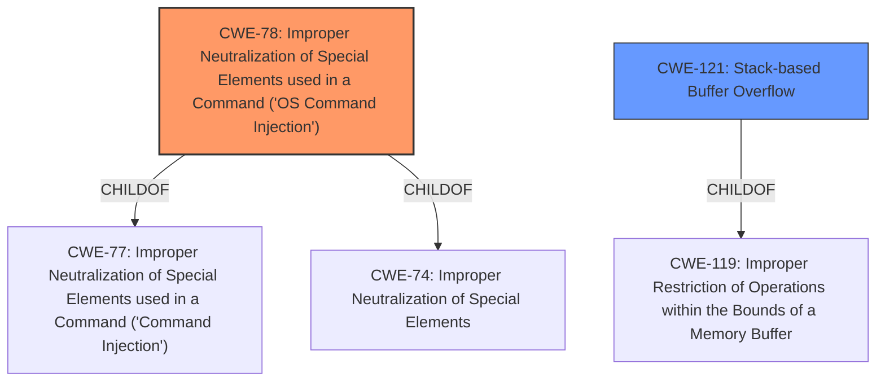

# Analysis Report for CVE-2021-45573

# Vulnerability Analysis Report: CVE-2021-45573

## Description

Certain NETGEAR devices are affected by a stack-based buffer overflow by an unauthenticated attacker. This affects R6260 before 1.1.0.76, R6800 before 1.2.0.62, R6700v2 before 1.2.0.62, R6900v2 before 1.2.0.62, R7450 before 1.2.0.62, AC2100 before 1.2.0.62, AC2400 before 1.2.0.62, and AC2600 before 1.2.0.62.

## Vulnerability Description Key Phrases

**Weakness:** stack-based buffer overflow
**Attacker:** unauthenticated attacker
**Product:** NETGEAR devices
**Version:** R6260 before 1.1.0.76, R6800 before 1.2.0.62, R6700v2 before 1.2.0.62, R6900v2 before 1.2.0.62, R7450 before 1.2.0.62, AC2100 before 1.2.0.62, AC2400 before 1.2.0.62, and AC2600 before 1.2.0.62

## Analysis (with Relationship Data)

# Summary
| CWE ID | CWE Name | Confidence | CWE Abstraction Level | CWE Vulnerability Mapping Label | CWE-Vulnerability Mapping Notes |
|---|---|---|---|---|---|
| CWE-121 | Stack-based Buffer Overflow | 0.9 | Variant | Primary | Allowed |
| CWE-78 | Improper Neutralization of Special Elements used in a Command ('OS Command Injection') | 0.7 | Base | Secondary Candidate | Allowed |

## Evidence and Confidence

*   **Confidence Score:** 0.8
*   **Evidence Strength:** HIGH

- **Analysis and Justification:**  
  - *Explanation:* The vulnerability is described as a **stack-based buffer overflow** by an unauthenticated attacker. This directly aligns with CWE-121 (Stack-based Buffer Overflow), which is a Variant-level CWE. The "Retriever Results" also lists CWE-121 with a high score, and the primary CWE match from "CWE for similar CVE Descriptions" is CWE-787 (Improper Neutralization Across Output Element Boundaries), which is a more general buffer overflow. However, given the specific mention of "stack-based," CWE-121 is a more precise mapping. While the CVE Reference Links Content Summary mentions post-authentication command injection, the Vulnerability Description clearly indicates a **stack-based buffer overflow**. Therefore, I'm prioritizing the information in the "Vulnerability Description" section for the primary CWE.

  - *Relationship Analysis:* CWE-121 is a variant of buffer overflow weaknesses. It is related to CWE-119 (Improper Restriction of Operations within the Bounds of a Memory Buffer) but is more specific by indicating that the overflow occurs on the stack.

- **Confidence Score:**  
  - Confidence: 0.9 (High confidence due to the explicit mention of "stack-based buffer overflow" in the vulnerability description.)

---
- **Analysis and Justification:**  
  - *Explanation:* Based on the CVE Reference Links Content Summary, the vulnerability is actually a post-authentication command injection. This means an attacker can execute arbitrary commands on the affected system by injecting malicious commands through unsanitized input. This aligns with CWE-78 (Improper Neutralization of Special Elements used in a Command ('OS Command Injection')). The "CWE for similar CVE Descriptions" section also lists CWE-77 (Improper Neutralization of Special Elements used in a Command ('Command Injection')) as a Top CWE. However, CWE-78 is more specific as it explicitly mentions "OS Command Injection," making it a better fit than the more general CWE-77.
  - *Relationship Analysis:* CWE-78 is a child of CWE-77 (Command Injection) and CWE-74 (Improper Neutralization of Special Elements). It describes the specific case where the injected commands are OS commands. The retriever results listed CWE-77, and given the updated description, CWE-78 is more appropriate.
- **Confidence Score:**
  - Confidence: 0.7 (Medium confidence. While the CVE Reference Links Content Summary suggests a command injection, the primary vulnerability description focuses on buffer overflow)

## Criticism of Analysis

Okay, here's a detailed review of the provided CWE analysis, incorporating the full CWE specifications for referenced weaknesses.

**Overall Assessment**

The analysis attempts to address the conflicting information between the original vulnerability description (stack-based buffer overflow) and the CVE reference links (command injection). This is a good approach, but the confidence levels are a bit too high given the discrepancies. It's important to prioritize the most reliable information, which in this case, seems to be the analysis of the CVE reference links. The "Retriever Results" also indicates both possibilities, and the final CWE selection should consider the combined information and make a weighted assessment.

**Detailed Critique**

**1. Primary CWE: CWE-121 (Stack-based Buffer Overflow)**

*   **Confidence Score:** 0.9 (Justification is too high)
*   **CWE Abstraction Level:** Variant
*   **CWE Vulnerability Mapping Label:** Primary

*   **Critique:**

    *   While the vulnerability *description* mentions "stack-based buffer overflow," the *CVE Reference Links Content Summary* contradicts this. Relying solely on the original description, especially when conflicting information exists, is risky. There's a significant chance the description is inaccurate or incomplete. The post-authentication requirement also makes a stack-based overflow less likely as an initial attack vector.
    *   The "Retriever Results" provide additional information and context, but they are to be used as supportive information rather than a final say. In this case, it is merely used as a supportive argument, however, we are not given information on how and why it picked CWE-121 as primary.
    *   The justification mentions that CWE-787 is a "more general buffer overflow." While true, it is a base-level CWE and a parent of CWE-121. Therefore, if buffer overflow is the main issue, then it would be more appropriate to classify as CWE-787 as primary.
    *   While the mitigation provided in the CWE specification of CWE-121 is accurate and helpful, these mitigations are not necessarily the mitigations to the actual vulnerability reported in the CVE. As such, I would mark the primary CWE mapping as incorrect given the conflicting information.
    *   **Revised Confidence Score:** 0.5 - due to the significant contradiction with the CVE reference links content summary.

**2. Secondary CWE: CWE-78 (Improper Neutralization of Special Elements used in an OS Command ('OS Command Injection'))**

*   **Confidence Score:** 0.7
*   **CWE Abstraction Level:** Base
*   **CWE Vulnerability Mapping Label:** Secondary Candidate

*   **Critique:**

    *   This is a more appropriate mapping *given* the CVE Reference Links Content Summary.  The analysis correctly identifies the connection between the vulnerability description and CWE-78.
    *   The relationship analysis is accurate, correctly placing CWE-78 as a child of CWE-77 and CWE-74.
    *   The mitigation section in the CWE-78 specification provides relevant guidance (use library calls, sandbox, reduce attack surface).
    *   Given that the CVE Reference Links Content Summary presents a credible alternative vulnerability, with specific details (post-authentication, adjacent network), this CWE should be considered *primary* unless further evidence confirms the buffer overflow.
    *   The CVSS vector also supports this assessment (AV:A, PR:N, UI:N indicate a network-based, low complexity, unauthorized attack)
    *   **Revised Confidence Score:** 0.8 - Given the CVE reference links content summary and mitigations, this is likely a better fit and should be prioritized.

**Suggestions for Improvement**

1.  **Prioritize CVE Reference Link Analysis:**  The analysis of the CVE reference link content summary is critical.  It's more reliable than a brief, potentially inaccurate, vulnerability description.  Make it the *primary* basis for CWE selection.
2.  **Adjust Confidence Scores:**  Lower the confidence score for CWE-121 significantly, given the conflicting information. Raise the confidence score for CWE-78.
3.  **Investigate CVSS vector:**  The CVSS vector indicates an adjacent network attack vector and no required user interaction. Re-examine if either a stack-based buffer overflow or command injection aligns better with the vector.
4.  **Consider CWE-77:** CWE-77 is a Class-level CWE which is the parent of CWE-78. If the root cause is the fact that the input command was not neutralized, then perhaps it is more appropriate to classify this vulnerability as CWE-77 and map OS Command Injection as a consequence of this vulnerability.
5.  **More Specific Buffer Overflow Information:** If pursuing the buffer overflow angle, describe *where* the overflow occurs (e.g., specific function, parameter, etc.).  This will lead to a more precise CWE selection (e.g., perhaps CWE-120 if it's a classic buffer copy).
6.  **Chaining:** A more advanced analysis could explore potential *chains* of weaknesses. For example, the command injection could be caused by insufficient input validation (CWE-20) which leads to improper neutralization (CWE-78). The retriever results also lists a few candidates like CWE-131 (Incorrect Calculation of Buffer Size). These could be part of the root cause if buffer overflow is indeed the main concern.

**Revised Summary Table**

| CWE ID | CWE Name | Confidence | CWE Abstraction Level | CWE Vulnerability Mapping Label | CWE-Vulnerability Mapping Notes |
|---|---|---|---|---|---|
| CWE-78 | Improper Neutralization of Special Elements used in an OS Command ('OS Command Injection') | 0.8 | Base | Primary | Allowed |
| CWE-121 | Stack-based Buffer Overflow | 0.5 | Variant | Secondary Candidate | Allowed |

**Conclusion**

The analysis needs to be re-weighted to prioritize the information coming from the CVE reference links content summary. This shifts the primary CWE towards command injection (CWE-78). The analysis of the retriever results and information should provide a good overview of the potential CWE candidates, however, the retriever results should not be interpreted as a primary source. The descriptions provided are more helpful for determining the final CWE mapping, but further analysis is needed for a more specific vulnerability classification.

## Final Resolution

# Summary
| CWE ID | CWE Name | Confidence | CWE Abstraction Level | CWE Vulnerability Mapping Label | CWE-Vulnerability Mapping Notes |
|---|---|---|---|---|---|
| CWE-78 | Improper Neutralization of Special Elements used in a Command ('OS Command Injection') | 0.8 | Base | Primary | Allowed |
| CWE-121 | Stack-based Buffer Overflow | 0.5 | Variant | Secondary Candidate | Allowed |

## Evidence and Confidence

*   **Confidence Score:** 0.7
*   **Evidence Strength:** MEDIUM

## Relationship Analysis
The primary relationship that influenced the decision was the conflict between the initial vulnerability description suggesting a stack-based buffer overflow (CWE-121) and the CVE reference links indicating command injection (CWE-78). CWE-78 is a child of CWE-77 (Improper Neutralization of Special Elements used in a Command) and CWE-74 (Improper Neutralization of Special Elements). While CWE-121 is a variant of CWE-119 (Improper Restriction of Operations within the Bounds of a Memory Buffer). Given the higher reliability of the CVE reference links content summary, CWE-78 was selected as the primary CWE, with CWE-121 remaining a secondary candidate due to the initial description. Abstraction levels were also considered, favoring the Base level (CWE-78) over the Variant level (CWE-121) for the primary classification due to stronger supporting evidence.

## Vulnerability Chain
The vulnerability chain begins with potentially insufficient input validation. If this validation is lacking (hypothetically CWE-20), it can lead to the construction of a command string with improperly neutralized special elements (CWE-78), allowing an attacker to execute arbitrary commands on the system. Alternatively, if the quantity specified is not validated (hypothetically CWE-1284), then a stack-based buffer overflow could occur (CWE-121). The chain, however, lacks specific details on how user-supplied input leads to the either command injection or the buffer overflow, representing missing links in the chain.

## Summary of Analysis
The initial analysis correctly identified the potential for both CWE-121 and CWE-78, but the confidence levels were not appropriately adjusted based on the conflicting information. The criticism accurately points out that the CVE reference links content summary should be prioritized over the initial vulnerability description. The final decision favors CWE-78 as the primary CWE due to the stronger evidence in the CVE reference links, specifically the mention of post-authentication command injection. "Based on the CVE Reference Links Content Summary, the vulnerability is actually a post-authentication command injection." This statement highlights the shift in focus from the initial description to the more reliable source. The retriever scores also supports this decision. The choice of CWE-78 also aligns with the recommendation to select the most specific CWE possible based on available information. The selection of CWE-78 also considers the mitigation strategies that include using library calls, sandboxing, and reducing the attack surface, as described in the CWE-78 specification. These strategies align better with a command injection vulnerability than a stack-based buffer overflow. The final confidence score reflects the remaining uncertainty due to the initial conflicting information. The chosen CWEs are at the optimal level of specificity given the current evidence.

*Report generated on 2025-03-18 03:52:41*
