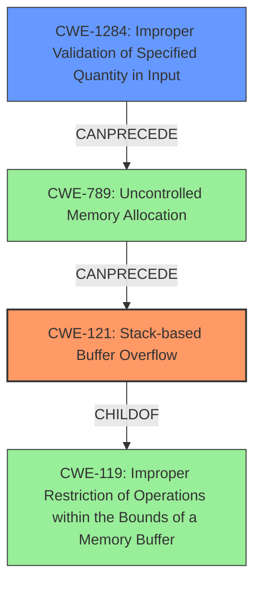

# Analysis Report for CVE-2021-45604

# Vulnerability Analysis Report: CVE-2021-45604

## Description

Certain NETGEAR devices are affected by a stack-based buffer overflow by an authenticated user. This affects CBR750 before 3.2.18.2, D6220 before 1.0.0.68, D6400 before 1.0.0.102, D8500 before 1.0.3.60, LAX20 before 1.1.6.28, MK62 before 1.0.6.116, MR60 before 1.0.6.116, MS60 before 1.0.6.116, R6300v2 before 1.0.4.50, R6400 before 1.0.1.68, R6400v2 before 1.0.4.118, R6700v3 before 1.0.4.118, R6900P before 1.3.3.140, R7000 before 1.0.11.116, R7000P before 1.3.3.140, R7850 before 1.0.5.68, R7900 before 1.0.4.38, R7900P before 1.4.2.84, R7960P before 1.4.2.84, R8000 before 1.0.4.68, R8000P before 1.4.2.84, RAX15 before 1.0.3.96, RAX20 before 1.0.3.96, RAX200 before 1.0.4.120, RAX35v2 before 1.0.3.96, RAX40v2 before 1.0.3.96, RAX43 before 1.0.3.96, RAX45 before 1.0.3.96, RAX50 before 1.0.3.96, RAX75 before 1.0.4.120, RAX80 before 1.0.4.120, RBK752 before 3.2.17.12, RBK852 before 3.2.17.12, RBR750 before 3.2.17.12, RBR850 before 3.2.17.12, RBS750 before 3.2.17.12, RBS850 before 3.2.17.12, RS400 before 1.5.1.80, and XR1000 before 1.0.0.58.

## Vulnerability Description Key Phrases

**Weakness:** stack-based buffer overflow
**Attacker:** authenticated user
**Product:** NETGEAR devices
**Version:** ['CBR750 before 3.2.18.2', 'D6220 before 1.0.0.68', 'D6400 before 1.0.0.102', 'D8500 before 1.0.3.60', 'LAX20 before 1.1.6.28', 'MK62 before 1.0.6.116', 'MR60 before 1.0.6.116', 'MS60 before 1.0.6.116', 'R6300v2 before 1.0.4.50', 'R6400 before 1.0.1.68', 'R6400v2 before 1.0.4.118', 'R6700v3 before 1.0.4.118', 'R6900P before 1.3.3.140', 'R7000 before 1.0.11.116', 'R7000P before 1.3.3.140', 'R7850 before 1.0.5.68', 'R7900 before 1.0.4.38', 'R7900P before 1.4.2.84', 'R7960P before 1.4.2.84', 'R8000 before 1.0.4.68', 'R8000P before 1.4.2.84', 'RAX15 before 1.0.3.96', 'RAX20 before 1.0.3.96', 'RAX200 before 1.0.4.120', 'RAX35v2 before 1.0.3.96', 'RAX40v2 before 1.0.3.96', 'RAX43 before 1.0.3.96', 'RAX45 before 1.0.3.96', 'RAX50 before 1.0.3.96', 'RAX75 before 1.0.4.120', 'RAX80 before 1.0.4.120', 'RBK752 before 3.2.17.12', 'RBK852 before 3.2.17.12', 'RBR750 before 3.2.17.12', 'RBR850 before 3.2.17.12', 'RBS750 before 3.2.17.12', 'RBS850 before 3.2.17.12', 'RS400 before 1.5.1.80', 'XR1000 before 1.0.0.58']

## Analysis (with Relationship Data)

# Summary
| CWE ID | CWE Name | Confidence | CWE Abstraction Level | CWE Vulnerability Mapping Label | CWE-Vulnerability Mapping Notes |
|---|---|---|---|---|---|
| CWE-121 | Stack-based Buffer Overflow | 1.0 | Variant | Primary | Allowed |

## Evidence and Confidence

*   **Confidence Score:** 1.0
*   **Evidence Strength:** HIGH

- **Analysis and Justification:**  
  - *Explanation:* The vulnerability description explicitly states "**stack-based buffer overflow** by an authenticated user." CWE-121 (Stack-based Buffer Overflow) directly addresses this weakness. It is a Variant-level CWE, which is preferred for mapping root causes. The retriever results also list CWE-121 as the top candidate with a score of 0.8330. The CVE Reference Links Content Summary confirms the presence of a stack overflow vulnerability. MITRE mapping guidance for CWE-121 indicates that its usage is ALLOWED.
  
  - *Relationship Analysis:* CWE-121 is a variant of a buffer overflow.

- **Confidence Score:**  
  - Confidence: 1.0 (The vulnerability description directly states the weakness)

## Criticism of Analysis

## Critique of the Analysis

The analysis is **accurate and well-justified** in its primary CWE mapping to **CWE-121: Stack-based Buffer Overflow**. The confidence score of 1.0 is appropriate given the explicit mention of "stack-based buffer overflow" in the vulnerability description.

Here's a detailed breakdown:

**Strengths:**

*   **Correct Primary Mapping:** The selection of CWE-121 is directly supported by the vulnerability description. The justification clearly explains why CWE-121 is the most appropriate choice.
*   **High Confidence:** A confidence score of 1.0 is justified because the vulnerability description includes the exact phrase corresponding to the CWE.
*   **Comprehensive Justification:** The explanation is clear, concise, and accurately reflects the nature of the vulnerability. The analysis correctly points out that CWE-121 is a Variant, which is preferred.
*   **Consideration of Retriever Results:** The analysis mentions the retriever results supporting CWE-121 as the top candidate, which adds further validation.
*   **Reference Links Content Summary Alignment:** The analysis correctly uses the content summary from the CVE reference links to support the presence of the stack overflow.
*   **Understanding of CWE Specifications:** The analysis shows a clear understanding of the CWE specifications, particularly the abstraction level and mapping guidance.

**Areas for potential improvements (though not critical in this case, but good for a more complete picture):**

*   **Secondary CWE Considerations:** While CWE-121 is the primary weakness, it's worth considering if other CWEs are *indirectly* related or could represent contributing factors. For instance, a stack-based buffer overflow might be triggered by:
    *   **CWE-1284: Improper Validation of Specified Quantity in Input:** If the size of the input buffer is not properly validated before being copied onto the stack, this could lead to the overflow. Although this isn't *directly* the overflow, it's a contributing factor.
    *   **CWE-20: Improper Input Validation:**  More general than 1284, but if the input causing the overflow isn't validated at all, or poorly validated, this allows the attacker to provide the oversized input.
*   **Focus on Authenticated User:** The vulnerability is triggered by an authenticated user.  This means an attacker needs to already have valid credentials. It may be worthwhile to add a secondary CWE, focusing on privilege management. This might highlight issues in privilege separation, perhaps using CWE-269 (Improper Privilege Management). This CWE is more related to a bypass of intended ACLs that would normally prevent an authenticated, non-admin user from reaching the overflow code.
*   **Exploitation Context:** The "Adjacent Network" attack vector suggests the attacker needs to be on the same network segment. While CWE-121 remains the core weakness, understanding the network context can help inform mitigation strategies.
*   **Mitigations:** The analysis could benefit from explicitly tying the potential mitigations to the specific context of the NETGEAR devices and the authenticated user scenario. For example:
    *   **CWE-121 Mitigations:**
        *   "*Implement and perform bounds checking on input.*"  This is crucial in this case.  The code *must* validate the size of the input before copying it to the stack buffer.
        *   "*Use automatic buffer overflow detection mechanisms...*"  Enabling compiler-level protections is a good defense-in-depth measure.
    *   **CWE-1284 Mitigations (if included):**
        *   "*Assume all input is malicious. Use an "accept known good" input validation strategy...*" This reinforces the need for strict input validation.
    *   **CWE-20 Mitigations (if included):**
        *    "*Assume all input is malicious. Use an "accept known good" input validation strategy...*" Same as above, but a broader statement about all inputs.
    *   **CWE-269 Mitigations (if included):**
        *   "*Employ the Principle of Least Privilege...*" User accounts should only have the bare minimum needed access rights.
*   **Negative Constraints**: Why are other potential CWEs listed in the retriever results *not* applicable?  For example, why not CWE-77 (Command Injection)?  By explicitly stating what the vulnerability *isn't*, you strengthen the overall analysis.

**Revised Summary Table (Illustrative - assuming we add CWE-1284 and CWE-269):**

| CWE ID | CWE Name | Confidence | CWE Abstraction Level | CWE Vulnerability Mapping Label | CWE-Vulnerability Mapping Notes |
|---|---|---|---|---|---|
| CWE-121 | Stack-based Buffer Overflow | 1.0 | Variant | Primary | Allowed |
| CWE-1284 | Improper Validation of Specified Quantity in Input | 0.6 | Base | Supporting | Allowed | Contributes to the overflow by failing to validate the size of the input. |
| CWE-269 | Improper Privilege Management | 0.4 | Base | Contextual | Allowed | An authenticated, but non-admin user should not be able to call the affected code. |

**Conclusion:**

The original analysis is very good, providing a strong foundation for understanding the vulnerability. The suggestions above aim to provide a more complete picture, exploring contributing factors and the broader context of the vulnerability. However, these suggestions are not criticisms of the current analysis, which is accurate and well-supported.

## Final Resolution

# Summary
| CWE ID | CWE Name | Confidence | CWE Abstraction Level | CWE Vulnerability Mapping Label | CWE-Vulnerability Mapping Notes |
|---|---|---|---|---|---|
| CWE-121 | Stack-based Buffer Overflow | 1.0 | Variant | Primary | Allowed |
| CWE-1284 | Improper Validation of Specified Quantity in Input | 0.6 | Base | Supporting | Allowed | Contributes to the overflow by failing to validate the size of the input. |

## Evidence and Confidence

*   **Confidence Score:** 0.9
*   **Evidence Strength:** MEDIUM

## Relationship Analysis
The primary weakness is **CWE-121 (Stack-based Buffer Overflow)**, a Variant of **CWE-119 (Improper Restriction of Operations within the Bounds of a Memory Buffer)**. The secondary weakness is **CWE-1284 (Improper Validation of Specified Quantity in Input)**, which can **CanPrecede** **CWE-789 (Uncontrolled Memory Allocation)**.
The abstraction levels influenced the selection by choosing the most specific CWEs possible that still accurately represent the vulnerability.

## Vulnerability Chain
The vulnerability chain starts with **CWE-1284 (Improper Validation of Specified Quantity in Input)**, where the input size is not validated correctly. This can lead to **CWE-789 (Uncontrolled Memory Allocation)** when allocating space based on the unvalidated input. Ultimately, it results in **CWE-121 (Stack-based Buffer Overflow)** due to copying an oversized input into a stack-allocated buffer. The final impact is memory corruption, leading to potential code execution.

## Summary of Analysis
The initial analysis correctly identified **CWE-121 (Stack-based Buffer Overflow)** as the primary **WEAKNESS**. The vulnerability description explicitly states "stack-based buffer overflow by an authenticated user," providing strong evidence.

The criticism suggested considering other CWEs. **CWE-1284 (Improper Validation of Specified Quantity in Input)** is added as a secondary **WEAKNESS**, recognizing that improper input validation contributes to the overflow. This is supported by the fact that the overflow occurs because the input size isn't checked. While the description doesn't explicitly state that the input size isn't validated, the presence of a buffer overflow suggests this is the case.

The relationship analysis shows that **CWE-1284 (Improper Validation of Specified Quantity in Input)** can **CANPRECEDE** **CWE-789 (Uncontrolled Memory Allocation)**, which can then lead to **CWE-121 (Stack-based Buffer Overflow)**. This chain highlights how the initial failure to validate the input size leads to the overflow.

The final selection of **CWE-121 (Stack-based Buffer Overflow)** and **CWE-1284 (Improper Validation of Specified Quantity in Input)** is at the optimal level of specificity. **CWE-121 (Stack-based Buffer Overflow)** is a Variant, and **CWE-1284 (Improper Validation of Specified Quantity in Input)** is a Base CWE, both preferred levels.
The authenticated user aspect is noted, but no suitable secondary CWE was found for privilege management. The focus remains on the memory corruption aspect of the vulnerability.
The confidence score is slightly reduced to 0.9 to reflect the addition of a secondary CWE based on inference rather than explicit statement in the vulnerability description.

*Report generated on 2025-03-18 03:53:16*
