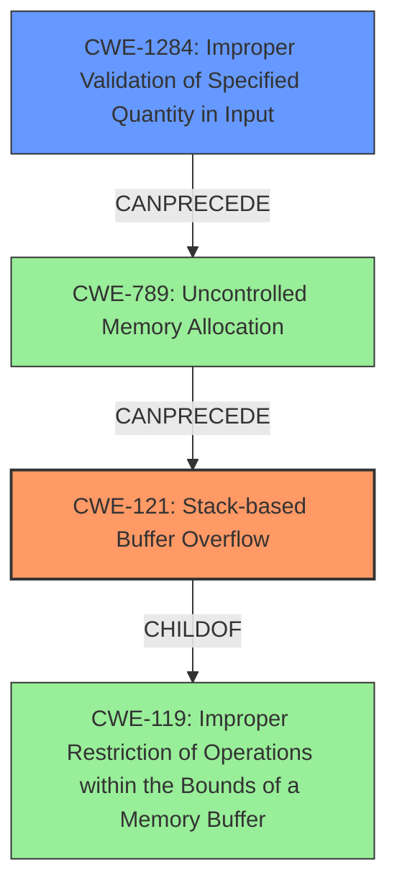

# Final Resolution for CVE-2021-45604

# Summary
| CWE ID | CWE Name | Confidence | CWE Abstraction Level | CWE Vulnerability Mapping Label | CWE-Vulnerability Mapping Notes |
|---|---|---|---|---|---|
| CWE-121 | Stack-based Buffer Overflow | 1.0 | Variant | Primary | Allowed |
| CWE-1284 | Improper Validation of Specified Quantity in Input | 0.6 | Base | Supporting | Allowed | Contributes to the overflow by failing to validate the size of the input. |

## Evidence and Confidence

*   **Confidence Score:** 0.9
*   **Evidence Strength:** MEDIUM

## Relationship Analysis
The primary weakness is **CWE-121 (Stack-based Buffer Overflow)**, a Variant of **CWE-119 (Improper Restriction of Operations within the Bounds of a Memory Buffer)**. The secondary weakness is **CWE-1284 (Improper Validation of Specified Quantity in Input)**, which can **CanPrecede** **CWE-789 (Uncontrolled Memory Allocation)**.
The abstraction levels influenced the selection by choosing the most specific CWEs possible that still accurately represent the vulnerability.

## Vulnerability Chain
The vulnerability chain starts with **CWE-1284 (Improper Validation of Specified Quantity in Input)**, where the input size is not validated correctly. This can lead to **CWE-789 (Uncontrolled Memory Allocation)** when allocating space based on the unvalidated input. Ultimately, it results in **CWE-121 (Stack-based Buffer Overflow)** due to copying an oversized input into a stack-allocated buffer. The final impact is memory corruption, leading to potential code execution.

## Summary of Analysis
The initial analysis correctly identified **CWE-121 (Stack-based Buffer Overflow)** as the primary **WEAKNESS**. The vulnerability description explicitly states "stack-based buffer overflow by an authenticated user," providing strong evidence.

The criticism suggested considering other CWEs. **CWE-1284 (Improper Validation of Specified Quantity in Input)** is added as a secondary **WEAKNESS**, recognizing that improper input validation contributes to the overflow. This is supported by the fact that the overflow occurs because the input size isn't checked. While the description doesn't explicitly state that the input size isn't validated, the presence of a buffer overflow suggests this is the case.

The relationship analysis shows that **CWE-1284 (Improper Validation of Specified Quantity in Input)** can **CANPRECEDE** **CWE-789 (Uncontrolled Memory Allocation)**, which can then lead to **CWE-121 (Stack-based Buffer Overflow)**. This chain highlights how the initial failure to validate the input size leads to the overflow.

The final selection of **CWE-121 (Stack-based Buffer Overflow)** and **CWE-1284 (Improper Validation of Specified Quantity in Input)** is at the optimal level of specificity. **CWE-121 (Stack-based Buffer Overflow)** is a Variant, and **CWE-1284 (Improper Validation of Specified Quantity in Input)** is a Base CWE, both preferred levels.
The authenticated user aspect is noted, but no suitable secondary CWE was found for privilege management. The focus remains on the memory corruption aspect of the vulnerability.
The confidence score is slightly reduced to 0.9 to reflect the addition of a secondary CWE based on inference rather than explicit statement in the vulnerability description.