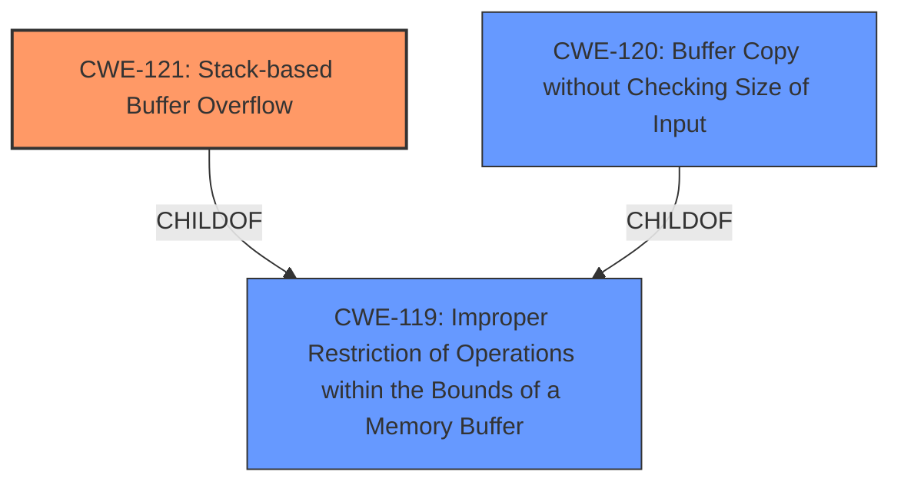

# Final Resolution for CVE-2021-45606

# Summary
| CWE ID  | CWE Name  | Confidence | CWE Abstraction Level | CWE Vulnerability Mapping Label | CWE-Vulnerability Mapping Notes |
|---|---|---|---|---|---|
| CWE-121 | Stack-based Buffer Overflow | 0.95 | Variant | Allowed | Primary CWE |
| CWE-120 | Buffer Copy without Checking Size of Input ('Classic Buffer Overflow') | 0.60 | Base | Allowed-with-Review | Secondary Candidate |
| CWE-119 | Improper Restriction of Operations within the Bounds of a Memory Buffer | 0.40 | Class | Discouraged | Secondary Candidate |

## Evidence and Confidence

*   **Confidence Score:** 0.95
*   **Evidence Strength:** HIGH

## Relationship Analysis
The primary CWE is CWE-121 (Stack-based Buffer Overflow), which is a variant of the more general CWE-119 (Improper Restriction of Operations within the Bounds of a Memory Buffer). This hierarchical relationship supports the decision to classify with CWE-121 due to its higher specificity. CWE-120 (Buffer Copy without Checking Size of Input) is considered as a secondary candidate because buffer overflows often involve copying data without proper size validation, but it is less specific than CWE-121.

## Vulnerability Chain
The vulnerability chain starts with the lack of proper bounds checking during a buffer copy operation, leading to a **stack-based buffer overflow (CWE-121)**. This allows an authenticated user to overwrite data on the stack, potentially including return addresses or other critical data, which can lead to arbitrary code execution.

## Summary of Analysis
The initial analysis and criticism both correctly identify CWE-121 (Stack-based Buffer Overflow) as the primary CWE. This determination is based on the explicit mention of "stack-based buffer overflow" in the vulnerability description. The confidence score of 0.95 reflects the high degree of certainty due to this direct evidence.

The decision to classify with CWE-121 is further supported by the hierarchical relationship with CWE-119 (Improper Restriction of Operations within the Bounds of a Memory Buffer), as CWE-121 is a more specific variant. The consideration of CWE-120 (Buffer Copy without Checking Size of Input) as a secondary candidate is also justified, although it is ultimately less precise than CWE-121.

The selection of CWE-121 is at the optimal level of specificity because it directly addresses the root cause of the vulnerability (a buffer overflow on the stack). While CWE-119 is a broader category, CWE-121 provides a more accurate and detailed classification. The analysis is based on the provided evidence and aligns with the MITRE mapping guidance for each CWE.