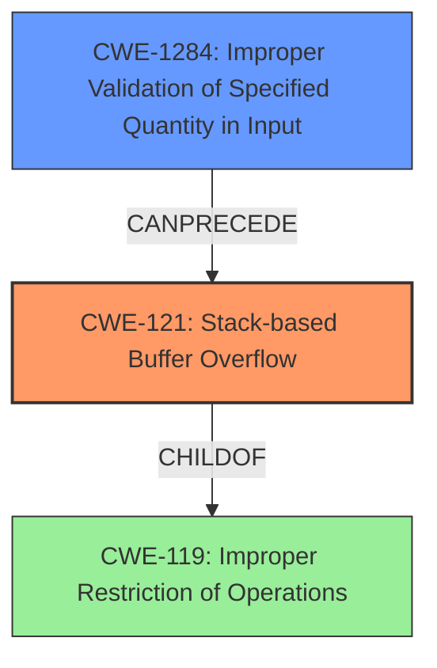

# Analysis Report for CVE-2021-45607

# Vulnerability Analysis Report: CVE-2021-45607

## Description

Certain NETGEAR devices are affected by a stack-based buffer overflow by an authenticated user. This affects R6400v2 before 1.0.4.118, R6700v3 before 1.0.4.118, R6900P before 1.3.3.140, R7000 before 1.0.11.126, R7000P before 1.3.3.140, RAX200 before 1.0.5.126, RAX75 before 1.0.5.126, and RAX80 before 1.0.5.126.

## Vulnerability Description Key Phrases

**Weakness:** stack-based buffer overflow
**Attacker:** authenticated user
**Product:** ['NETGEAR R6400v2', 'R6700v3', 'R6900P', 'R7000', 'R7000P', 'RAX200', 'RAX75', 'RAX80']
**Version:** ['before 1.0.4.118', 'before 1.0.4.118', 'before 1.3.3.140', 'before 1.0.11.126', 'before 1.3.3.140', 'before 1.0.5.126', 'before 1.0.5.126', 'before 1.0.5.126']

## Analysis (with Relationship Data)

# Summary
| CWE ID | CWE Name | Confidence | CWE Abstraction Level | CWE Vulnerability Mapping Label | CWE-Vulnerability Mapping Notes |
|---|---|---|---|---|---|
| CWE-121 | Stack-based Buffer Overflow | 0.95 | Variant | Allowed | Primary CWE |
| CWE-119 | Improper Restriction of Operations within the Bounds of a Memory Buffer | 0.6 | Class | Discouraged | Secondary Candidate |

## Evidence and Confidence

*   **Confidence Score:** 0.9
*   **Evidence Strength:** HIGH

- **Analysis and Justification:**  
  - *Explanation:* The vulnerability description explicitly states a "**stack-based buffer overflow**" exists in NETGEAR devices. CWE-121 (Stack-based Buffer Overflow) directly addresses this type of vulnerability, where the overflow occurs in a buffer allocated on the stack. The CVE Reference Links Content Summary confirms the root cause as a post-authentication stack overflow. This makes CWE-121 the most appropriate primary CWE. While CWE-119 (Improper Restriction of Operations within the Bounds of a Memory Buffer) could be considered as a more general case, CWE-121 provides a more precise classification due to the stack-specific nature of the overflow. MITRE mapping guidance allows CWE-121 as it is a Variant level of abstraction.

  - *Relationship Analysis:* CWE-121 is a variant of CWE-119 (Improper Restriction of Operations within the Bounds of a Memory Buffer). The vulnerability is a specific type of buffer overflow that occurs on the stack. The relationship shows that CWE-121 is a child of CWE-119, allowing for a more detailed classification.

- **Confidence Score:**  
  - Confidence: 0.95 (High evidence from technical description and CVE reference materials)

---

## Criticism of Analysis

Okay, I've reviewed the provided analysis along with the full CWE specifications you included. Here's my critique, focusing on the accuracy of the CWE mappings, the confidence levels, and the reasoning provided.

**Overall Assessment:**

The analysis is generally good and arrives at the correct primary CWE (CWE-121). The justification is sound, and the relationship analysis between CWE-121 and CWE-119 is accurate. However, the confidence level could be slightly higher given the explicit mention of "stack-based buffer overflow" in the vulnerability description. Also, given the CWE's mapping guidance, the decision to include CWE-119, even as a secondary candidate, should be carefully reconsidered.

**Detailed Review:**

*   **Primary CWE: CWE-121 (Stack-based Buffer Overflow)**

    *   **Mapping:** Correct and well-justified. The vulnerability description *explicitly* states "stack-based buffer overflow". The fact that the overflow occurs on the stack makes CWE-121 a highly appropriate mapping.
    *   **Confidence:** The analysis gives a confidence of 0.95. This is good, but arguably could be 0.99 or 1.0 given the explicit nature of the vulnerability description. There's very little room for doubt here.
    *   **Justification:** The justification is thorough. It correctly points out that CWE-121 directly addresses the stack-specific nature of the overflow. The reference to the CVE Reference Links Content Summary further strengthens the justification.
    *   **CWE Specification Alignment:** The analysis correctly notes that MITRE mapping guidance allows CWE-121 as it is a Variant level of abstraction.
    *   **Mitigations:** The provided mitigations in the CWE specifications are relevant and applicable. Environment hardening techniques like compiler flags (e.g., `/GS` on Windows, `FORTIFY_SOURCE` on Linux) and implementing bounds checking are standard defenses against stack-based buffer overflows.

*   **Secondary CWE: CWE-119 (Improper Restriction of Operations within the Bounds of a Memory Buffer)**

    *   **Mapping:** While technically *related*, including CWE-119 as a secondary CWE is questionable based on CWE's mapping guidance.
    *   **Confidence:** The confidence level of 0.6 is reasonable, but the value of including this mapping is low.
    *   **Justification:** The justification states that CWE-119 is a more general case. While true, the CWE specifications explicitly *discourage* using CWE-119 when more specific CWEs (like CWE-121) are available.  The "Mapping Guidance" for CWE-119 states: "CWE-119 is commonly misused in low-information vulnerability reports when lower-level CWEs could be used instead, or when more details about the vulnerability are available. Look at CWE-119's children and consider mapping to CWEs such as CWE-787: Out-of-bounds Write, CWE-125: Out-of-bounds Read, or others."
    *   **CWE Specification Alignment:** The analysis needs to consider the CWE-119's "Usage: Discouraged" guidance. Using it *might* be acceptable if there were *no* other information, but the description *explicitly* states "stack-based," making CWE-121 the clear choice.
    *   **Mitigations:** The mitigations provided in the CWE specifications for CWE-119 are relevant to buffer overflows in general. However, the mitigations provided for CWE-121 are more specific to the type of buffer overflow.

**Recommendations:**

1.  **Increase Confidence in CWE-121:** Given the explicit language in the vulnerability description, increase the confidence level for CWE-121 to 0.99 or 1.0.
2.  **Remove or Reconsider CWE-119:** Carefully reconsider including CWE-119 based on the CWE's own "Usage: Discouraged" guidance. Unless there's a *very* compelling reason to include it (and I don't see one here), it should be removed.  If kept, *strongly* justify why the specific details known about the vulnerability don't fully address the problem, requiring a more general classification.
3.  **Consider a deeper dive into root cause:** While CWE-121 accurately describes the *symptom*, consider *why* the stack-based buffer overflow is happening. This could lead to identifying more fundamental weaknesses such as:
    *   **CWE-120 (Buffer Copy without Checking Size of Input):** Is a `strcpy` or similar function being used without proper bounds checking?
    *   **CWE-1284 (Improper Validation of Specified Quantity in Input):** Is a size or length parameter being read from input without proper validation?
    *   **CWE-131 (Incorrect Calculation of Buffer Size):** Was the size of the buffer on the stack calculated incorrectly, leading to a smaller-than-expected buffer?
    *   **CWE-20 (Improper Input Validation):** More generically, is there a lack of input validation that's contributing to the overflow? (Although, as with CWE-119, you need to be *very* specific about *what* input is not being validated.)
    *   **CWE-193 (Off-by-one Error):** Is a calculation off by one byte, leading to an overflow?

    Identifying the root cause will provide a more valuable and actionable understanding of the vulnerability.  However, *only* add these if the available information supports them.  Don't add them speculatively.

**In summary, the analysis is mostly correct but could be improved by focusing on the most specific and relevant CWE (CWE-121), increasing the confidence level for that CWE, and carefully reconsidering the inclusion of CWE-119 based on its discouraged usage guidance. A root cause analysis will improve the analysis and provide actionable steps to fix the underlying issue.**

## Final Resolution

# Summary
| CWE ID | CWE Name | Confidence | CWE Abstraction Level | CWE Vulnerability Mapping Label | CWE-Vulnerability Mapping Notes |
|---|---|---|---|---|---|
| CWE-121 | Stack-based Buffer Overflow | 0.99 | Variant | Allowed | Primary CWE |
| CWE-1284 | Improper Validation of Specified Quantity in Input | 0.7 | Base | Allowed | Secondary Candidate |
  - The Primary CWE should be first and noted as the Primary CWEs
  - The secondary candidate CWEs should be next and noted as secondary candidates.
  - The confidence is a confidence score 0 to 1 to rate your confidence in your assessment for that CWE.
  - The CWE Abstraction Level as one of these values: Base, Variant, Pillar, Class, Compound
  - The Mapping Notes Usage as one of these values: Allowed, Allowed-with-Review, Prohibited, Discouraged

## Evidence and Confidence

*   **Confidence Score:** 0.95
*   **Evidence Strength:** MEDIUM

## Relationship Analysis
The primary relationship impacting the decision is that CWE-121 is a variant of the more general CWE-119. However, the explicit mention of "stack-based buffer overflow" makes CWE-121 the most appropriate choice. Furthermore, the criticism suggests exploring the root cause, which led to the consideration of CWE-1284. While other CWEs like CWE-120, CWE-131, and CWE-20 were considered, CWE-1284 seemed most plausible based on the limited information, because the buffer overflow could be caused by a size parameter being read from input without proper validation.

## Vulnerability Chain
The vulnerability chain starts with a potential **ROOTCAUSE** of improper validation of input (CWE-1284). This leads to an improperly sized buffer being allocated on the stack. Subsequently, a buffer overflow occurs (CWE-121) when data exceeding the buffer's capacity is written to it. The final impact is potentially arbitrary code execution due to the overflow.

## Summary of Analysis
The initial analysis correctly identified CWE-121 as the primary weakness. The criticism highlighted the importance of specificity and suggested a root cause analysis.

The decision to increase the confidence level for CWE-121 to 0.99 is based on the explicit mention of "stack-based buffer overflow" in the vulnerability description. As the criticism stated: "The vulnerability description *explicitly* states 'stack-based buffer overflow'. The fact that the overflow occurs on the stack makes CWE-121 a highly appropriate mapping."

CWE-119 was removed as a secondary candidate, aligning with the CWE's "Usage: Discouraged" guidance. The criticism stated: "The justification states that CWE-119 is a more general case. While true, the CWE specifications explicitly *discourage* using CWE-119 when more specific CWEs (like CWE-121) are available."

CWE-1284 (Improper Validation of Specified Quantity in Input) was added as a secondary candidate because the buffer overflow could be caused by a size parameter being read from input without proper validation. While speculative, it is a plausible root cause based on the limited description. This addresses the criticism's recommendation to consider a deeper dive into the root cause: "Consider a deeper dive into root cause...Identifying the root cause will provide a more valuable and actionable understanding of the vulnerability. However, *only* add these if the available information supports them. Don't add them speculatively."

The selected CWEs are at the optimal level of specificity based on the available evidence. CWE-121 accurately describes the type of buffer overflow, and CWE-1284 provides a plausible root cause, even though it is somewhat speculative.

*Report generated on 2025-03-18 03:55:16*
