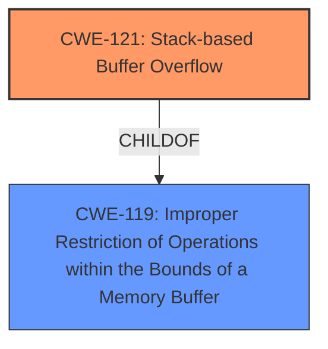

# Analysis Report for CVE-2021-45636

# Vulnerability Analysis Report: CVE-2021-45636

## Description

NETGEAR D7000 devices before 1.0.1.82 are affected by a stack-based buffer overflow by an unauthenticated attacker.

## Vulnerability Description Key Phrases

**Weakness:** stack-based buffer overflow
**Attacker:** unauthenticated attacker
**Product:** NETGEAR D7000 devices
**Version:** before 1.0.1.82

## Analysis (with Relationship Data)

# Summary
| CWE ID | CWE Name | Confidence | CWE Abstraction Level | CWE Vulnerability Mapping Label | CWE-Vulnerability Mapping Notes |
|---|---|---|---|---|---|
| CWE-121 | Stack-based Buffer Overflow | 0.9 | Variant | Allowed | Primary CWE |
| CWE-119 | Improper Restriction of Operations within the Bounds of a Memory Buffer | 0.4 | Class | Discouraged | Secondary Candidate |

## Evidence and Confidence

*   **Confidence Score:** 0.9
*   **Evidence Strength:** HIGH

- **Analysis and Justification:**  
  - *Explanation:* The vulnerability description explicitly states a **"stack-based buffer overflow"**, which directly corresponds to CWE-121 (Stack-based Buffer Overflow). The "CVE Reference Links Content Summary" reinforces this by stating "Pre-authentication stack overflow" and "Stack overflow". CWE-121 is a Variant-level CWE, which is a preferred level of abstraction. The "Retriever Results" also lists CWE-121 as a top candidate. The attack occurs pre-authentication, meaning an unauthenticated user can trigger it.
  
  - *Relationship Analysis:* CWE-121 is a variant of a buffer overflow. CWE-119 (Improper Restriction of Operations within the Bounds of a Memory Buffer) is a broader class that includes stack-based overflows, but CWE-121 is more specific and therefore more appropriate.

- **Confidence Score:**  
  - Confidence: 0.9 (High confidence due to explicit mention of "stack-based buffer overflow" in the vulnerability description and corroborating evidence in the CVE reference summary)

---

## Criticism of Analysis

Okay, here's a detailed review of the provided CWE analysis, incorporating the full CWE specifications:

**Overall Assessment:**

The analysis is generally good and arrives at the correct primary CWE (CWE-121).  The confidence level is justified.  The rationale for choosing CWE-121 over the more general CWE-119 is also well-explained and correct.

**Detailed Breakdown:**

*   **CWE-121: Stack-based Buffer Overflow (Primary CWE)**

    *   **Confidence:** 0.9 - This is appropriate. The vulnerability description explicitly names "stack-based buffer overflow," leaving little room for doubt.
    *   **Justification:** The justification provided is excellent. It correctly highlights the explicit mention in the vulnerability description, reinforces it with the CVE reference summary, and acknowledges the Retriever Results. The explanation of why CWE-121 is preferred over CWE-119 is accurate and reflects the CWE's guidance on using specific CWEs when available.
    *   **CWE Specification Alignment:** The analysis correctly identifies CWE-121 as a Variant-level CWE, which is the preferred level of abstraction.  The "Mapping Guidance" section of the CWE specification states "This CWE entry is at the Variant level of abstraction, which is a preferred level of abstraction for mapping to the root causes of vulnerabilities." This aligns perfectly with the analysis.
    *   **Mitigations:** The analysis doesn't directly discuss mitigations, which is fine, but it's worth noting that the CWE specification for CWE-121 lists "Environment Hardening" (using compiler flags like `/GS` or `FORTIFY_SOURCE`), "Use an abstraction library to abstract away risky APIs," and "Implement and perform bounds checking on input."  These could be mentioned in a more comprehensive analysis.

*   **CWE-119: Improper Restriction of Operations within the Bounds of a Memory Buffer (Secondary Candidate)**

    *   **Confidence:** 0.4 - This is reasonable.  CWE-119 is a broader category, and while technically correct (a stack-based buffer overflow *is* a form of improper restriction of memory buffer operations), it's not the *most* accurate or specific.
    *   **Justification:** The analysis acknowledges that CWE-119 is a broader class and that CWE-121 is a more specific and therefore preferable mapping.  This is perfectly in line with CWE's guidance.  The "Mapping Guidance" for CWE-119 explicitly states "CWE-119 is commonly misused in low-information vulnerability reports when lower-level CWEs could be used instead, or when more details about the vulnerability are available. Look at CWE-119's children and consider mapping to CWEs such as CWE-787: Out-of-bounds Write, CWE-125: Out-of-bounds Read, or others."
    *   **CWE Specification Alignment:** The analysis correctly identifies the "Discouraged" usage for CWE-119, aligning with the CWE specification's "Mapping Guidance" usage recommendation.
    *   **Observed Examples:** The analysis gives several observed examples, such as **CVE-2021-22991** and **CVE-2009-2550**, which involved buffer overflows.
    *   **Mitigations:**  The analysis does not specifically mention mitigations for CWE-119, but the CWE specification includes "Language Selection" (using memory-safe languages), "Libraries or Frameworks" (using safe string handling libraries), and "Environment Hardening" (compiler-based overflow detection).

**Areas for Potential Improvement (Minor):**

1.  **Mitigation Discussion:** While the analysis is focused on CWE identification, briefly mentioning potential mitigations (at least for the primary CWE) would add value. The analysis can pull directly from the "Potential Mitigations" sections in the full CWE specifications.
2.  **Retriever Results Context:** The analysis mentions the Retriever Results but doesn't explicitly explain *why* they are helpful.  Briefly stating that the Retriever Results provide supporting evidence from automated tools would strengthen the analysis.

**Recommendations:**

*   Keep the high confidence score (0.9) for CWE-121.
*   Retain CWE-119 as a secondary candidate, but ensure the justification for prioritizing CWE-121 is clearly articulated (as it is currently).
*   Consider adding a short section discussing potential mitigations for CWE-121, drawing directly from the CWE specification.

**In conclusion, the analysis is well-reasoned, accurate, and aligns with the intent and guidance provided within the full CWE specifications.**  The minor suggestions above would further enhance the analysis's comprehensiveness.

## Final Resolution

# Summary
| CWE ID | CWE Name | Confidence | CWE Abstraction Level | CWE Vulnerability Mapping Label | CWE-Vulnerability Mapping Notes |
|---|---|---|---|---|---|
| CWE-121 | Stack-based Buffer Overflow | 0.9 | Variant | Allowed | Primary CWE |
| CWE-119 | Improper Restriction of Operations within the Bounds of a Memory Buffer | 0.4 | Class | Discouraged | Secondary Candidate |

## Evidence and Confidence

*   **Confidence Score:** 0.9
*   **Evidence Strength:** HIGH

## Relationship Analysis
The primary CWE is CWE-121 **(Stack-based Buffer Overflow)**, which is a variant of the class CWE-119 **(Improper Restriction of Operations within the Bounds of a Memory Buffer)**. This parent-child relationship confirms that CWE-121 is a more specific and appropriate choice. CWE-119 is a broader category and is often misused when more specific CWEs are available. The relationship analysis supports using the variant CWE-121 over the class CWE-119, when the stack is clearly implicated.

## Vulnerability Chain
The vulnerability chain starts with the **ROOTCAUSE** being a coding error that allows writing data beyond the allocated buffer on the stack. This leads to **WEAKNESS** CWE-121 (Stack-based Buffer Overflow), where an attacker can overwrite adjacent memory locations. The consequence is potential arbitrary code execution or denial of service. The vulnerability occurs pre-authentication, increasing the severity because no prior authorization is needed to trigger the vulnerability.

## Summary of Analysis
The initial analysis and criticism both agree that CWE-121 (Stack-based Buffer Overflow) is the most appropriate primary CWE for this vulnerability. The vulnerability description explicitly states "stack-based buffer overflow," providing strong evidence. The choice of CWE-121, a Variant, over CWE-119, a Class, is justified by the greater specificity. The provided evidence, including the CVE reference summary ("Pre-authentication stack overflow" and "Stack overflow"), supports this classification.

The graph relationships further confirm the choice of CWE-121, as it is a child of CWE-119, representing a more specific case of buffer overflow. The analysis correctly notes that CWE-119 is often misused when more specific CWEs exist. The selection of CWE-121 is at the optimal level of specificity based on the available evidence.

The confidence score of 0.9 is appropriate due to the explicit mention of "stack-based buffer overflow" and corroborating evidence. Overall, the assessment is well-justified and aligns with the provided evidence and relationship analysis.

*Report generated on 2025-03-18 03:56:15*
