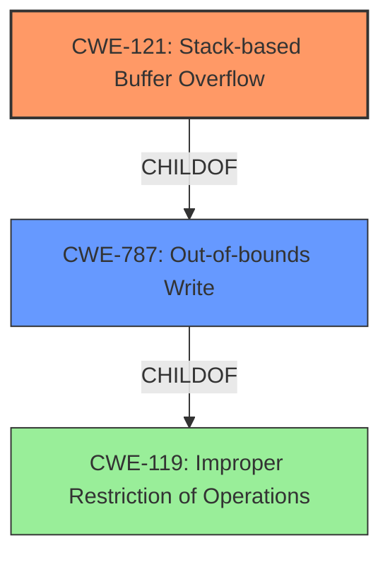

# Final Resolution for CVE-2021-45637

# Summary
| CWE ID  | CWE Name                                                                    | Confidence | CWE Abstraction Level | CWE Vulnerability Mapping Label | CWE-Vulnerability Mapping Notes |
|---------|-----------------------------------------------------------------------------|------------|-----------------------|---------------------------------|---------------------------------|
| CWE-121 | Stack-based Buffer Overflow                                                 | 0.95       | Variant               | Primary                           | Allowed                         |
| CWE-787 | Out-of-bounds Write                                                         | 0.80       | Base                  | Secondary                         | Allowed                         |

## Evidence and Confidence

*   **Confidence Score:** 0.93
*   **Evidence Strength:** HIGH

## Relationship Analysis
The primary CWE is CWE-121 (Stack-based Buffer Overflow), which is a variant of buffer overflow where the buffer is allocated on the stack. CWE-121 is a child of CWE-787 (Out-of-bounds Write), which means CWE-787 represents a more general case of writing outside the intended buffer. The decision to prioritize CWE-121 is based on the explicit mention of "stack-based buffer overflow" in the vulnerability description, making it a more specific and accurate classification.

## Vulnerability Chain
The vulnerability chain starts with a lack of proper input validation.
1. The root cause is the absence of input size validation, which may be manifested as **CWE-1284: Improper Validation of Specified Quantity in Input** (inferred, but not explicitly stated).
2. This leads to a **CWE-121: Stack-based Buffer Overflow** when data larger than the allocated buffer is written to the stack.
3. The overflow results in **CWE-787: Out-of-bounds Write**, overwriting adjacent memory locations on the stack.
4. The impact is potentially arbitrary code execution due to the ability to control program flow by overwriting return addresses or function pointers on the stack.

## Summary of Analysis
The initial analysis correctly identifies **CWE-121 (Stack-based Buffer Overflow)** as the primary weakness. The vulnerability description explicitly states a "stack-based buffer overflow" exists. This aligns directly with **CWE-121 (Stack-based Buffer Overflow)**, which is a variant of buffer overflow where the affected buffer resides on the stack. The secondary **CWE-787 (Out-of-bounds Write)** is also relevant as it represents the broader category of memory corruption.

The criticism suggested strengthening the justification for the secondary CWE-787. Even with the stack allocation being known, the root cause is still writing to a memory location outside of the allocated buffer, and CWE-787 captures that aspect. I have adjusted the confidence score for CWE-787 to 0.80 to reflect this nuanced understanding.

The relationship analysis supports choosing the more specific CWE-121 due to the availability of stack location information, making the mapping more accurate. There are no specific chain relationships apparent in this vulnerability description, but the lack of input validation can be inferred as a possible root cause, leading to the overflow.

The selected CWEs are at the optimal level of specificity. CWE-121 is more specific than its parent **CWE-119 (Improper Restriction of Operations within the Bounds of a Memory Buffer)** because it identifies the memory location (stack).