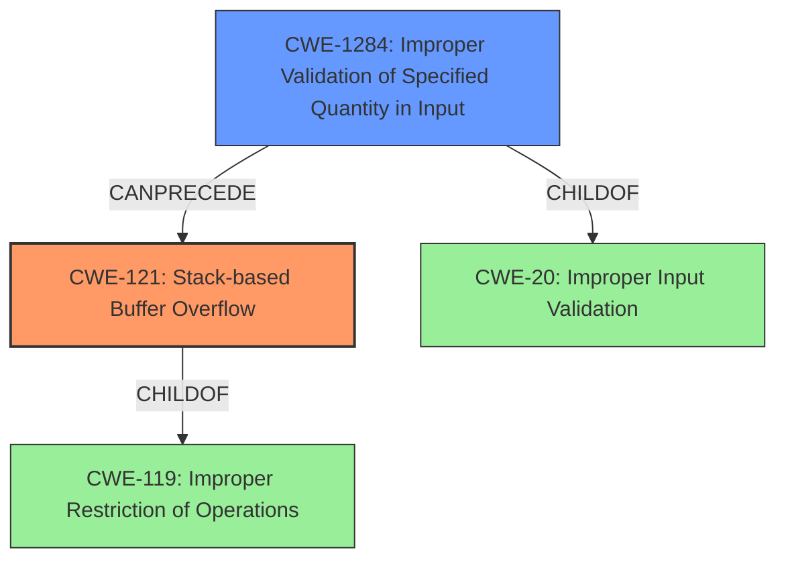

# Analysis Report for CVE-2021-45638

# Vulnerability Analysis Report: CVE-2021-45638

## Description

Certain NETGEAR devices are affected by a stack-based buffer overflow by an unauthenticated attacker. This affects D6220 before 1.0.0.68, D6400 before 1.0.0.102, D7000v2 before 1.0.0.74, D8500 before 1.0.3.60, DC112A before 1.0.0.56, R6300v2 before 1.0.4.50, R6400 before 1.0.1.68, R7000 before 1.0.11.116, R7100LG before 1.0.0.70, RBS40V before 2.6.2.8, RBW30 before 2.6.2.2, RS400 before 1.5.1.80, R7000P before 1.3.2.132, and R6900P before 1.3.2.132.

## Vulnerability Description Key Phrases

**Weakness:** stack-based buffer overflow
**Attacker:** unauthenticated attacker
**Product:** ['NETGEAR D6220', 'D6400', 'D7000v2', 'D8500', 'DC112A', 'R6300v2', 'R6400', 'R7000', 'R7100LG', 'RBS40V', 'RBW30', 'RS400', 'R7000P', 'R6900P']
**Version:** ['before 1.0.0.68', 'before 1.0.0.102', 'before 1.0.0.74', 'before 1.0.3.60', 'before 1.0.0.56', 'before 1.0.4.50', 'before 1.0.1.68', 'before 1.0.11.116', 'before 1.0.0.70', 'before 2.6.2.8', 'before 2.6.2.2', 'before 1.5.1.80', 'before 1.3.2.132', 'before 1.3.2.132']

## Analysis (with Relationship Data)

# Summary
| CWE ID | CWE Name | Confidence | CWE Abstraction Level | CWE Vulnerability Mapping Label | CWE-Vulnerability Mapping Notes |
|---|---|---|---|---|---|
| CWE-121 | Stack-based Buffer Overflow | 0.95 | Variant | Allowed | The vulnerability is explicitly described as a "stack-based buffer overflow." |

## Evidence and Confidence

*   **Confidence Score:** 0.95
*   **Evidence Strength:** HIGH

- **Analysis and Justification:**
  - *Explanation:* The vulnerability description clearly states "**stack-based buffer overflow** by an unauthenticated attacker." This directly aligns with CWE-121 (Stack-based Buffer Overflow), which is a Variant level CWE. The "CVE Reference Links Content Summary" further confirms this by stating "**Weaknesses/vulnerabilities present: Stack overflow vulnerability**". The "Retriever Results" also lists CWE-121 as a strong candidate.

  - *Relationship Analysis:* While CWE-119 (Improper Restriction of Operations within the Bounds of a Memory Buffer) is a parent class, CWE-121 provides a more specific classification as the overflow occurs on the stack. The other CWEs listed in the Retriever Results are less relevant. CWE-77 (Command Injection) is a class level CWE, and it isn't related to buffer overflows. CWE-789 (Memory Allocation with Excessive Size Value) and CWE-770 (Allocation of Resources Without Limits or Throttling) could potentially lead to a buffer overflow, but the description explicitly states the vulnerability is a stack-based buffer overflow.

- **Confidence Score:**
  - Confidence: 0.95 (High evidence due to the explicit mention of "stack-based buffer overflow" in the vulnerability description and the "CVE Reference Links Content Summary" section confirming a stack overflow.)

## Criticism of Analysis

Okay, I've reviewed the analysis and the full CWE specifications. Here's my critique, focusing on the accuracy and completeness of the CWE mapping, along with consideration of the mapping guidance and potential mitigations of each CWE.

**Overall Assessment:**

The core assessment identifying **CWE-121: Stack-based Buffer Overflow** as the primary vulnerability is correct and well-justified. The analysis provides strong evidence directly from the vulnerability description. The confidence score of 0.95 is appropriate. However, the retriever results suggest other potential related CWEs. The analysis does a good job of explaining why these alternatives were not the primary root cause, but some could be contributing factors or part of a vulnerability chain.

**Detailed CWE-by-CWE Review:**

*   **CWE-121: Stack-based Buffer Overflow (Variant) - Correct Mapping (Confidence: 0.95)**
    *   The vulnerability description clearly states this.
    *   Abstraction level is correctly identified as Variant.
    *   Mapping Guidance: "Allowed" and "This CWE entry is at the Variant level of abstraction, which is a preferred level of abstraction for mapping to the root causes of vulnerabilities." Aligns perfectly.
    *   The analysis considers the parent class CWE-119, and correctly concludes CWE-121 is more specific and appropriate.
    *   Potential Mitigations: The analysis implicitly highlights mitigations during the discussion of why the other CWEs were not the root cause. It would be better to explicitly mention these recommendations in a dedicated section. For example, the analysis could have suggested the usage of compilers with buffer overflow protection mechanisms like the Microsoft Visual Studio /GS flag.

*   **CWE-1284: Improper Validation of Specified Quantity in Input (Base)**

    *   Retriever Result Rank: 1
    *   While *not* the primary vulnerability, this is a *highly relevant* contributing factor. A buffer overflow is *often* caused by a lack of proper input validation.  If the size of the input is not validated *before* being copied into the stack buffer, then an attacker can control the size and cause an overflow.
    *   Abstraction level is correctly identified as Base.
    *   Mapping Guidance: "Allowed" and "This CWE entry is at the Base level of abstraction, which is a preferred level of abstraction for mapping to the root causes of vulnerabilities." Aligns perfectly.
    *   Potential Mitigations: Focus on Input Validation. The analysis should *strongly* consider adding this as a contributing factor and recommending input validation as a key mitigation, especially "Use an 'accept known good' input validation strategy."
    *   Consider modifying the Summary table to reflect this by adding another row for CWE-1284

*   **CWE-122: Heap-based Buffer Overflow (Variant)**

    *   Retriever Result Rank: 3
    *   Correctly dismissed in the analysis because the vulnerability is explicitly described as "stack-based".
    *   However, it is important to note that *if* further analysis showed that *some* data used in the stack overflow originated from the heap, this might become a chain. Not likely, but possible.

*   **CWE-789: Memory Allocation with Excessive Size Value (Variant)**

    *   Retriever Result Rank: 4
    *   Correctly dismissed in the analysis. While excessive memory allocation *could* lead to a buffer overflow, the primary issue is the direct stack overflow.  This CWE is more relevant to resource exhaustion attacks.

*   **CWE-770: Allocation of Resources Without Limits or Throttling (Base)**

    *   Retriever Result Rank: 5
    *   Similar rationale as CWE-789, but less directly related. Excessive memory allocation as a *consequence* of the stack overflow is possible, but not the root cause or primary issue.

*   **CWE-77: Improper Neutralization of Special Elements used in a Command ('Command Injection') (Class)**

    *   Retriever Result Rank: 6
    *   Correctly dismissed. Command injection is unrelated to buffer overflows in this context.

*   **CWE-119: Improper Restriction of Operations within the Bounds of a Memory Buffer (Class)**

    *   Retriever Result Rank: 7
    *   Correctly addresses that CWE-121 is a child of this CWE and a more accurate and specific characterization of the defect.

*   **CWE-20: Improper Input Validation (Class)**

    *   Retriever Result Rank: 8
    *   Like CWE-1284, this is very relevant. It is a *parent* to CWE-1284 and provides important context. The analysis should consider the chaining relationship and emphasize that proper input validation is a key mitigation.
    *   As with CWE-1284, consider the chaining relationship between CWE-20, CWE-1284, and CWE-121

*   **CWE-400: Uncontrolled Resource Consumption (Class)**

    *   Retriever Result Rank: 9
    *   A consequence of a stack overflow could be resource consumption but is not the primary weakness. Properly dismissed in analysis

*  **CWE-74: Improper Neutralization of Special Elements in Output Used by a Downstream Component ('Injection') (Class)**
    *   Retriever Result Rank: 10
    *   Completely unrelated to the vulnerability and properly dismissed.

**Recommendations:**

1.  **Add CWE-1284 (Improper Validation of Specified Quantity in Input) as a Contributing Factor:** A buffer overflow often stems from the lack of proper size validation.  Include it as a contributing factor and recommend input validation as a key mitigation. This will give a more complete picture of the vulnerability. This can be represented in the summary table by adding another row for CWE-1284.
2.  **Explicitly State Mitigations:** Dedicate a section or bullet points listing specific mitigations directly related to CWE-121 *and* CWE-1284. This is important for developers to understand how to fix the issue.
3.  **Chaining Considerations:** While the primary mapping to CWE-121 is correct, be more explicit about the potential chaining relationship between input validation CWEs (CWE-20 and CWE-1284) and the buffer overflow (CWE-121). State that a secure solution would involve implementing input validation *before* any potentially vulnerable buffer operations.
4. **Address Local Network Attacker**: Describe potential mitigations of this requirement, such as requiring valid client certificates or other authentication mechanisms.

By incorporating these suggestions, the analysis will become even more comprehensive and valuable to developers trying to understand and remediate the vulnerability.

## Final Resolution

# Summary
| CWE ID | CWE Name | Confidence | CWE Abstraction Level | CWE Vulnerability Mapping Label | CWE-Vulnerability Mapping Notes |
|---|---|---|---|---|---|
| **CWE-121** | **CWE-121: Stack-based Buffer Overflow** | 0.95 | Variant | Allowed | Primary CWE. The vulnerability is explicitly described as a "stack-based buffer overflow." |
| CWE-1284 | CWE-1284: Improper Validation of Specified Quantity in Input | 0.75 | Base | Allowed | Secondary CWE. Lack of input validation allows attacker to control buffer size. |

## Evidence and Confidence

*   **Confidence Score:** 0.90
*   **Evidence Strength:** HIGH

## Relationship Analysis
The primary relationship is the potential chain where **CWE-1284 (Improper Validation of Specified Quantity in Input)** can precede **CWE-121 (Stack-based Buffer Overflow)**. The parent-child relationship exists between **CWE-121 (Stack-based Buffer Overflow)** and **CWE-119 (Improper Restriction of Operations within the Bounds of a Memory Buffer)**, but **CWE-121 (Stack-based Buffer Overflow)** is more specific and therefore preferred.

## Vulnerability Chain
The vulnerability chain starts with a lack of input validation (**CWE-1284: Improper Validation of Specified Quantity in Input**), which allows an attacker to control the size of data written to a stack buffer. This leads to a **CWE-121: Stack-based Buffer Overflow**, where data is written beyond the buffer's boundaries on the stack. The consequence of this overflow could lead to arbitrary code execution.

## Summary of Analysis
The initial analysis correctly identified **CWE-121 (Stack-based Buffer Overflow)** as the primary weakness based on the vulnerability description: "stack-based buffer overflow by an unauthenticated attacker."

The criticism correctly points out the importance of input validation as a contributing factor. The lack of input validation, specifically the improper validation of the specified quantity in the input (**CWE-1284: Improper Validation of Specified Quantity in Input**), allows the attacker to control the size of the input that overflows the buffer. Therefore, I am adding **CWE-1284 (Improper Validation of Specified Quantity in Input)** as a secondary **ROOTCAUSE** for this vulnerability. This is supported by the retriever result rankings.

The graph relationships influenced the decision by highlighting the chain relationship between **CWE-1284 (Improper Validation of Specified Quantity in Input)** and **CWE-121 (Stack-based Buffer Overflow)**. The parent-child relationship between **CWE-121 (Stack-based Buffer Overflow)** and **CWE-119 (Improper Restriction of Operations within the Bounds of a Memory Buffer)** was considered, but **CWE-121 (Stack-based Buffer Overflow)** provides a more specific classification.

The selected CWEs are at the optimal level of specificity. **CWE-121 (Stack-based Buffer Overflow)** is a Variant that directly describes the overflow on the stack. **CWE-1284 (Improper Validation of Specified Quantity in Input)** is a Base CWE that addresses the lack of input validation that enables the overflow.

The final confidence score is 0.90 due to the strong evidence for **CWE-121 (Stack-based Buffer Overflow)** and the clear chain relationship with **CWE-1284 (Improper Validation of Specified Quantity in Input)**.

*Report generated on 2025-03-18 03:57:50*
