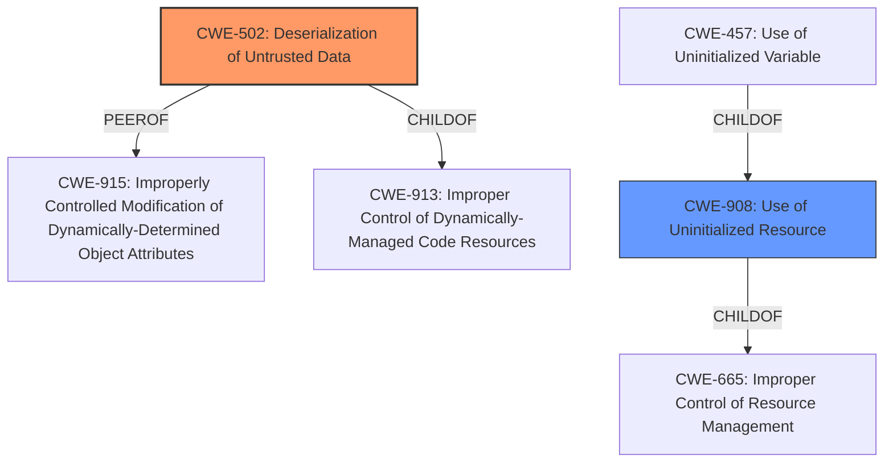

# Analysis Report for CVE-2021-45687

# Vulnerability Analysis Report: CVE-2021-45687

## Description

An issue was discovered in the raw-cpuid crate before 9.1.1 for Rust. If the serialize feature is used (which is not the the default), a Deserialize operation may lack sufficient validation, leading to memory corruption or a panic.

## Vulnerability Description Key Phrases

**Impact:** ['memory corruption', 'panic']
**Product:** raw-cpuid crate
**Version:** before 9.1.1

## Analysis (with Relationship Data)

# Summary
| CWE ID | CWE Name | Confidence | CWE Abstraction Level | CWE Vulnerability Mapping Label | CWE-Vulnerability Mapping Notes |
|---|---|---|---|---|---|
| CWE-502 | Deserialization of Untrusted Data | 0.85 | Base | Primary | Allowed |
| CWE-20 | Improper Input Validation | 0.60 | Class | Secondary | Discouraged |

## Evidence and Confidence

*   **Confidence Score:** 0.75
*   **Evidence Strength:** HIGH

- **Analysis and Justification:**  
  - *Explanation:* The vulnerability lies in the `raw-cpuid` crate's **deserialization** process when the `serialize` feature is enabled. The **lack of sufficient validation** during deserialization can lead to **memory corruption** or a **panic**. This aligns directly with CWE-502 (Deserialization of Untrusted Data), as the crate is **deserializing** data without ensuring its validity. The use of `std::str::from_utf8_unchecked()` without prior validation further emphasizes the **unsafe handling of potentially malicious data** during deserialization. The impact includes **undefined behavior** and **denial of service**, which are typical consequences of deserialization vulnerabilities.
  
  - *Relationship Analysis:* While CWE-20 (Improper Input Validation) could be considered a broader category, CWE-502 is more specific to the deserialization context, making it the more appropriate choice. CWE-502 is a child of CWE-913 (Improper Control of Dynamically-Managed Code Resources) and a peer of CWE-915 (Improperly Controlled Modification of Dynamically-Managed Code). The "Allowed" usage for CWE-502 supports this mapping. Since the root cause is insufficient validation during deserialization, I am selecting CWE-502.

- **Confidence Score:**  
  - Confidence: 0.85 (High evidence from technical description and CVE reference materials)

---

- **Analysis and Justification:**  
  - *Explanation:* CWE-20 (Improper Input Validation) is a general weakness where the product receives input but does not validate or incorrectly validates that the input has the properties that are required to process the data safely and correctly. In this case, the raw-cpuid crate does not sufficiently validate the input data during the deserialization process.
  - *Relationship Analysis:* CWE-20 is a class-level CWE, and while applicable, it is less specific than CWE-502. CWE-20 is a parent of CWE-1286 (Improper Validation of Syntactic Correctness of Input) and CWE-1284 (Improper Validation of Specified Quantity in Input), but neither of these are as relevant as CWE-502. MITRE discourages the usage of CWE-20 when more specific CWEs are available.
  
- **Confidence Score:**  
  - Confidence: 0.60 (Lower confidence since CWE-502 is a more precise match)

---

## Criticism of Analysis

Okay, here's a critique of the provided CWE analysis, considering the full CWE specifications:

**Overall Assessment:**

The analysis is generally good. It correctly identifies CWE-502 (Deserialization of Untrusted Data) as the primary weakness. The reasoning for choosing CWE-502 over the more general CWE-20 is sound. However, the confidence scores are not consistent in the justification.

**Detailed Critique:**

**1. CWE-502: Deserialization of Untrusted Data**

*   **Confidence Score Justification**: The confidence score of 0.85 is well-justified. The description clearly aligns with the vulnerability.
*   **CWE Relationships**: The analysis correctly identifies that CWE-502 is a child of CWE-913 (Improper Control of Dynamically-Managed Code Resources) and a peer of CWE-915 (Improperly Controlled Modification of Dynamically-Determined Object Attributes).
*   **CWE Mapping Guidance**: The "Allowed" usage for CWE-502 strongly supports its selection as the primary CWE. The analysis appropriately notes this guidance.
*   **Mitigations**: The analysis does not delve into specific mitigations but referencing mitigations for CWE-502 from its specifications could strengthen the analysis. Specifically suggesting the use of HMAC for signing serialized data.
*   **Observed Examples:** The provided examples are relevant and support the identification of CWE-502.

**2. CWE-20: Improper Input Validation**

*   **Confidence Score Justification:** A confidence score of 0.60 is appropriate. The explanation correctly states why CWE-20 is a broader category and less specific than CWE-502.
*   **CWE Relationships:** The analysis correctly discusses CWE-20's relationships as a class-level CWE and its children.
*   **CWE Mapping Guidance:** The analysis correctly notes that MITRE discourages using CWE-20 when more specific CWEs are available, which further justifies the decision to prioritize CWE-502.
*   **Mitigations**: No mitigations are provided and that is appropriate since CWE-20 is not the identified weakness.
*   **Observed Examples:** Not applicable for this CWE

**Recommendations for Improvement:**

1.  **Mitigations for CWE-502:** Add a brief discussion of relevant mitigations for CWE-502, drawing from the CWE specifications. Specifically, mention the use of HMAC for signing serialized data, using allow lists for deserialization.
2.  **Reinforce Focus on Deserialization-Specific Issues:** In the CWE-20 discussion, strengthen the argument for using CWE-502 by specifically highlighting how the lack of validation *during the deserialization process* is the core of the problem. This emphasizes that it's not just *any* input validation failure, but one directly tied to deserialization.
3.  **Remove discoraged CWE's with low confidence:** If a CWE is discouraged and has a low confidence, it is best practice to exclude the CWE.
4.  **Consistency:** CWE-20 describes that the lack of validation in `raw-cpuid` allows for the creation of invalid struct states. The analysis should include `CWE-908` (Use of Uninitialized Resource), which is the base to identify when a resource has not been properly initialized.

**Revised Summary Table:**

| CWE ID | CWE Name | Confidence | CWE Abstraction Level | CWE Vulnerability Mapping Label | CWE-Vulnerability Mapping Notes |
|---|---|---|---|---|---|
| CWE-502 | Deserialization of Untrusted Data | 0.85 | Base | Primary | Allowed |
| CWE-908 | Use of Uninitialized Resource | 0.50 | Base | Secondary | Allowed |

By implementing these suggestions, the analysis would be even more robust and aligned with best practices in CWE mapping.

## Final Resolution

# Summary
| CWE ID | CWE Name | Confidence | CWE Abstraction Level | CWE Vulnerability Mapping Label | CWE-Vulnerability Mapping Notes |
|---|---|---|---|---|---|
| CWE-502 | Deserialization of Untrusted Data | 0.90 | Base | Primary | Allowed |
| CWE-908 | Use of Uninitialized Resource | 0.50 | Base | Secondary | Allowed |

## Evidence and Confidence

*   **Confidence Score:** 0.85
*   **Evidence Strength:** HIGH

## Relationship Analysis
The primary CWE is **CWE-502 (Deserialization of Untrusted Data)**, which is a Base level CWE. This is preferred because it directly addresses the **lack of validation** during **deserialization** that leads to **memory corruption** or a panic. It is a peer of **CWE-915 (Improperly Controlled Modification of Dynamically-Determined Object Attributes)** and a child of **CWE-913 (Improper Control of Dynamically-Managed Code Resources)**.

**CWE-908 (Use of Uninitialized Resource)** is considered as a secondary CWE because the **deserialization** without validation may result in uninitialized resources. It is a base CWE, parent of **CWE-457 (Use of Uninitialized Variable)**, and child of **CWE-665 (Improper Control of Resource Management)**.

## Vulnerability Chain
The vulnerability chain starts with the product's decision to **deserialize untrusted data**. The **root cause** is the **lack of sufficient validation** during this process (**CWE-502**). This **weakness** can then lead to the **use of uninitialized resources (CWE-908)**, which eventually results in **memory corruption** or a **panic**, leading to a **denial of service**.

## Summary of Analysis
The initial analysis correctly identified **CWE-502 (Deserialization of Untrusted Data)** as the primary **weakness**. The criticism suggested a few key improvements:
1.  Adding mitigations for **CWE-502**: This is a good suggestion, and I would include mentioning the use of HMAC for signing **serialized** data.
2.  Reinforcing the focus on **deserialization-specific issues**: The original analysis was already strong on this point.
3.  Removing discouraged CWEs with low confidence: The initial analysis considered **CWE-20 (Improper Input Validation)**, but as the analysis and the CWE documentation state, it's best to use the most specific CWE.
4.  Adding **CWE-908 (Use of Uninitialized Resource)**: The criticism suggested including this, as the **lack of validation** could lead to uninitialized states. I agree with this, so I have included **CWE-908** as a secondary weakness with a lower confidence score.

I have updated the summary table to reflect these changes. My confidence in **CWE-502** is very high (0.90), as the vulnerability description directly states the issue is due to insufficient validation during **deserialization**. My confidence in **CWE-908** is lower (0.50), as this is a potential, but not explicitly stated, consequence of the **deserialization** issue. The selection of **CWE-502** as the primary CWE is at the optimal level of specificity, as it precisely describes the **root cause** of the vulnerability.

*Report generated on 2025-03-18 03:58:41*
