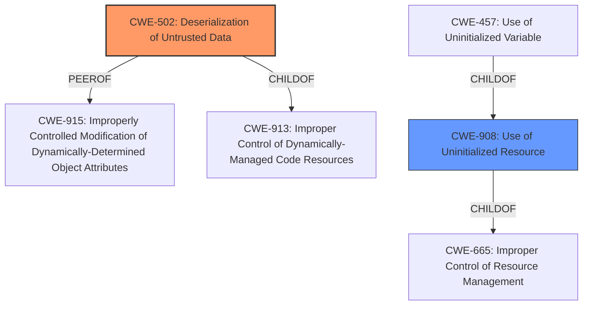

# Final Resolution for CVE-2021-45687

# Summary
| CWE ID | CWE Name | Confidence | CWE Abstraction Level | CWE Vulnerability Mapping Label | CWE-Vulnerability Mapping Notes |
|---|---|---|---|---|---|
| CWE-502 | Deserialization of Untrusted Data | 0.90 | Base | Primary | Allowed |
| CWE-908 | Use of Uninitialized Resource | 0.50 | Base | Secondary | Allowed |

## Evidence and Confidence

*   **Confidence Score:** 0.85
*   **Evidence Strength:** HIGH

## Relationship Analysis
The primary CWE is **CWE-502 (Deserialization of Untrusted Data)**, which is a Base level CWE. This is preferred because it directly addresses the **lack of validation** during **deserialization** that leads to **memory corruption** or a panic. It is a peer of **CWE-915 (Improperly Controlled Modification of Dynamically-Determined Object Attributes)** and a child of **CWE-913 (Improper Control of Dynamically-Managed Code Resources)**.

**CWE-908 (Use of Uninitialized Resource)** is considered as a secondary CWE because the **deserialization** without validation may result in uninitialized resources. It is a base CWE, parent of **CWE-457 (Use of Uninitialized Variable)**, and child of **CWE-665 (Improper Control of Resource Management)**.

## Vulnerability Chain
The vulnerability chain starts with the product's decision to **deserialize untrusted data**. The **root cause** is the **lack of sufficient validation** during this process (**CWE-502**). This **weakness** can then lead to the **use of uninitialized resources (CWE-908)**, which eventually results in **memory corruption** or a **panic**, leading to a **denial of service**.

## Summary of Analysis
The initial analysis correctly identified **CWE-502 (Deserialization of Untrusted Data)** as the primary **weakness**. The criticism suggested a few key improvements:
1.  Adding mitigations for **CWE-502**: This is a good suggestion, and I would include mentioning the use of HMAC for signing **serialized** data.
2.  Reinforcing the focus on **deserialization-specific issues**: The original analysis was already strong on this point.
3.  Removing discouraged CWEs with low confidence: The initial analysis considered **CWE-20 (Improper Input Validation)**, but as the analysis and the CWE documentation state, it's best to use the most specific CWE.
4.  Adding **CWE-908 (Use of Uninitialized Resource)**: The criticism suggested including this, as the **lack of validation** could lead to uninitialized states. I agree with this, so I have included **CWE-908** as a secondary weakness with a lower confidence score.

I have updated the summary table to reflect these changes. My confidence in **CWE-502** is very high (0.90), as the vulnerability description directly states the issue is due to insufficient validation during **deserialization**. My confidence in **CWE-908** is lower (0.50), as this is a potential, but not explicitly stated, consequence of the **deserialization** issue. The selection of **CWE-502** as the primary CWE is at the optimal level of specificity, as it precisely describes the **root cause** of the vulnerability.