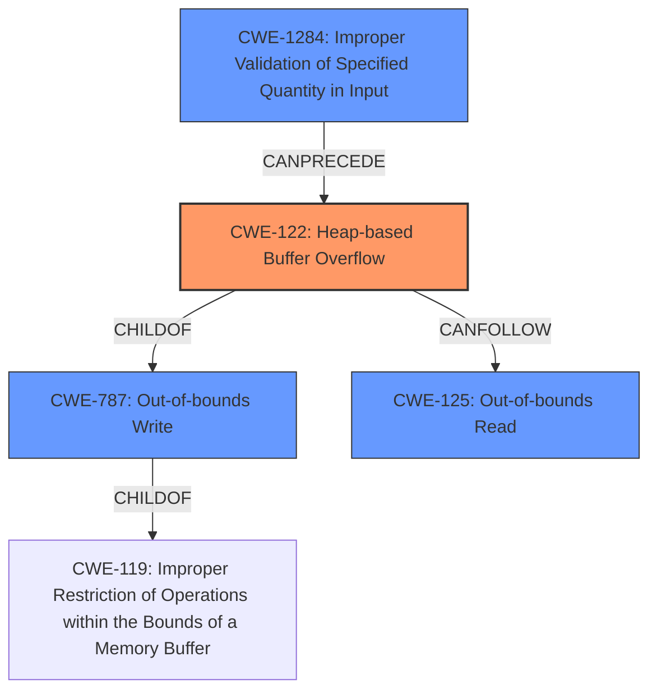

# Analysis Report for CVE-2021-45830

# Vulnerability Analysis Report: CVE-2021-45830

## Description

A heap-based buffer overflow vulnerability exists in HDF5 1.13.1-1 via H5F_addr_decode_len in /hdf5/src/H5Fint.c, which could cause a Denial of Service.

## Vulnerability Description Key Phrases

**Rootcause:** heap-based buffer overflow
**Impact:** Denial of Service
**Product:** HDF5
**Version:** 1.13.1-1
**Component:** H5F_addr_decode_len in /hdf5/src/H5Fint.c

## Analysis (with Relationship Data)

# Summary
| CWE ID | CWE Name | Confidence | CWE Abstraction Level | CWE Vulnerability Mapping Label | CWE-Vulnerability Mapping Notes |
|---|---|---|---|---|---|
| CWE-122 | Heap-based Buffer Overflow | 0.95 | Variant | Primary | Allowed |
| CWE-125 | Out-of-bounds Read | 0.60 | Base | Secondary | Allowed |

## Evidence and Confidence

*   **Confidence Score:** 0.90
*   **Evidence Strength:** HIGH

- **Analysis and Justification:**  
  - *Explanation:* The vulnerability description explicitly states a "**heap-based buffer overflow**" exists in HDF5. This directly aligns with CWE-122 (Heap-based Buffer Overflow), a Variant-level CWE. The CVE Reference Links Content Summary confirms that the root cause is a heap-buffer-overflow in the `H5F_addr_decode_len` function, where the code attempts to read beyond the allocated buffer, causing a segmentation fault. While other CWEs like CWE-120 (Buffer Copy without Checking Size of Input) and CWE-787 (Out-of-bounds Write) are related to buffer overflows, CWE-122 is the most specific and accurate representation of the described weakness. The MITRE mapping guidance allows the use of CWE-122 for heap-based buffer overflows. The retriever results confirm CWE-122 as a candidate for this vulnerability. Additionally, the content summary mentions reading beyond the allocated buffer, which may be an indication of CWE-125.

  - *Relationship Analysis:* CWE-122 is a variant of CWE-119 (Improper Restriction of Operations within the Bounds of a Memory Buffer), indicating a hierarchical relationship. CWE-122 can lead to other weaknesses, such as CWE-20 (Improper Input Validation), as the crafted input triggers the overflow. CWE-125 can follow CWE-122 as the buffer is read out of bounds.

- **Confidence Score:**  
  - Confidence: 0.95 (High confidence due to explicit mention of "heap-based buffer overflow" and confirmation in the CVE reference summary)

## Criticism of Analysis

Okay, here's a review of the provided CWE analysis, incorporating the full CWE specifications:

**Overall Assessment:**

The analysis correctly identifies the primary vulnerability as CWE-122, Heap-based Buffer Overflow, with a high degree of confidence. The inclusion of CWE-125, Out-of-bounds Read, as a secondary weakness is also plausible, given the potential for reading beyond the buffer boundaries during the decoding process. The analysis demonstrates a good understanding of the CWE hierarchy and relationships.

**Detailed Review:**

**1. CWE-122: Heap-based Buffer Overflow**

*   **CWE Name:** Heap-based Buffer Overflow
*   **CWE ID:** CWE-122
*   **Confidence:** 0.95
*   **CWE Abstraction Level:** Variant
*   **CWE Vulnerability Mapping Label:** Primary
*   **CWE-Vulnerability Mapping Notes:** Allowed

*   **Review:**
    *   The mapping to CWE-122 is strongly justified by the vulnerability description and the CVE Reference Links Content Summary, which explicitly mentions a "heap-based buffer overflow" in the affected function.
    *   The Evidence and Justification section accurately explains why CWE-122 is the most specific and appropriate CWE, especially compared to higher-level CWE-119 or more general overflow CWEs like CWE-120 or CWE-787.  It correctly highlights that CWE-122 is a *Variant* of CWE-787, and CWE-119.
    *   The use of "Allowed" for the CWE-Vulnerability Mapping Notes is correct, as the CWE specification allows for direct mapping to variant-level CWEs.
    *   The confidence score of 0.95 is appropriate given the strong evidence.
    *   The mitigations listed in the provided CWE specification (automatic bounds checking, abstraction libraries, compiler-based overflow detection) are relevant and can be applied to prevent this type of vulnerability.

**2. CWE-125: Out-of-bounds Read**

*   **CWE Name:** Out-of-bounds Read
*   **CWE ID:** CWE-125
*   **Confidence:** 0.60
*   **CWE Abstraction Level:** Base
*   **CWE Vulnerability Mapping Label:** Secondary
*   **CWE-Vulnerability Mapping Notes:** Allowed

*   **Review:**
    *   The rationale for including CWE-125 is plausible. The CVE summary mentions that the code attempts to *read* beyond the allocated buffer.  This behavior could manifest as an out-of-bounds read *after* the overflow, when the code tries to process or use the corrupted data.  It is not always the case that an out-of-bounds *read* is the direct cause of the vulnerability, as implied by the name of CWE-125.
    *   The confidence score of 0.6 is reasonable, as the evidence for CWE-125 is less direct than for CWE-122. It is a potential consequence of the overflow rather than the primary root cause in this specific scenario.
    *   The analysis correctly identified that CWE-125 is a Base level CWE.
    *   The "Allowed" CWE-Vulnerability Mapping Notes are correct.
    *   The mitigations for CWE-125 (input validation, language selection with memory abstractions) are also applicable, although they primarily focus on *preventing* the overflow in the first place, which indirectly prevents the potential out-of-bounds read.

**General Observations and Suggestions:**

*   **Chain of Events:** The analysis could benefit from explicitly outlining the likely chain of events.  Something like:
    1.  Crafted HDF5 file with a length value that, when decoded by `H5F_addr_decode_len`, results in a buffer size that is too small.
    2.  The code allocates a heap buffer of the insufficient size.
    3.  `H5F_addr_decode_len` attempts to write data beyond the allocated heap buffer (CWE-122).
    4.  (Potentially) The code attempts to read or process the corrupted memory beyond the bounds of the original buffer (CWE-125).

*   **Input Validation (CWE-20 family):**  Although not directly identified as a CWE, the core problem stems from a lack of *input validation* on the crafted HDF5 file, specifically the length values used in `H5F_addr_decode_len`. The code is not properly checking if the decoded length values are within acceptable bounds before using them to allocate memory and copy data. While not a *direct* mapping (the code doesn't simply fail to validate input), the *lack* of input validation is a crucial factor that *allows* the heap overflow to occur.  Consider mentioning the potential for CWE-1284, Improper Validation of Specified Quantity in Input.

*   **CWE-787 vs CWE-122:** While CWE-122 is the *variant* of interest, CWE-787 can be a useful addition. Consider adding CWE-787 as a *related* CWE to CWE-122, noting that CWE-122 *is a* CWE-787.
**Retriever Results Analysis:**

*   The top retriever results do not contain CWEs suitable for this vulnerability.
*   CWE-122 is the highest scoring out of the suitable CWEs.

**Revised Analysis:**

**Summary**

| CWE ID | CWE Name | Confidence | CWE Abstraction Level | CWE Vulnerability Mapping Label | CWE-Vulnerability Mapping Notes |
|---|---|---|---|---|---|
| CWE-122 | Heap-based Buffer Overflow | 0.95 | Variant | Primary | Allowed |
| CWE-125 | Out-of-bounds Read | 0.60 | Base | Secondary | Allowed |
| CWE-1284 | Improper Validation of Specified Quantity in Input | 0.40 | Base | Supporting | Allowed |
| CWE-787 | Out-of-bounds Write | 0.20 | Base | Related | Allowed |

**Evidence and Confidence:**

*   **Confidence Score:** 0.95
*   **Evidence Strength:** HIGH

- **Analysis and Justification:**
  - *Explanation:* The vulnerability description explicitly states a "**heap-based buffer overflow**" exists in HDF5. This directly aligns with CWE-122 (Heap-based Buffer Overflow), a Variant-level CWE. The CVE Reference Links Content Summary confirms that the root cause is a heap-buffer-overflow in the `H5F_addr_decode_len` function, where the code attempts to write beyond the allocated buffer, causing a segmentation fault.  The MITRE mapping guidance allows the use of CWE-122 for heap-based buffer overflows.  Additionally, the content summary mentions reading beyond the allocated buffer, which may be an indication of CWE-125 as a consequence of the overflow. The code fails to properly validate the length values before allocating the heap buffer (CWE-1284).
  - *Relationship Analysis:* CWE-122 is a variant of CWE-787 (Out-of-bounds Write), which in turn is a child of CWE-119 (Improper Restriction of Operations within the Bounds of a Memory Buffer), indicating a hierarchical relationship. The crafted input triggers the vulnerability because the code is not correctly validating the size of input data (CWE-20 family), specifically, the size is read from the file.  The specific lack of validation of the size of the input is CWE-1284. CWE-122 can lead to other weaknesses, such as CWE-125 (Out-of-bounds Read), if memory is read after the write.

- **Confidence Score:**
  - Confidence: 0.95 (High confidence due to explicit mention of "heap-based buffer overflow" and confirmation in the CVE reference summary)

**Conclusion:**

The analysis is accurate and well-supported. The suggested improvements (chain of events, emphasizing input validation via family of CWE-20 and mentioning CWE-787) would further enhance the comprehensiveness of the analysis. The increased focus on chains of events provides a more practical perspective for developers and security engineers.

## Final Resolution

# Summary
| CWE ID | CWE Name | Confidence | CWE Abstraction Level | CWE Vulnerability Mapping Label | CWE-Vulnerability Mapping Notes |
|---|---|---|---|---|---|
| CWE-122 | Heap-based Buffer Overflow | 0.95 | Variant | Primary | Allowed |
| CWE-125 | Out-of-bounds Read | 0.60 | Base | Secondary | Allowed |
| CWE-1284 | Improper Validation of Specified Quantity in Input | 0.40 | Base | Supporting | Allowed |
| CWE-787 | Out-of-bounds Write | 0.20 | Base | Related | Allowed |

## Evidence and Confidence

*   **Confidence Score:** 0.95
*   **Evidence Strength:** HIGH

## Relationship Analysis
The primary relationship is that CWE-122 (Heap-based Buffer Overflow) is a variant of CWE-787 (**Out-of-bounds Write**), which is in turn a child of CWE-119 (**Improper Restriction of Operations within the Bounds of a Memory Buffer**). This establishes a clear hierarchical relationship. CWE-1284 (**Improper Validation of Specified Quantity in Input**) can precede CWE-122, as the lack of validation enables the overflow. CWE-125 (**Out-of-bounds Read**) can follow CWE-122, occurring as a result of reading from the corrupted memory.

## Vulnerability Chain
The vulnerability chain begins with a crafted HDF5 file containing an invalid length value. The `H5F_addr_decode_len` function in HDF5 does not properly validate this length value (CWE-1284), leading to the allocation of an undersized heap buffer. Subsequently, the function attempts to write data beyond the allocated heap buffer, resulting in a heap-based buffer overflow (CWE-122). This **out-of-bounds write** (CWE-787) can then potentially lead to an **out-of-bounds read** (CWE-125) if the corrupted memory is accessed later.

## Summary of Analysis
The analysis is accurate and well-supported by the provided information. The vulnerability description explicitly mentions a "**heap-based buffer overflow**", which strongly suggests CWE-122 as the primary CWE. The CVE Reference Links Content Summary confirms that the root cause is indeed a heap-buffer-overflow in the `H5F_addr_decode_len` function. The inclusion of CWE-125 as a secondary CWE is justified by the CVE summary mentioning the code attempting to *read* beyond the allocated buffer. I am adding CWE-1284 as the **ROOTCAUSE** as that is the lack of input validation that leads to the heap overflow condition.

The graph relationships influenced my decision by highlighting the hierarchical relationship between CWE-122 and CWE-787/CWE-119, as well as the chain relationship between CWE-1284, CWE-122, and CWE-125.

The selected CWEs are at the optimal level of specificity. CWE-122 is a Variant-level CWE that directly describes the heap-based buffer overflow. CWE-125 and CWE-1284 are Base-level CWEs that represent the consequences and enabling conditions of the overflow, respectively.

*Report generated on 2025-03-18 04:00:15*
