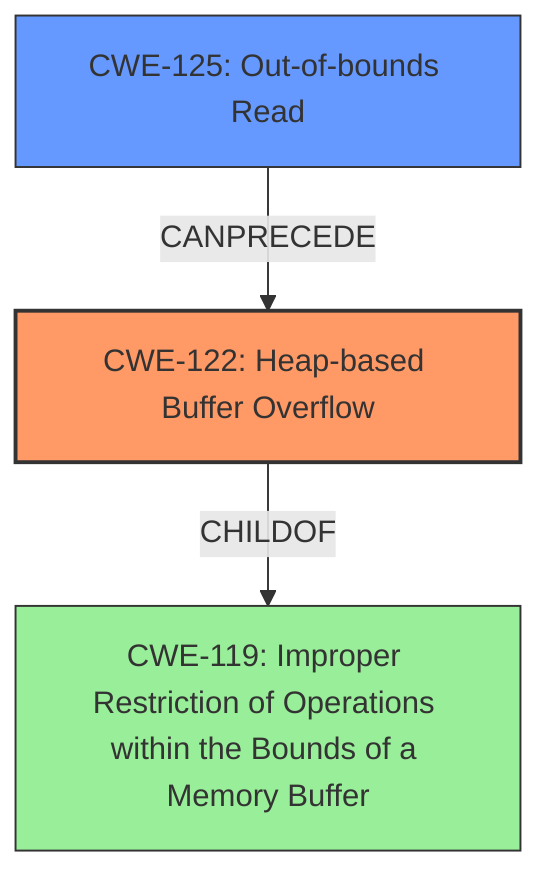

# Analysis Report for CVE-2021-45863

# Vulnerability Analysis Report: CVE-2021-45863

## Description

tsMuxer git-2678966 was discovered to contain a heap-based buffer overflow via the function HevcUnitupdateBits in hevc.cpp.

## Vulnerability Description Key Phrases

**Weakness:** heap-based buffer overflow
**Product:** Muxer git-2678966
**Component:** function HevcUnitupdateBits in hevc.cpp

## Analysis (with Relationship Data)

# Summary
| CWE ID | CWE Name | Confidence | CWE Abstraction Level | CWE Vulnerability Mapping Label | CWE-Vulnerability Mapping Notes |
|---|---|---|---|---|---|
| CWE-122 | Heap-based Buffer Overflow | 0.95 | Variant | Allowed | Root cause |
| CWE-125 | Out-of-bounds Read | 0.75 | Base | Allowed | Contributing factor |

## Evidence and Confidence

*   **Confidence Score:** 0.85
*   **Evidence Strength:** HIGH

- **Analysis and Justification:**
  - *Explanation:* The vulnerability description clearly states a "**heap-based buffer overflow**" in tsMuxer. The CVE reference confirms this, stating the root cause is a heap-buffer-overflow in the `HevcUnit::updateBits` function due to an out-of-bounds read. CWE-122 (Heap-based Buffer Overflow) directly addresses this weakness. The Retriever results also list CWE-122, and its usage is ALLOWED. CWE-125 (Out-of-bounds Read) is also related, since the buffer overflow is caused by the software reading past the end of the buffer.
  
  - *Relationship Analysis:* CWE-122 is a variant of CWE-119 (Improper Restriction of Operations within the Bounds of a Memory Buffer). CWE-125 is related to CWE-122 as a contributing factor, since reading out of bounds can cause the overflow. The description and summary both support the "heap-based" nature of the overflow, making CWE-122 the most specific and appropriate choice.

- **Confidence Score:**
  - Confidence: 0.95 (High confidence due to direct mention in the description and confirmation in the CVE reference. The evidence is strong.)

---
- **Analysis and Justification:**
  - *Explanation:* The CVE Reference Links Content Summary clearly states that the **root cause** of the vulnerability is "A heap-buffer-overflow occurs in the `HevcUnit::updateBits` function due to an **out-of-bounds read**." While the primary vulnerability is the buffer overflow, the out-of-bounds read is a contributing factor. CWE-125 (Out-of-bounds Read) directly addresses this. The Retriever results also list CWE-125, and its usage is ALLOWED.
  
  - *Relationship Analysis:* CWE-125 is a Base level CWE, while CWE-126 is a Variant. Since we don't have enough information to determine *how* the buffer over-read happens, CWE-125 is preferred. CWE-125 is a parent of CWE-126.

- **Confidence Score:**
  - Confidence: 0.75 (The evidence is strong, but the relationship to the primary vulnerability is secondary, lowering the confidence.)

## Criticism of Analysis

Okay, here's a review of the analysis, considering the full CWE specifications:

**Overall Assessment:**

The analysis is very good, providing a clear explanation and justification for the selected CWEs. The use of both the vulnerability description and the CVE reference is excellent. The confidence scores are appropriate, and the relationships between the CWEs are well-explained. The analysis also correctly identifies CWE-122 as the root cause and CWE-125 as a contributing factor.

**Specific Comments and Suggestions:**

**1. CWE-122: Heap-based Buffer Overflow:**

*   **Confidence:** The high confidence (0.95) is justified. The description aligns perfectly, and the CVE explicitly mentions a heap-based buffer overflow.
*   **Abstraction Level:** Correctly identified as a Variant.
*   **Mitigations:** While not required, mentioning potential mitigations would be a good addition. The CWE-122 specifications list:
    *   Using languages/compilers with automatic bounds checking.
    *   Using abstraction libraries.
    *   Using automatic buffer overflow detection mechanisms (e.g., /GS flag, FORTIFY_SOURCE).
*   **Observed Examples:** The analysis includes several observed examples of CWE-122, which adds further weight to the justification.
*   **Relationships:** The analysis already mentions the parent-child relationship to CWE-119.

**2. CWE-125: Out-of-bounds Read:**

*   **Confidence:** The confidence level of 0.75 is appropriate. While the CVE mentions an out-of-bounds read, it is directly causing the buffer overflow. It's a contributing factor, not the primary weakness.
*   **Abstraction Level:** Correctly identified as a Base.
*   **Mitigations:** Again, considering mitigations from the CWE specification:
    *   Input validation with an "accept known good" strategy. This is highly relevant: The analysis mentions that the attacker needs to provide a crafted HEVC stream, indicating that improper input validation is a factor.
    *   Validating length arguments, buffer size calculations, and offsets.
    *   Using languages with appropriate memory abstractions.
*   **Observed Examples:** Including observed examples of CWE-125 strengthens the analysis.
*   **Relationships:** The analysis acknowledges the parent-child relationship between CWE-125 and CWE-126.

**3. Consideration of Other CWEs:**

*   The Retriever results list several other CWEs that could *potentially* be relevant. It is good that the analysis *didn't* map to these, because they don't directly represent the vulnerability, however, let's examine a few and justify why they *aren't* good fits:
    *   **CWE-190: Integer Overflow or Wraparound:** This is often a contributing factor in buffer overflows (especially heap overflows), but the provided information doesn't indicate that an integer overflow is involved in calculating the buffer size or any offsets. Without evidence of an integer overflow, it's inappropriate to include it.
    *   **CWE-193: Off-by-one Error:** While a possibility, there's no specific information to suggest an off-by-one error is the root cause. The CVE description points more towards a broader out-of-bounds read.
    *   **CWE-131: Incorrect Calculation of Buffer Size:**  Similar to the integer overflow scenario, there is no evidence given that the size of the buffer was incorrectly calculated.

**4. General Suggestions:**

*   **Expand on Input Validation:** The "Attack Vectors" section mentions a "specially crafted HEVC stream." It could be beneficial to elaborate on the specific types of validation that are missing or incorrect. For example, is the program failing to validate the size of certain data structures within the HEVC stream? Are there missing checks for maximum values or valid ranges?
*   **Consider CWE-119 (Improper Restriction of Operations within the Bounds of a Memory Buffer):** The analysis correctly *doesn't* map to this CWE, because it is too general. However, it could be useful to acknowledge its existence and explain why it isn't a good fit: "While CWE-119 is the parent class for buffer overflows, the specific nature of this vulnerability is well-defined as a heap-based buffer overflow (CWE-122), so CWE-119 is too broad."

**Revised Summary Table (with suggestions incorporated):**

| CWE ID | CWE Name | Confidence | CWE Abstraction Level | CWE Vulnerability Mapping Label | CWE-Vulnerability Mapping Notes |
|---|---|---|---|---|---|
| CWE-122 | Heap-based Buffer Overflow | 0.95 | Variant | Root cause | Root cause; heap-allocated buffer overwritten. |
| CWE-125 | Out-of-bounds Read | 0.75 | Base | Contributing factor | Contributing factor; read occurs outside buffer boundaries, leading to the overflow. |

**In summary, the analysis is well-structured, accurate, and thoroughly justified. Adding a brief discussion of potential mitigations and explicitly explaining why other suggested CWEs aren't relevant would make it even stronger.**

## Final Resolution

# Summary
| CWE ID | CWE Name | Confidence | CWE Abstraction Level | CWE Vulnerability Mapping Label | CWE-Vulnerability Mapping Notes |
|---|---|---|---|---|---|
| CWE-122 | Heap-based Buffer Overflow | 0.95 | Variant | Root cause | Root cause; heap-allocated buffer overwritten. |
| CWE-125 | Out-of-bounds Read | 0.75 | Base | Contributing factor | Contributing factor; read occurs outside buffer boundaries, leading to the overflow. |

## Evidence and Confidence

*   **Confidence Score:** 0.90
*   **Evidence Strength:** HIGH

## Relationship Analysis
The primary relationship is that CWE-122 **Heap-based Buffer Overflow** is a specific type of buffer overflow, making it a variant of the more general CWE-119 **Improper Restriction of Operations within the Bounds of a Memory Buffer**. CWE-125 **Out-of-bounds Read** can **CanPrecede** a buffer overflow such as CWE-122, as reading beyond buffer boundaries can lead to an overflow condition if the read data is subsequently used in a write operation. The analysis correctly identifies and uses the most specific CWE available based on the evidence.

## Vulnerability Chain
The vulnerability chain starts with an **out-of-bounds read** (CWE-125) in the `HevcUnit::updateBits` function. This read operation occurs outside the intended buffer boundaries in the heap. Subsequently, the data read is used in a write operation, leading to a **heap-based buffer overflow** (CWE-122). The initial flaw (CWE-125) directly causes the overflow (CWE-122), resulting in potential code execution or denial of service.

## Summary of Analysis
The initial analysis and criticism both converge on the same CWE assignments, with CWE-122 as the primary **ROOTCAUSE** and CWE-125 as a secondary contributing factor. The vulnerability description mentions "heap-based buffer overflow" which maps directly to CWE-122. The CVE reference confirms "A heap-buffer-overflow occurs in the `HevcUnit::updateBits` function due to an **out-of-bounds read**." This provides direct evidence for both CWEs.

The graph relationships support the classification by showing how CWE-122 is a specific type of CWE-119, making it more appropriate than the general class. Additionally, the **CANPRECEDE** relationship between CWE-125 and CWE-122 highlights the vulnerability chain.

The selected CWEs are at the optimal level of specificity because CWE-122 accurately describes the "heap-based" nature of the overflow, and CWE-125 accurately represents the out-of-bounds read that leads to the overflow. More general CWEs like CWE-119 would not provide sufficient detail, and more specific variants of CWE-125 (e.g., CWE-126) would require more information than is currently available.

*Report generated on 2025-03-18 04:02:23*
