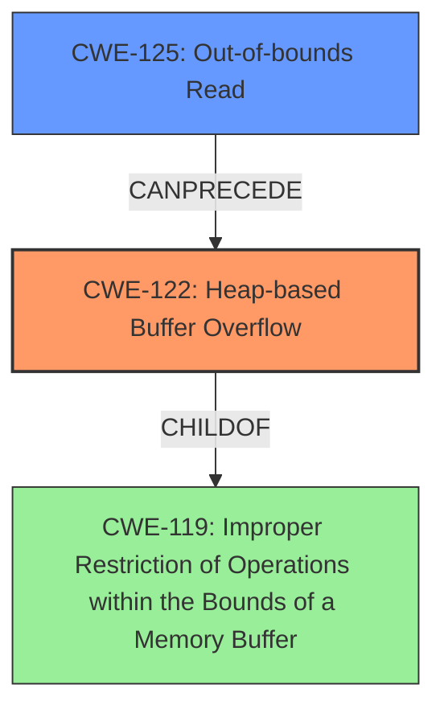

# Final Resolution for CVE-2021-45863

# Summary
| CWE ID | CWE Name | Confidence | CWE Abstraction Level | CWE Vulnerability Mapping Label | CWE-Vulnerability Mapping Notes |
|---|---|---|---|---|---|
| CWE-122 | Heap-based Buffer Overflow | 0.95 | Variant | Root cause | Root cause; heap-allocated buffer overwritten. |
| CWE-125 | Out-of-bounds Read | 0.75 | Base | Contributing factor | Contributing factor; read occurs outside buffer boundaries, leading to the overflow. |

## Evidence and Confidence

*   **Confidence Score:** 0.90
*   **Evidence Strength:** HIGH

## Relationship Analysis
The primary relationship is that CWE-122 **Heap-based Buffer Overflow** is a specific type of buffer overflow, making it a variant of the more general CWE-119 **Improper Restriction of Operations within the Bounds of a Memory Buffer**. CWE-125 **Out-of-bounds Read** can **CanPrecede** a buffer overflow such as CWE-122, as reading beyond buffer boundaries can lead to an overflow condition if the read data is subsequently used in a write operation. The analysis correctly identifies and uses the most specific CWE available based on the evidence.

## Vulnerability Chain
The vulnerability chain starts with an **out-of-bounds read** (CWE-125) in the `HevcUnit::updateBits` function. This read operation occurs outside the intended buffer boundaries in the heap. Subsequently, the data read is used in a write operation, leading to a **heap-based buffer overflow** (CWE-122). The initial flaw (CWE-125) directly causes the overflow (CWE-122), resulting in potential code execution or denial of service.

## Summary of Analysis
The initial analysis and criticism both converge on the same CWE assignments, with CWE-122 as the primary **ROOTCAUSE** and CWE-125 as a secondary contributing factor. The vulnerability description mentions "heap-based buffer overflow" which maps directly to CWE-122. The CVE reference confirms "A heap-buffer-overflow occurs in the `HevcUnit::updateBits` function due to an **out-of-bounds read**." This provides direct evidence for both CWEs.

The graph relationships support the classification by showing how CWE-122 is a specific type of CWE-119, making it more appropriate than the general class. Additionally, the **CANPRECEDE** relationship between CWE-125 and CWE-122 highlights the vulnerability chain.

The selected CWEs are at the optimal level of specificity because CWE-122 accurately describes the "heap-based" nature of the overflow, and CWE-125 accurately represents the out-of-bounds read that leads to the overflow. More general CWEs like CWE-119 would not provide sufficient detail, and more specific variants of CWE-125 (e.g., CWE-126) would require more information than is currently available.