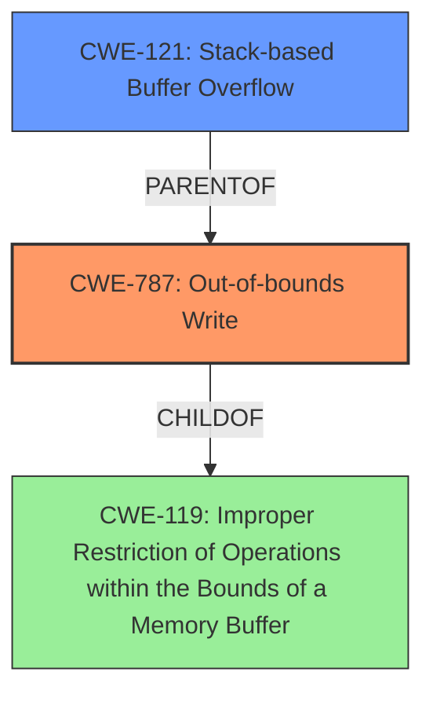

# Final Resolution for CVE-2021-45908

# Summary
| CWE ID | CWE Name | Confidence | CWE Abstraction Level | CWE Vulnerability Mapping Label | CWE-Vulnerability Mapping Notes |
|---|---|---|---|---|---|
| **CWE-787** | **Out-of-bounds Write** | 0.95 | Base | Allowed | Primary **CWE** |
| **CWE-121** | **Stack-based Buffer Overflow** | 0.75 | Variant | Allowed | Secondary Candidate |

## Evidence and Confidence

*   **Confidence Score:** 0.95
*   **Evidence Strength:** HIGH

## Relationship Analysis
The primary relationship impacting the decision is the parent-child relationship between **CWE-119** (**Improper Restriction of Operations within the Bounds of a Memory Buffer**) and **CWE-787** (**Out-of-bounds Write**), and between **CWE-787** and **CWE-121** (**Stack-based Buffer Overflow**). **CWE-787** is a more specific form of **CWE-119**, and **CWE-121** is a specific instance of **CWE-787** occurring on the stack. **CWE-787** is chosen as the primary **weakness** because it directly addresses the core issue of writing beyond the intended buffer. **CWE-121** is a secondary candidate since the description explicitly mentions the "**stack-based buffer overflow**".

## Vulnerability Chain
The chain starts with the insufficient boundary checks in the `DecodeLZW` function, which leads to an **out-of-bounds write** (**CWE-787**) on the stack, resulting in a **stack-based buffer overflow** (**CWE-121**). The root cause is the lack of proper input validation and bounds checking before writing to the buffer.

## Summary of Analysis
The initial analysis and criticism both agree that **CWE-787** is the most appropriate primary **CWE**, given the vulnerability description explicitly states a "**stack-based buffer overflow**" and that the underlying issue is an out-of-bounds write due to missing boundary checks. The criticism suggested removing **CWE-1284** which I agree with because it is not the direct cause. The analysis is heavily based on the provided evidence in the vulnerability description. The relationships, particularly the parent-child relationships between **CWE-119**, **CWE-787**, and **CWE-121**, helped in selecting the most specific and accurate **CWEs**. **CWE-787** is at the Base level of abstraction, which is a preferred level for mapping. The choice of **CWE-787** and **CWE-121** reflects the optimal level of specificity based on the available evidence.