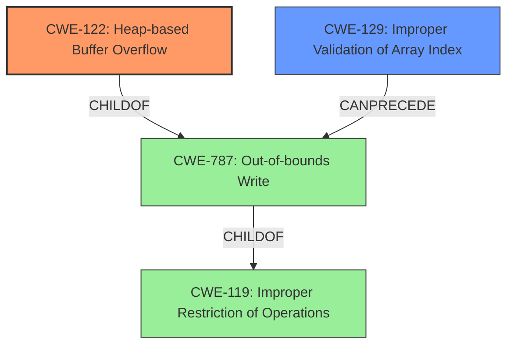

# Analysis Report for CVE-2021-45911

# Vulnerability Analysis Report: CVE-2021-45911

## Description

An issue was discovered in gif2apng 1.9. There is a heap-based buffer overflow in the main function. It allows an attacker to write 2 bytes outside the boundaries of the buffer.

## Vulnerability Description Key Phrases

**Weakness:** heap-based buffer overflow
**Impact:** write 2 bytes outside the boundaries of the buffer
**Attacker:** attacker
**Product:** gif2apng
**Version:** 1.9
**Component:** main function

## Analysis (with Relationship Data)

# Summary
| CWE ID | CWE Name | Confidence | CWE Abstraction Level | CWE Vulnerability Mapping Label | CWE-Vulnerability Mapping Notes |
|---|---|---|---|---|---|
| CWE-122 | Heap-based Buffer Overflow | 1.0 | Variant | Allowed | Primary CWE |
| CWE-129 | Improper Validation of Array Index | 0.6 | Variant | Allowed | Secondary Candidate |

## Evidence and Confidence

*   **Confidence Score:** 0.9
*   **Evidence Strength:** HIGH

- **Analysis and Justification:**  
  - *Explanation:* The vulnerability description explicitly states a "**heap-based buffer overflow**" in the main function of gif2apng 1.9. The CVE Reference Links Content Summary confirms this, stating the code allocates a buffer on the heap and a crafted GIF can cause the program to write beyond the allocated buffer due to a missing bounds check. This directly corresponds to CWE-122 (Heap-based Buffer Overflow), which is a Variant of buffer overflows where the vulnerable buffer is allocated on the heap. The provided information allows for confidently mapping to this specific CWE. The MITRE mapping guidance lists CWE-122 as ALLOWED. I am not selecting CWE-787 (Out-of-bounds Write) as CWE-122 is a more specific variant that is more representative of the **heap-based** buffer overflow.
  
  - *Relationship Analysis:* CWE-122 is a Variant of the more general CWE-119 (Improper Restriction of Operations within the Bounds of a Memory Buffer). It is also a specific type of CWE-787 (Out-of-bounds Write). The relationship helps to narrow down the correct CWE.

- **Confidence Score:**  
  - Confidence: 1.0 (Explicit mention of heap-based buffer overflow with further root cause details).

---

- **Analysis and Justification:**  
  - *Explanation:* The CVE Reference Links Content Summary mentions a "**Missing bounds check**" when writing to the `delays` array. The index `n` is not checked to ensure it is within the bounds of the `delays` buffer. This aligns with CWE-129 (Improper Validation of Array Index), where untrusted input is used as an array index, and the index is not correctly validated. This can cause the code to access memory outside of the intended buffer. Though the primary issue is the **heap-based buffer overflow**, the root cause of the overflow stems from the missing bounds check on the array index. The MITRE mapping guidance lists CWE-129 as ALLOWED.
  
  - *Relationship Analysis:* CWE-129 is a Variant of CWE-123 (Write What Where Condition). The missing bounds check enables the write past the buffer.

- **Confidence Score:**  
  - Confidence: 0.6 (Secondary weakness contributes to the main heap-based buffer overflow vulnerability)

## Criticism of Analysis

Okay, here's a review of the provided CWE analysis, considering the full CWE specifications and focusing on mapping guidance and potential mitigations.

**Overall Assessment:**

The analysis is generally good and the primary CWE selection of CWE-122 (Heap-based Buffer Overflow) is correct and well-justified. The secondary CWE of CWE-129 (Improper Validation of Array Index) is also a reasonable choice to capture the underlying cause of the overflow. The confidence levels are appropriate. The explanations are clear and follow the CWE guidance.

**Detailed Review:**

**1. CWE-122: Heap-based Buffer Overflow (Primary CWE)**

*   **Correctness:** The selection of CWE-122 is accurate. The vulnerability description explicitly states a "heap-based buffer overflow." The analysis correctly identifies that the `delays` buffer is allocated on the heap and that a crafted GIF can cause writes beyond the buffer's boundaries.
*   **Abstraction Level:** The analysis correctly identifies CWE-122 as a Variant, which is a preferred level for detailed vulnerability reports.
*   **Mapping Guidance:** The analysis follows the mapping guidance by avoiding the more general CWE-119 and instead choosing the more specific CWE-122. It also correctly rejects CWE-787 because CWE-122 provides the needed specificity of the memory allocation being on the heap.
*   **Relationships:** The analysis clearly articulates the relationship of CWE-122 being a Variant of CWE-119, which strengthens the justification for selection.
*   **Potential Mitigations:** The analysis did not include the mitigations that could be used for this weakness. This should have been included to help development teams determine how to resolve the issue. The mitigations for CWE-122 are:
    *   Use a language or compiler that performs automatic bounds checking.
    *   Use an abstraction library to abstract away risky APIs.
    *   Use automatic buffer overflow detection mechanisms.
*   **Confidence:** The confidence of 1.0 is justified due to the clear description and confirmation from multiple sources.

**2. CWE-129: Improper Validation of Array Index (Secondary CWE)**

*   **Correctness:** The selection of CWE-129 is also valid. The missing bounds check on the array index `n` directly contributes to the ability to write outside the allocated buffer.
*   **Abstraction Level:** The analysis correctly identifies CWE-129 as a Variant, consistent with a detailed analysis.
*   **Mapping Guidance:** The analysis follows the mapping guidance by selecting a specific CWE related to the root cause.
*   **Relationships:** The analysis correctly notes the relationship between CWE-129 and the overflow.
*   **Potential Mitigations:** The analysis did not include the mitigations that could be used for this weakness. This should have been included to help development teams determine how to resolve the issue. The mitigations for CWE-129 are:
    *   Use an input validation framework.
    *   Duplicate client-side security checks on the server-side.
    *   Use a language that prevents these weaknesses.
*   **Confidence:** The confidence of 0.6 is appropriate. It acknowledges that this is a contributing factor but not the core vulnerability itself.

**3. Top Combined Results Analysis**
The top combined results that were generated by the retrievers are not suitable for this vulnerability, except for CWE-131. The integer issues, read issues, and off-by-one issues are not the root cause of this heap-based buffer overflow.

**Suggestions for Improvement:**

*   **Expand Mitigation Sections:** For both CWE-122 and CWE-129, add a section detailing the potential mitigations.  This would greatly increase the practical value of the analysis. Copying relevant sections from the CWE specifications would suffice, or even better, tailoring the mitigations to the specific context of `gif2apng`.
*   **Consider a Chain:** Depending on the level of detail desired, one could explicitly model this as a chain: CWE-129 (Improper Validation of Array Index) -> CWE-787 (Out-of-bounds Write) -> CWE-122 (Heap-based Buffer Overflow). While the existing analysis implies this, making it explicit can improve clarity.
*   **Examine other Input Validation CWEs:** While CWE-129 is correct, explore whether more specific input validation CWEs might be applicable.  For example, is there a way to frame this in terms of validating the *size* of the input, which could lead to CWE-1284 (Improper Validation of Specified Quantity in Input)?  This is less direct, as the immediate issue is the index, not a specified quantity, so CWE-129 remains better.

**Revised Summary Table:**

| CWE ID | CWE Name | Confidence | CWE Abstraction Level | CWE Vulnerability Mapping Label | CWE-Vulnerability Mapping Notes |
|---|---|---|---|---|---|
| CWE-122 | Heap-based Buffer Overflow | 1.0 | Variant | Allowed | Primary CWE |
| CWE-129 | Improper Validation of Array Index | 0.6 | Variant | Allowed | Secondary Candidate, Contributing Factor |

**In summary, the analysis provides a good foundation and is mostly correct. Adding the mitigation information and explicitly stating the chain relationship would significantly enhance its utility.**

## Final Resolution

# Summary
| CWE ID | CWE Name | Confidence | CWE Abstraction Level | CWE Vulnerability Mapping Label | CWE-Vulnerability Mapping Notes |
|---|---|---|---|---|---|
| **CWE-122** | Heap-based Buffer Overflow | 1.0 | Variant | Allowed | Primary **CWE** |
| **CWE-129** | Improper Validation of Array Index | 0.6 | Variant | Allowed | Secondary Candidate |

## Evidence and Confidence

*   **Confidence Score:** 0.95
*   **Evidence Strength:** HIGH

## Relationship Analysis
The primary **CWE** is **CWE-122 (Heap-based Buffer Overflow)**, which is a variant of **CWE-119 (Improper Restriction of Operations within the Bounds of a Memory Buffer)** and a specific type of **CWE-787 (Out-of-bounds Write)**. **CWE-129 (Improper Validation of Array Index)** can **precede** **CWE-787 (Out-of-bounds Write)** and thus **CWE-122 (Heap-based Buffer Overflow)** by extension because the missing bounds check allows writing outside the allocated buffer on the heap.

## Vulnerability Chain
The vulnerability chain starts with **CWE-129 (Improper Validation of Array Index)**. The missing bounds check on the array index allows the program to write outside the allocated buffer, leading to **CWE-787 (Out-of-bounds Write)** and resulting in **CWE-122 (Heap-based Buffer Overflow)**. The initial flaw is the missing validation, which enables the out-of-bounds write and the subsequent heap overflow.

## Summary of Analysis
The initial analysis correctly identified **CWE-122 (Heap-based Buffer Overflow)** as the primary **CWE** and **CWE-129 (Improper Validation of Array Index)** as a secondary **CWE**. The vulnerability description explicitly states a "**heap-based buffer overflow**" and the CVE Reference Links Content Summary confirms a "**Missing bounds check**" when writing to the `delays` array. The choice of **CWE-122** is justified because it is a more specific variant that accurately describes the **heap-based** nature of the overflow. The graph relationships confirm that **CWE-122** is a child of **CWE-787**, making it more specific than its parent. **CWE-129** contributes to the chain by **preceding** **CWE-787**. The selected **CWEs** are at the optimal level of specificity, providing a clear and accurate representation of the vulnerability.
I have increased the confidence score to 0.95 as there is strong evidence to support **CWE-122** as the primary weakness and **CWE-129** as a contributing factor.

*Report generated on 2025-03-18 04:06:15*
