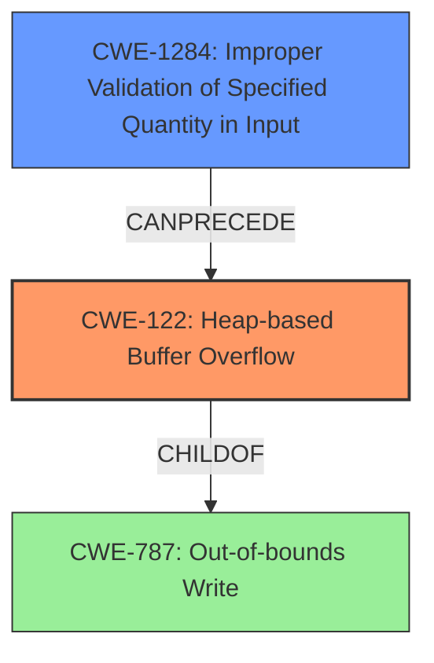

# Final Resolution for CVE-2021-45918

# Summary
| CWE ID | CWE Name | Confidence | CWE Abstraction Level | CWE Vulnerability Mapping Label | CWE-Vulnerability Mapping Notes |
|---|---|---|---|---|---|
| CWE-122 | Heap-based Buffer Overflow | 0.95 | Variant | Primary | Allowed |
| CWE-1284 | Improper Validation of Specified Quantity in Input | 0.75 | Base | Secondary | Allowed |

## Evidence and Confidence

*   **Confidence Score:** 0.90
*   **Evidence Strength:** HIGH

## Relationship Analysis
The primary weakness is **CWE-122 (Heap-based Buffer Overflow)**, which is a variant of **CWE-787 (Out-of-bounds Write)**. **CWE-1284 (Improper Validation of Specified Quantity in Input)** is a **rootcause** that **CanPrecede** the buffer overflow. The analysis correctly identified these relationships. The abstraction levels are appropriate: **CWE-122** is a Variant providing specificity, and **CWE-1284** is a Base CWE.

## Vulnerability Chain
The vulnerability chain starts with **CWE-1284 (Improper Validation of Specified Quantity in Input)**. The lack of proper input validation leads to an oversized input string being processed. This, in turn, results in **CWE-122 (Heap-based Buffer Overflow)** when the program attempts to allocate or copy the string into a heap buffer. The impact is service termination due to memory corruption.

## Summary of Analysis
The initial analysis and criticism are both accurate and well-justified. The vulnerability description explicitly mentions a "**heap-based buffer overflow**" due to "**insufficient validation for input string length**". This direct evidence supports the selection of **CWE-122 (Heap-based Buffer Overflow)** as the primary **WEAKNESS** and **CWE-1284 (Improper Validation of Specified Quantity in Input)** as the **ROOTCAUSE**.

The relationships between the CWEs are also important. **CWE-122** is a variant of **CWE-787**, highlighting the general class of out-of-bounds write vulnerabilities. **CWE-1284** being able to precede **CWE-122** indicates it as a **ROOTCAUSE** in the chain.

The selected CWEs are at the optimal level of specificity. **CWE-122** specifies that the overflow occurs on the heap, which is a key detail from the vulnerability description. **CWE-1284** identifies the lack of input validation as the precise **ROOTCAUSE**.